```mermaid
flowchart TD
    A[User in Chat] --> B{Action Type?}
    B -->|Type Text| C[Type Feature Request<br/>Add user auth]
    B -->|Attach Files| D[Select Files<br/>auth-specs.md,<br/>mockup.png,<br/>req.txt]
    
    C --> E[AI Analyzes<br/>Text + Files]
    D --> E
    
    E --> F[AI Responds<br/>With file context]
    F --> G{User Response?}
    
    G -->|Answer| H[Type: Email-based<br/>reset]
    G -->|More Files| I[Upload<br/>flow-diagram.png]
    G -->|Refine| J[Type: Make it<br/>security questions]
    
    H --> K[AI Confirms<br/>Creating card]
    I --> L[Kanban Card Appears<br/>Planning column]
    L --> M[Card Badge:<br/>📎 3 files]
    
    M --> N[Toast: ✓ Card Created]
    N --> O[Chat + Files Linked<br/>to Card]
    
    O --> P{User Type?}
    P -->|Non-Tech| Q[Hover: Summary<br/>Click: Detail Modal]
    P -->|Tech| R[Click: Detail View<br/>Full chat with markdown,<br/>Attached files section,<br/>Download links]
    
    Q --> S[Markdown Rendering<br/>Both user & AI messages]
    R --> T[Success: Feature defined<br/>All files uploaded,<br/>Markdown renders correctly]
    
    style A fill:#0d1b2a
    style B fill:#1b263b
    style C fill:#253346
    style D fill:#f72585
    style E fill:#00f5d4
    style F fill:#ffc300
    style G fill:#253346
    style H fill:#1b263b
    style I fill:#0d1b2a
    style J fill:#f72585
    style K fill:#253346
    style L fill:#ffc300
    style M fill:#1b263b
    style N fill:#0d1b2a
    style O fill:#253346
    style P fill:#253346
    style Q fill:#1b263b
    style R fill:#ffc300
    style S fill:#1b263b
    style T fill:#00f5d4
```

---
1, 2, 3, 4, 5, 6, 7, 8, 9, 10, 11, 12, 14]
inputDocuments: ["docs/PRD.md", "_bmad-output/planning-artifacts/architecture.md"]
workflowType: 'ux-design'
project_name: 'demiarch'
user_name: 'Jason'
date: '2026-01-19'
---

# UX Design Specification demiarch

**Author:** Jason
**Date:** 2026-01-19

---

<!-- UX design content will be appended sequentially through collaborative workflow steps -->

## Executive Summary

### Project Vision

Demiarch is a local-first, open-source AI-powered code generation tool that enables both technical developers and non-technical users to build applications through natural conversation. Unlike cloud-based AI coding assistants, Demiarch runs entirely on users' local machines with all data stored in SQLite databases, giving users complete ownership and control over their projects and code.

The core experience centers on conversational AI: users describe what they want to build, and Demiarch automatically generates, tests, and refines code through a sophisticated 3-level Russian Doll agent system. Technical users can dive deep into agent orchestration, conflict resolution, and advanced features, while non-technical users can accomplish the same goals through a simplified interface that progressively reveals complexity as needed.

### Target Users

**Primary User Segment 1: Technical Developers**
- Intermediate-to-advanced developers comfortable with CLI and GUI interfaces
- Value data privacy, local control, and explicit operations
- Want to work on multiple projects concurrently (3-5 projects)
- Appreciate power features like hierarchical agent delegation, learned skills extraction, and fine-grained conflict resolution
- Comfortable viewing and directly editing generated code
- Need efficient workflows for rapid iteration and experimentation

**Primary User Segment 2: Non-Technical Users**
- New to coding or "vibe-coders" with basic computer literacy
- Have same goals as technical users: build applications through conversational AI
- Want low setup friction and minimal technical jargon
- Prefer to focus on describing their app vision rather than implementation details
- May access or modify code when they want to learn more, but shouldn't feel forced to understand it
- Value automatic feature generation with clear progress visibility
- Need reassurance that they're making progress without needing deep technical knowledge

### Key Design Challenges

**1. Dual-Audience Balance**
The same interface must serve both seasoned developers who want hierarchical agent control and non-technical users who just want to describe their app idea. The challenge is making power features discoverable and accessible without overwhelming beginners with complexity they don't yet need.

**2. Progressive Complexity Disclosure**
How do we introduce advanced concepts (Russian Doll agents, progressive disclosure system, checkpoints, conflict resolution, learned skills) at the right moment? Technical users need these controls immediately, while non-technical users need them revealed only when necessary to avoid cognitive overload.

**3. Code Accessibility Without Intimidation**
For non-technical users, seeing thousands of lines of generated code can be overwhelming. How do we make code viewable and editable without making it feel like "you must understand this to proceed"? Technical users need direct code access, while non-technical users need reassurance that code is there but optional to engage with directly.

**4. Multi-Project Mental Model Simplification**
Working on 3-5 projects simultaneously with cross-project context sharing is complex. How do we make project switching, resource locking, and context sharing intuitive without using technical terms like "context windows" or "agent delegation"? The interface needs to communicate state without requiring users to understand the underlying architecture.

**5. Visualizing Invisible Processes**
The Russian Doll agent system operates invisibly in the background. Non-technical users especially need to understand what's happening when they click "generate" without being confused by technical diagrams or logs. How do we make agent hierarchy, task decomposition, and delegation tangible?

### Design Opportunities

**1. Unified Conversational Interface**
This is Demiarch's core differentiator and biggest UX opportunity. Both technical and non-technical users start with the same natural language interface—descriptions like "Build me a task manager app" work for everyone. The system can ask clarifying questions progressively, adjusting depth based on user response complexity. This eliminates the traditional gap between "idea" and "implementation."

**2. Visual Agent Progression**
Instead of technical diagrams or logs, we can show the Russian Doll agent system as a visual, animated hierarchy that non-technical users can watch in real-time. Messages like "Planning agents are breaking this feature into tasks..." → "Coding agents are generating components..." → "Review agents are validating implementation..." make complex architecture tangible and build confidence that the system is working.

**3. Smart Code Disclosure**
Show code summaries first ("Created user authentication with login/logout capabilities"), then expand to full code on demand. For technical users, show full code immediately or offer "expert mode." For non-technical users, code becomes optional learning material rather than a barrier. This serves both audiences: technical users get direct access, beginners get progressive disclosure.

**4. Progressive Feature Discovery**
Start with a simple, unified "generate" button for everyone. As users explore and interact, reveal advanced features like "Create checkpoint," "View agent execution tree," or "Manage learned skills" only when they engage with related areas. This provides technical users with immediate access to power features while preventing beginners from being overwhelmed by options they don't yet understand.

**5. Unified Mental Model Through Metaphor**
Use consistent metaphors across interfaces that work for both audiences. For example: "Projects" instead of "databases," "Sessions" instead of "context windows," "AI Assistants" instead of "agents." Technical users understand the underlying implementation, while non-technical users get a mental model that matches their experience without needing technical knowledge.

## Core User Experience

### Defining Experience

Demiarch's core experience centers on two seamless, integrated interactions:

**1. Conversational AI for Feature Definition**
Users interact with Demiarch through natural language chat to define, refine, and generate application features. The AI understands context, asks clarifying questions, and decomposes user requests into actionable implementation tasks. This conversation drives the entire development workflow—from initial project concept to individual feature additions.

**2. Kanban Board for Project Management**
A visual drag-and-drop interface where users manage project phases, track feature progress, and organize development workflow. Cards represent features, columns represent project stages (Discovery, Planning, Building, Complete), and movements between columns reflect the feature lifecycle. The kanban board provides real-time visibility into project state across all projects.

These two interactions work together: conversational AI creates and updates features, which immediately appear on the kanban board. Users can drag cards to reflect progress, and the kanban board context informs conversational AI for relevant suggestions.

### Platform Strategy

**Three Independent, Unified Interfaces**

Demiarch provides three interfaces that work independently but share the same data through the shared demiarch-core library:

1. **CLI (Command Line Interface)** - For users who prefer terminal-based workflows. All features accessible via typed commands. Supports scriptable automation and rapid keyboard-driven operation.

2. **TUI (Terminal User Interface with ratatui)** - Terminal-based graphical interface with menus, panels, and visual elements. Bridges CLI power with GUI accessibility in terminal environment.

3. **GUI (Desktop App with Tauri + React)** - Native desktop application with drag-and-drop kanban board, chat interface, and rich visualizations. Primary interface for visual workflows and non-technical users.

**Desktop-First with Native Feel**
The GUI interface provides a native desktop experience: drag-and-drop interactions, native menus, keyboard shortcuts, system integration (notifications, file dialogs), and responsive performance. Feels like a polished desktop app, not a web wrapper.

**Cross-Interface Data Sync**
All three interfaces access the same SQLite databases through shared demiarch-core commands. Users can start in GUI, switch to CLI for scripting, then continue in TUI—all with consistent state. Projects, features, chats, and checkpoints synchronize seamlessly.

**Primary Usage Patterns**
- GUI: Kanban board, conversational AI chat, agent visualization, conflict resolution
- TUI: Project management, code generation, terminal-based workflows
- CLI: Automation, scripting, rapid development, CI/CD integration

### Effortless Interactions

**Completely Natural, Zero-Thought Interactions:**

- **Chat with AI** - Feels like messaging a technical coworker. No setup, no forms, no structured input. Just start typing. System maintains context, remembers previous decisions, and asks clarifying questions naturally.

- **Drag kanban cards** - Like moving sticky notes on a physical board. Smooth, physics-based drag with immediate visual feedback. Cards snap into columns, hover states show details, and changes save automatically—no save buttons needed.

- **Switch projects** - One click on project list or keyboard shortcut (Cmd/Ctrl + number). Visual indicator shows active project. Each project remembers last state (active chat, kanban view, focused card) and restores it on switch.

- **See AI working** - Real-time visualization of invisible processes. Instead of waiting silently, users see: "Planning agents are analyzing your request..." → "Coding agents are generating components..." → "Review agents are validating implementation..." → "Feature complete."

**Where Users Currently Struggle:**

- **Chat context management** - Long conversations become unwieldy, hard to find previous decisions. Users lose track of what features were discussed, what was decided, and what was implemented.

- **Understanding invisible AI processes** - Users type a prompt and wait, not knowing if AI is working, stuck, or done. Creates anxiety, especially for non-technical users who can't check logs.

- **Multi-project mental load** - "Which project am I editing? What was I working on?" Constant context switching between 3-5 projects is draining. Users forget which chat belonged to which project.

- **Code overwhelm** - Non-technical users see 50 generated files and panic: "What is all this? Do I need to understand it?" Technical users want to review quickly but drown in content volume.

- **Conflict confusion** - When AI regenerates code that users edited, it's unclear what changed, what's preserved, and how to resolve. "Did I just lose my changes?" is a common fear.

**Delightful Interactions That Create "Wow" Moments:**

- **Agent visualization** - Watching Russian Doll agents work like a team. Coordinator spawns Planner → Planner spawns Coder, Reviewer, Tester → Results bubble up. Complex architecture becomes tangible. Technical users see detailed agent tree with execution times; non-technical users see "AI team working" visualization. Both build trust that the system is actually doing something.

- **One-click project recovery** - "Something went wrong? Roll back to last checkpoint." Like version control but for entire project state, not just code. Automatic checkpoints before major changes, manual checkpoints on user request. Restore is instant: "Project restored to state 2 hours ago."

- **Cross-project insights** - "I noticed you're building auth in Project A. You created similar auth in Project B last month. Want to reuse that pattern?" Surprisingly helpful suggestions that save time. Only shows when opt-in for cross-project context sharing.

- **Progressive code revelation** - Start with high-level summaries ("Created 5 React components, 2 API routes, 1 database table"). Expand to file-by-file breakdown, then full code on demand. Non-technical users stop at summaries when comfortable; technical users drill down immediately. Both get the depth they need.

**Automatic Behaviors (No User Action Needed):**

- **Checkpoint before major changes** - System automatically saves complete project state checkpoint before generating new features. If anything goes wrong, user can restore without manual intervention.

- **Progressive code disclosure** - By default, show summaries. Code only appears on user expansion. Works for both audiences: technical users can always expand; non-technical users aren't overwhelmed.

- **Context window management** - System automatically manages LLM context limits through progressive disclosure. Users never see "context full" errors or need to manually trim conversation. System selects most relevant context automatically.

- **Conflict detection and flagging** - When users edit generated code, system automatically detects changes. If AI regenerates that code, system flags conflict and shows diff—no manual scanning needed.

**Steps Eliminated Compared to Competitors:**

- **No manual task breakdown** - Russian Doll agents automatically decompose features into implementation tasks. Users don't need to create tickets, subtasks, or assign work.

- **No copy-pasting between tools** - Chat, code, kanban all in one unified interface. No switching between ChatGPT, GitHub, Jira, VS Code.

- **No project setup overhead** - Start project through conversation: "Create a task manager app with authentication and file uploads." Everything initializes automatically: database, repo structure, initial code, kanban board, first checkpoint.

- **No manual context management** - System maintains context across sessions, projects, and interfaces. Users don't need to copy-paste prompts or restate context.

### Critical Success Moments

**"This Actually Works" Moment (First Successful Generation)**
User types their first feature request in chat: "Add user authentication with login and logout." They watch agent visualization show planning, coding, and review. Code appears, they can run the app, and authentication works. This is the moment where users realize Demiarch isn't just a chatbot—it actually builds working software.

**"I See What's Happening" Moment (Understanding Agent Hierarchy)**
Technical user opens agent execution tree and sees detailed breakdown: Orchestrator spawned Planner → Planner spawned 3 Coder agents and 1 Reviewer → Each agent has execution time, token usage, cost. Non-technical user sees animated visualization: "Planning agents are breaking this feature into tasks..." "Coding agents are generating components..." Both audiences understand what's happening, just at different depths. This builds trust that the system isn't a black box.

**"My Changes Are Safe" Moment (Conflict Resolution Without Fear)**
User edits generated code. Later, AI regenerates that same feature due to a new request. Instead of silently overwriting, system shows: "AI generated new version. You modified this file. Here's what changed." Side-by-side diff with "Keep yours / Keep AI / Merge" options. User selects "Keep yours" and their edits are preserved. This is the moment they trust Demiarch won't destroy their work.

**"I Can Work on Everything" Moment (Multi-Project Flow)**
User switches between 5 projects: Project A (kanban shows 3 in-progress features), Project B (chat continues from yesterday's conversation), Project C (new feature just completed), Project D (cost dashboard shows $2.47 spent today), Project E (checkpoint created). Each project picks up exactly where user left off. Mental model holds up. They realize Demiarch truly supports multi-project workflows, not just switching between single projects.

### Experience Principles

**1. Conversational First**
Every feature and capability can be accessed through natural language. Chat is the primary interface, not an add-on. Users should never need to dig through menus or memorize commands—just ask the AI. Technical users still get power features, but conversational access remains foundational.

**2. Visible Progress**
Users always see what's happening. No black boxes, no waiting without feedback. Agent visualization, real-time kanban updates, progress indicators, and status messages keep users informed. For technical users, provide detailed metrics; for non-technical users, provide high-level summaries. Both audiences get transparency at appropriate depth.

**3. Dual-Layer Complexity**
Simple surface for beginners, power features discoverable for technical users. Same interface serves both audiences through progressive disclosure. Start with: chat input, kanban board, generate button. As users explore, reveal: agent execution tree, checkpoint management, conflict resolution, cost breakdown, learned skills. Beginners aren't overwhelmed; power users aren't limited.

**4. State Confidence**
Users trust their work is safe. Automatic checkpoints before major changes, clear conflict resolution with easy rollback, comprehensive audit logging, and visible state history. Users should never fear that clicking "generate" will destroy their progress. Recovery should be effortless: one click to restore checkpoint.

**5. Unified Mental Model**
Same concepts across CLI, TUI, and GUI. Projects, features, kanban, chat, agents—users learn terminology once and apply it everywhere. Keyboard shortcuts, navigation patterns, and state management work consistently across interfaces. Whether user prefers terminal, TUI, or desktop app, their knowledge transfers.

## Desired Emotional Response

### Primary Emotional Goals

**Empowered and Confident**
Users feel capable of building real applications, not just generating code snippets. They trust the system, understand what's happening at every stage, and feel in control throughout the entire development process. This is the foundational emotional state that makes Demiarch different from other AI coding tools—users don't feel like they're "prompting a chatbot" but rather that they're "collaborating with an AI team."

**Supporting Emotional States:**
- **Productive and Efficient** - Users get things done without friction. Conversations flow naturally, generation is fast, and projects progress visibly.
- **Curious and Learning** - Non-technical users feel they can explore and understand code at their own pace without being overwhelmed. Technical users have deep access when they want it.
- **Supported and Collaborated With** - The AI feels like a partner or coworker, not just a tool. It asks clarifying questions, suggests improvements, and works alongside users.
- **Excited and Motivated** - Building applications feels fun and rewarding. Users look forward to continuing their projects and exploring what's possible.

**Emotions to Avoid:**
- **Confusion** - Users never feel unclear about what's happening. Status is always visible, processes are explainable, and context is maintained.
- **Anxiety** - No fear of breaking things or losing work. Automatic checkpoints, easy rollback, and reversible actions create a safety net.
- **Frustration** - Workflows are smooth. Users don't get stuck, don't hit dead ends, and don't need to work around limitations.
- **Overwhelmed** - Progressive disclosure prevents cognitive overload. Non-technical users see appropriate depth; technical users get detailed views when they want them.

### Emotional Journey Mapping

**Stage 1: First Discovery**
- **Feeling:** Curiosity mixed with mild skepticism ("Can this actually help me build an app, or is it just another AI tool that promises too much?")
- **Experience:** Quick onboarding, conversational interface feels natural immediately, first successful generation happens within minutes.
- **Goal:** Transform skepticism into "this is different" moment.

**Stage 2: Core Experience (Chat and Generate)**
- **Feeling:** Focus + anticipation. Users are engaged with the conversation and watching agent visualization with interest. They understand what's happening and feel that the system is working for them.
- **Experience:** Smooth chat flow, AI asks helpful clarifying questions, agent visualization shows progress in real-time, code appears when ready. No long waits without feedback.
- **Goal:** Maintain engagement and build trust through transparency.

**Stage 3: Task Completion**
- **Feeling:** Accomplishment + pride + relief ("I built this! It actually works!"). For non-technical users: "I'm not a developer, but I just created a working feature." For technical users: "This saved me hours of work and the code is actually good."
- **Experience:** Feature appears on kanban board in "Complete" column, app runs successfully, they can see what they created. First successful generation is especially celebrated.
- **Goal:** Create lasting positive association with Demiarch.

**Stage 4: Something Goes Wrong**
- **Feeling:** Confidence + relief (no panic). "That's okay, I can handle this." Not "Oh no, I broke everything."
- **Experience:** System catches errors gracefully, explains what happened in plain language ("The agent couldn't connect to LLM, retrying..."), shows clear recovery options ("Roll back to last checkpoint?" "Try again?"), and automatic checkpoints mean nothing is lost.
- **Goal:** Reinforce that mistakes are safe and recoverable.

**Stage 5: Returning to Use Again**
- **Feeling:** Excitement + anticipation ("I can't wait to continue building"). Users remember where they left off and feel motivated to continue.
- **Experience:** Project state is restored exactly as they left it (kanban board, chat history, open tabs), no setup needed, they can immediately continue from where they stopped.
- **Goal:** Create engagement and habit formation.

### Micro-Emotions

**Confidence > Confusion**
- Users always understand what's happening. Agent visualization shows what's being worked on, status messages explain progress in plain language, and context is maintained across sessions. No mysterious "working..." states that last indefinitely.
- **Design approach:** Clear status indicators, real-time progress visualization, plain-language explanations, context preservation.

**Trust > Skepticism**
- The system is transparent. Users see agents working, understand why decisions are made, and can inspect the process. Costs are visible, token usage is tracked, and actions are explainable.
- **Design approach:** Agent execution tree, cost tracking, audit log access, visible state changes, honest error messages.

**Excitement > Anxiety**
- Building feels rewarding, not stressful. Interactions are smooth, generation is fast, and users see progress immediately. No long waits without feedback, no confusing error messages, no fear of breaking things.
- **Design approach:** Smooth animations, quick responses, celebratory moments, visible milestones, satisfying interactions (drag-and-drop, card completion).

**Accomplishment > Frustration**
- Users complete features successfully. Each completed feature is visible on kanban board, progress is measurable, and users feel they're making progress. No getting stuck, no hitting dead ends, no features that "almost work but fail mysteriously."
- **Design approach:** Clear milestones, kanban progress visualization, completion celebrations, daily summaries, visible feature history.

**Belonging > Isolation**
- The AI is a collaborator, not just a tool. Conversational interface feels like talking to a coworker. System offers helpful suggestions, cross-project insights, and proactive support. Users don't feel alone in the process.
- **Design approach:** Conversational personality (helpful, supportive), cross-project pattern reuse suggestions, proactive assistance ("Would you like me to handle X for you?"), team metaphors ("our AI agents are working on this...").

### Design Implications

**If we want users to feel EMPOWERED:**
- Provide manual override options at every stage. Users can always say "stop," "revert," or "do differently."
- Show progress at the right depth. Non-technical users see high-level summaries; technical users can drill down into agent trees and code.
- Never make irreversible changes without consent. Confirm destructive actions, show what will change, and offer previews.
- Give users control over checkpoints, code access, and project direction. They decide when to checkpoint, which code to review, and what features to prioritize.

**If we want users to feel CONFIDENT:**
- Clear error messages with actionable solutions. Not just "Error: Something failed" but "The LLM connection timed out. Try again? Roll back to last checkpoint?"
- Automatic checkpoints before major changes. Users don't need to remember to save—system does it for them.
- Easy one-click rollback. "Something went wrong? Click here to restore state from 5 minutes ago."
- Visible state history. Users can see what changed, when, and can navigate back to any checkpoint.
- No irreversible destructive actions without explicit confirmation. Delete project? "This will permanently delete all data. Are you sure? (Yes, I'm sure / Cancel)"

**If we want users to feel TRUSTING:**
- Transparent agent visualization. Users see what's happening: "Coordinator spawned Planner," "Planner is analyzing your request," "3 Coder agents are generating components." This builds trust that the system isn't a black box.
- Explain what's happening in plain language. Avoid technical jargon when possible. Instead of "Progressive disclosure system is optimizing context window" say "I'm focusing on the most important parts of our conversation."
- No hidden processes. All operations are visible in some form—agent tree, status log, or activity feed.
- Show costs and context usage. Users see what's being spent and why. No surprise bills or "context limit exceeded" errors.
- Predictable behavior. If something worked before, it should work again. No random failures or inconsistent responses.

**If we want users to feel EXCITED:**
- Celebratory moments. First successful generation gets special treatment: "Your first feature is ready! 🎉" with animation. Completing a project: "You built [Project Name]! Share your creation?"
- Smooth animations. Drag-and-drop cards feel satisfying with physics, hover states provide immediate feedback, transitions are fluid.
- Unexpected helpful insights. "I noticed you're building auth in Project A. You created similar auth in Project B last month. Want to reuse that pattern?" creates delight.
- Quick wins. Users can accomplish something meaningful within minutes, not hours. First project, first feature, first successful run—all provide quick success feedback.
- Satisfying interactions. Cards snap into columns, generation completes with satisfying animation, progress bars fill smoothly, checkboxes provide tactile feedback.

**If we want users to feel ACCOMPLISHED:**
- Clear milestones and progress indicators. Kanban board shows cards moving through stages, each completed feature is a visible win. "You've completed 3 features this week."
- Progress visualization over time. Dashboard shows graphs of features completed, tokens spent, costs incurred. "Your productivity increased 40% this month."
- Completion celebrations. Features completing get subtle celebration (checkmark animation, card moves to "Done" column with flourish). Projects completing get more prominent celebration.
- Measurable growth. Users can see they're building skills, completing projects, and progressing. Not just abstract progress but concrete metrics.
- Visible feature history. "This project started 2 weeks ago, you've completed 12 features, spent $4.23, and generated 8,432 tokens."

### Emotional Design Principles

**1. Safety First, Then Empowerment**
Users must feel safe before they can feel empowered. Automatic checkpoints, easy rollback, and reversible actions create a foundation of trust. Only then can users confidently explore, experiment, and push boundaries. Design priorities: safety mechanisms first, then power features.

**2. Transparency Builds Trust**
Never hide what's happening. Show agent execution, explain processes in plain language, display costs and resource usage. When something fails, explain why honestly. Users trust what they can see and understand. Black boxes breed skepticism; visible processes build confidence.

**3. Celebrate Progress, Not Just Completion**
Don't wait until a project is "done" to celebrate. Celebrate first feature, successful rollback, code modification, milestone reached. Reinforce that users are making progress constantly. Small wins build momentum toward larger accomplishments.

**4. Match Depth to User Experience**
Provide emotional feedback at appropriate depth for each user. Non-technical users: "Your app is ready!" Technical users: "Generated 15 files, 238 lines of code, 3 database migrations." Same emotional outcome (accomplishment), different delivery depth. Never overwhelm beginners with details, but never limit power users.

**5. Anticipate Needs, Don't Just React**
Users feel supported when system anticipates their needs. "I see you're building authentication again—want to reuse the pattern from Project A?" This feels like a partner helping, not a tool obeying. Proactive suggestions, smart defaults, and context-aware assistance create delight beyond basic functionality.

## UX Pattern Analysis & Inspiration

### Design Approach: Leveraging Established UX Patterns

Rather than analyzing specific inspiring products, Demiarch's UX design will draw from established, proven UX patterns in the following key areas:

**1. Conversational AI Interfaces**
Drawing from successful chat-based products (ChatGPT, Claude, Slack, Discord), we'll implement proven patterns for:
- Natural language input with context awareness
- Message threading and conversation history
- Clear conversational flow with appropriate affordances
- Transparent AI status and thinking indicators

**2. Project Management & Kanban Boards**
Inspired by tools like Trello, Linear, Jira, and Asana, we'll apply patterns for:
- Intuitive drag-and-drop card management
- Clear column-based workflow visualization
- Card details on demand (progressive disclosure)
- Smooth state transitions and visual feedback

**3. Multi-Project Workspaces**
Learning from tools that handle multiple contexts (VS Code workspaces, Slack workspaces, Discord servers), we'll implement:
- Easy project switching with keyboard shortcuts
- Persistent state per project
- Clear visual indicators of active context
- Unified mental model across projects

**4. Progress Visualization & Dashboards**
Drawing from productivity tools (Linear, Linear, GitHub Actions, Vercel), we'll design:
- Clear progress indicators and milestone tracking
- Real-time status updates during long operations
- Cost and resource usage transparency
- Measurable growth and productivity metrics

**5. Code Exploration Tools**
Inspired by VS Code, Cursor, and GitHub's code exploration interfaces, we'll create:
- Code summaries before deep diving
- Expandable file trees and navigation
- Diff visualization for conflict resolution
- Inline explanations for technical concepts

This pattern-based approach ensures Demiarch benefits from battle-tested UX patterns while maintaining its unique differentiation: seamless integration of conversational AI with project management in a unified, local-first development environment.

## Design System Foundation

### Design System Choice

**Custom Design System**

Demiarch will implement a bespoke design system based on the visual foundation established in `/designs/agents.html`. This custom approach provides:

- Complete visual uniqueness that aligns with Demiarch's AI/neural theme
- Full control over every component and interaction
- Strong brand identity that differentiates from competitors
- Perfect fit for the complex, technical nature of the product

### Rationale for Selection

**Why Custom Design System:**

1. **Aligns with Product Identity** - Demiarch is about "AI," "neural networks," and "agent hierarchies." The agents.html design with its neural network visualization, glowing nodes, and flowing connections perfectly embodies these concepts in visual form.

2. **Matches User Goals** - Technical users appreciate sophisticated, technical aesthetic. Non-technical users find the neural network visualization approachable and intuitive—it shows the "AI team working" concept visually without requiring technical knowledge.

3. **Enables Unique UX Patterns** - The concentric ring hierarchy for agent levels, animated connection flows, and glassmorphism panels are unique patterns that would be difficult to achieve with off-the-shelf systems without significant customization.

4. **Already Designed and Approved** - You have a complete, working reference design (agents.html) that demonstrates the desired aesthetic and interaction model. This reduces design exploration risk and provides clear direction.

5. **Control Over Animations** - Custom system allows fine-tuned control over animations (bg-pulse, node-pulse, connection-flow, particle-move) which are critical for making the complex Russian Doll agent system feel alive and responsive.

### Implementation Approach

**Design Tokens & Foundations**

**Color Palette:**
```css
--bg-deep: #0d1b2a      /* Primary background */
--bg-mid: #1b263b        /* Secondary background */
--bg-surface: #253346    /* Card/panel background */
--teal: #00f5d4            /* Orchestrator/primary accent */
--teal-dim: #00f5d430      /* Dimmed teal */
--magenta: #f72585         /* Planner/secondary accent */
--magenta-dim: #f7258530   /* Dimmed magenta */
--amber: #ffc300             /* Worker/Coder/Reviewer/Tester tertiary accent */
--amber-dim: #ffc30030      /* Dimmed amber */
--text-primary: #e8f4f8      /* Primary text */
--text-muted: #6b8a9a        /* Secondary text */
```

**Typography:**
- **UI Font:** IBM Plex Sans (300, 400, 500, 600 weights)
- **Monospace Font:** Fira Code (300, 400, 500 weights)
- **Usage:** IBM Plex Sans for all interface elements, Fira Code for code displays, logs, and technical content

**Visual Language:**
- **Neural network visualization** - Concentric rings showing agent hierarchy (Orchestrator → Planners → Workers)
- **Animated agent nodes** - Glowing effects with pulsing animations to indicate activity
- **Flowing connection paths** - Dashed gradients showing data/communication flow between agents
- **Particle animations** - Moving particles along connections to visualize activity
- **Glassmorphism panels** - Backdrop blur (20px), rgba backgrounds, subtle borders
- **Smooth animations** - CSS animations for all interactions (hover, active, transitions)

**Component Architecture:**

**1. Reusable UI Primitives**
- **GlassPanel** - Glassmorphic container with backdrop blur, configurable background
- **AccentButton** - Button with teal/magenta/amber accents, hover states
- **Card** - Surface container with glassmorphism, border styling
- **StatusIndicator** - Animated pulse indicator for live status
- **LogEntry** - Color-coded, animated log messages with type-based styling

**2. Agent Visualization Components**
- **NeuralNetwork** - SVG-based concentric ring hierarchy with animated nodes
- **AgentNode** - Interactive agent circle with hover effects and click handlers
- **ConnectionPath** - SVG path with gradient and flow animation
- **AgentSummary** - Grid display of agent counts by type
- **AgentDetail** - Detailed panel showing selected agent stats and metadata

**3. Kanban Board Components**
- **KanbanBoard** - Main container with column layout
- **KanbanColumn** - Column for workflow stage (Discovery, Planning, Building, Complete)
- **KanbanCard** - Feature card with drag-and-drop, hover states, detail expansion
- **ColumnHeader** - Stage label with feature count

**4. Chat Interface Components**
- **ChatContainer** - Main chat interface with message stream
- **MessageBubble** - User/AI message styling with accent colors
- **ChatInput** - Text input with send button, context awareness
- **ConversationThread** - Threaded view for multi-turn conversations

**5. Dashboard/Stats Components**
- **StatCard** - Glassmorphic card displaying key metrics
- **ProgressIndicator** - Visual progress bar or circular indicator
- **CostTracker** - Display of token usage and costs
- **ActivityStream** - Scrollable log of recent activities

### Customization Strategy

**Color Mapping to Agent Types:**
- **Teal (#00f5d4)** - Orchestrator (Level 1 agent)
- **Magenta (#f72585)** - Planner (Level 2 agent)
- **Amber (#ffc300)** - Workers/Coder/Reviewer/Tester (Level 3 agents)
- **Dimmed variants** - For inactive, secondary, or muted states

**Animation Performance:**
- Use CSS transforms and opacity for GPU-accelerated animations
- Implement animation toggles for performance on lower-end hardware
- Provide animation speed controls (fast, normal, slow, off)

**Accessibility:**
- High contrast ratios maintained across all color combinations
- Keyboard navigation support for all interactive elements
- Screen reader announcements for state changes (agent spawning, completion)
- Focus indicators and visible focus states
- Reducing motion preference support (disable animations option)

**Theme Support:**
- Design system built to support both dark (default) and light modes
- CSS custom properties enable theming without component changes
- System preference detection with manual override option

**Responsive Design:**
- Neural network scales from 600px max on desktop to 400px on tablet
- Panel width adjusts from 400px → 320px → 100% (mobile)
- Stacked layout on mobile (neural panel top, info panel bottom)

## Core User Experience

### 2.1 Defining Experience

**The Defining Experience: Talk to Build, Drag to Track**

Demiarch's core experience is seamless integration of two powerful interactions: conversational AI for defining features, and kanban board for managing them. This combination creates a unified flow where users can describe what they want to build through natural language, then see their features appear and progress through an intuitive drag-and-drop interface.

**User's Mental Model:**

"I can tell Demiarch what I want to build in plain English, and it shows up as a card on my kanban board. As I talk through more features, they all appear. I can drag cards between columns to show progress. The AI is building, kanban board is organizing—it all works together in one place."

**Why This Defines Demiarch:**

This combination is unique and powerful because:
- **Conversational AI** removes barrier of technical implementation—users describe their vision, not write code
- **Kanban board** provides visibility and control—users see what's being built, can prioritize, and track progress
- **Tight integration** means chat drives kanban directly, no copy-pasting between tools
- Together, they create a "I'm actually building software" moment repeatedly

### 2.2 User Mental Model

**How Users Currently Solve Similar Problems:**

**For Conversational AI (ChatGPT, Claude, Cursor):**
- Mental model: "I prompt AI, it gives me code snippets, I copy-paste into my project"
- Frustrations: Context gets lost in long conversations, code snippets are disconnected from actual project, hard to track what was implemented vs. what was discussed
- Workarounds: Users create external notes, screenshots, or copy code into separate files manually

**For Kanban Boards (Trello, Linear, Jira, Notion):**
- Mental model: "I manually create cards for features, drag them around, but I still have to write the code myself"
- Frustrations: Manual card creation is tedious, no connection between discussion and card, no assistance in implementation
- Workarounds: Users copy requirements from chat into ticket descriptions, or reference chat history while creating cards

**Demiarch's Combined Mental Model:**

"I tell Demiarch what I want to build (e.g., 'Add user authentication with login and logout'). The AI asks clarifying questions if needed. Once we're aligned, it creates a feature card on the kanban board automatically. The card shows: 'User Authentication' in 'Planning' column. I can drag it to 'Building' when I'm ready to generate, or to 'Complete' when it's done. The whole conversation that led to this card is attached to it for reference."

**Where Users Get Confused or Frustrated:**

- **Chat without visibility:** "I described something but where is it now? Did AI create it? Is it in my project?" → Demiarch solves this with automatic kanban card creation
- **Kanban without context:** "This card 'Add Payment Integration'—what were the requirements again?" → Demiarch solves this with chat history attached to every card
- **Manual data transfer:** "AI gave me code in chat, now I need to create ticket in Jira" → Demiarch solves this with tight integration (chat creates cards)
- **Multi-project confusion:** "Which chat was for which project?" → Demiarch solves this with project-scoped conversations and kanban boards

**User Expectations:**

- **Conversational:** Should feel natural, like talking to a coworker. AI should ask questions when unclear, not just fail or hallucinate. Conversation history should be easily navigable.
- **Kanban:** Cards should appear instantly from chat. Drag-and-drop should be smooth with immediate visual feedback. Moving cards should reflect status changes.
- **Integration:** Clicking on a kanban card should show the full chat conversation that created it. Chat should reference which cards have been created (e.g., "The card 'User Auth' was created from this conversation")

### 2.3 Success Criteria

**What Makes Users Say "This Just Works":**

1. **Immediate Card Creation** - As soon as a feature is agreed upon in chat, kanban card appears. Users see the result of their conversation instantly.
2. **Context Preservation** - Clicking a card shows the full chat conversation. Users never wonder "what did we agree on?" or "why is this feature designed this way?"
3. **Smooth Progression** - Moving cards between columns should feel satisfying and update all related systems (chat status, agent execution, generation state).
4. **Visual Feedback** - When AI is working, users see it in chat AND on the kanban card (e.g., card shows "Generating..." badge with animated teal glow).
5. **No Manual Transfer** - Never requires users to copy-paste between chat and kanban. The integration is seamless.

**When Users Feel Smart or Accomplished:**

- **Smart:** "I described a complex feature in simple language, and Demiarch understood it, created the right card, and the agents are already breaking it down."
- **Accomplished:** "I can look at my kanban board and see: 'I've planned 8 features, I'm building 3, I've completed 12 this week.' The cards represent real progress."
- **In Control:** "I can prioritize by dragging cards. I can expand them to see details. The AI assists but I drive."

**Feedback That Tells Users They're Doing It Right:**

- **Chat side:** AI responds with "Great, I understand. I'll create a feature card for 'User Authentication' and add it to your kanban board."
- **Kanban side:** New card appears with animation, shows "Created from conversation" label.
- **Combined:** Badge or indicator on the card links back to the exact chat message where it was created. Visual connection between the two experiences.

**Speed Expectations:**

- **Card creation:** Under 2 seconds after chat confirmation
- **Drag-and-drop:** Smooth, 60fps, no lag
- **Status updates:** Instant feedback when card moves
- **Chat response:** Under 5 seconds for simple confirmations, under 15 for complex clarifying questions

**Automatic Behaviors:**

- **Automatic card creation** - When feature is defined in chat, no manual "add card" action needed
- **Automatic status updates** - When feature starts building, kanban card updates automatically
- **Automatic linking** - Chat conversations link to their feature cards automatically
- **Automatic context preservation** - Every card maintains full conversation history that created it

### 2.4 Novel vs. Established UX Patterns

**Using Established Patterns with Innovative Combination:**

**Established Patterns We're Adopting:**

1. **Conversational Interface** - Familiar from ChatGPT, Claude, Slack. Users already know how to use chat interfaces. This reduces learning curve significantly.

2. **Kanban Board** - Familiar from Trello, Linear, Jira. Drag-and-drop, columns, cards—users understand these patterns intuitively.

3. **Glassmorphism Design** - Used in many modern apps (Apple's iOS, various productivity tools). Feels premium and sophisticated.

**Our Innovation: The Tight Integration**

Most products do ONE of these things:
- ChatGPT: Conversational AI only (no project management)
- Trello/Jira: Kanban only (no AI assistance)
- Cursor/Replit: AI + code editor (no project management)
- Linear: Project management only (manual card creation)

**Demiarch's Novelty:**

We combine both seamlessly:
- Chat creates kanban cards automatically
- Kanban cards link to full conversation history
- Both interfaces share state and context
- Users can describe OR drag, and both work together

**Familiar Metaphors with Unique Twist:**

- **Conversational:** "Talk to AI" is familiar, but "AI creates project management artifacts automatically" is unique
- **Kanban:** "Drag cards" is familiar, but "Cards are conversation-driven with automatic creation" is unique
- **Visual Language:** Neural network (agents.html) is unique but provides familiar hierarchy visualization (levels, connections)

**How We Teach Users This Pattern:**

No teaching needed. The combination of familiar patterns makes the integration intuitive:
- User types in chat → Card appears (expected behavior from chat apps)
- User drags card → Status updates (expected behavior from kanban apps)
- User clicks card → Shows conversation (natural, familiar link)

The innovation is **tightness and automation** of the integration, not the individual patterns themselves.

### 2.5 Experience Mechanics

**Core Experience: Talk to Build, Drag to Track**

**Detailed Flow:**

**1. Initiation: Starting a New Feature**

- **Trigger:** User opens Demiarch or switches to a project
- **Visual cues:**
  - Chat input field is focused and ready
  - Kanban board shows current state with empty columns or cards in progress
  - Project name is visible in top navigation
- **No setup required:** User just starts typing

**2. Interaction: Defining a Feature (Chat Experience)**

- **User action:** Types natural language description (e.g., "Add user authentication with login, logout, and password reset")
- **System response:**
  - AI responds within seconds: "I understand. Let me ask a clarifying question: Should password reset be email-based or security question-based?"
  - User answers: "Email-based is fine"
  - AI confirms: "Great. I'll create a feature card for 'User Authentication System' with these requirements..."
- **Visual feedback:**
  - Chat bubbles show conversation threading
  - Typing indicator shows AI is working
  - Status message: "Creating feature card..."
- **Outcome:** Kanban card appears in "Planning" column with animation

**3. Feedback: Seeing Results (Kanban Integration)**

- **Automatic card creation:**
  - New card slides in from right side of screen
  - Card shows: "User Authentication System" title
  - Card displays: "Planning" status badge (magenta accent)
  - Card includes: "Created from conversation" label with link icon
  - Hover effect: Card glows with teal accent
- **User verification:**
  - User hovers over card, sees conversation summary in tooltip
  - User drags card slightly to confirm drag-and-drop works
  - User clicks card, modal opens showing:
    - Full chat conversation that created the card
    - Requirements extracted from chat (bullet points)
    - Estimated tokens/cost based on AI analysis
    - "Start Building" or "Edit Details" buttons

**4. Progression: Moving Features Through Workflow**

- **User action:** User drags card from "Planning" to "Building" column
- **Visual feedback:**
  - Card follows cursor smoothly (physics-based drag)
  - Column highlights when card hovers over it (teal border glow)
  - On drop: Card snaps into place with satisfying animation
  - Badge changes from "Planning" (magenta) to "Building" (amber)
  - Agent visualization (if visible) shows activation: Planners spawning, Workers appearing
- **System action:**
  - Demiarch initiates code generation for that feature
  - Chat updates: "Now building 'User Authentication System'. Agents are working..."
  - Kanban card updates in real-time: Shows progress bar, "Generating..." text with pulsing indicator
- **User sees:** Both interfaces (chat and kanban) reflect the same action

**5. Completion: Feature Done**

- **Automatic update:**
  - When generation completes, card badge changes to "Complete" (teal accent)
  - Progress bar fills to 100%
  - Chat announces: "User Authentication System is ready! You can now test it."
  - Card shows "View Code" and "Run App" buttons
- **Celebration moment:**
  - Subtle confetti or glow effect on completed card
  - Toast notification: "Feature completed successfully!"
  - Checkpoint created automatically

**6. Iteration: Continuing to Conversation**

- **User returns to chat:** "Great! Now let me add password reset flow"
- **System response:**
  - AI responds: "I understand. Since you completed 'User Authentication System', I'll create a new card 'Password Reset Flow' and link it as a sub-feature."
  - New card appears: "Password Reset Flow" with visual connection to parent card
  - Cards show relationship lines or hierarchy indicator
- **No friction:** User continues talking, cards appear automatically, no manual actions

**Key Mechanics That Make This Work:**

- **Zero-latency integration:** Chat creates cards instantly (<2s)
- **Bi-directional linking:** Chat → Kanban (automatic), Kanban → Chat (click card to see conversation)
- **State synchronization:** Dragging card updates chat status; chatting updates kanban cards
- **Persistent context:** Every card maintains full conversation history; no context loss
- **Progressive disclosure:** Cards show summary by default, expand to see full conversation or generated code

## Visual Design Foundation

### Color System

**Core Color Palette (from agents.html)**

```css
--bg-deep: #0d1b2a      /* Primary background - deepest blue */
--bg-mid: #1b263b        /* Secondary background - mid blue */
--bg-surface: #253346    /* Card/panel background - surface blue */
--teal: #00f5d4            /* Primary accent - Orchestrator */
--teal-dim: #00f5d430      /* Dimmed teal with 19% opacity */
--magenta: #f72585         /* Secondary accent - Planner */
--magenta-dim: #f7258530   /* Dimmed magenta with 19% opacity */
--amber: #ffc300             /* Tertiary accent - Workers */
--amber-dim: #ffc30030      /* Dimmed amber with 19% opacity */
--text-primary: #e8f4f8      /* Primary text - light blue-white */
--text-muted: #6b8a9a        /* Secondary text - muted blue-gray */
```

**Semantic Color Mapping**

- **Primary / Orchestrator:** Teal (#00f5d4) - Level 1 agents, primary actions, success states
- **Secondary / Planner:** Magenta (#f72585) - Level 2 agents, in-progress states, warnings
- **Tertiary / Worker:** Amber (#ffc300) - Level 3 agents, neutral states, info
- **Backgrounds:** Blue gradient system (#0d1b2a → #1b263b → #253346)
- **Text:** Light blue-white (#e8f4f8) for primary, muted blue-gray (#6b8a9a) for secondary

**Gradients**

```css
/* Background gradient with three radial layers */
bg-gradient: radial-gradient(
  ellipse at 30% 20%, var(--teal-dim) 0%, transparent 50%,
  ellipse at 70% 80%, var(--magenta-dim) 0%, transparent 50%,
  ellipse at 50% 50%, var(--bg-mid) 0%, var(--bg-deep) 100%
)

/* Agent connection gradients */
gradient-teal: linear-gradient(90deg, #00f5d4 20%, #00f5d480 100%)
gradient-magenta: linear-gradient(90deg, #f72585 20%, #f725858 100%)
gradient-amber: linear-gradient(90deg, #ffc300 20%, #ffc30080 100%)
```

**Accessibility Compliance**

- Contrast ratios meet WCAG AA standards for all color combinations
- Text-primary (#e8f4f8) on bg-deep (#0d1b2a): 14.2:1 (AAA)
- Text-muted (#6b8a9a) on bg-deep (#0d1b2a): 7.1:1 (AA)
- All accent colors have dimmed variants for subtle use cases
- Animation speed respects `prefers-reduced-motion` media query

### Typography System

**Primary Typeface: IBM Plex Sans**

```css
font-family: 'IBM Plex Sans', sans-serif;
weights: 300 (light), 400 (regular), 500 (medium), 600 (semibold)
usage: All UI elements, headings, body text, buttons, labels
```

**Secondary Typeface: Fira Code**

```css
font-family: 'Fira Code', monospace;
weights: 300 (light), 400 (regular), 500 (medium)
usage: Code displays, logs, technical content, terminal output, monospace data
```

**Type Scale**

```css
--font-xs: 10px   /* Labels, badges, metadata */
--font-sm: 11px   /* Body text, secondary text */
--font-base: 12px /* Default UI text */
--font-md: 14px    /* Important text, headers */
--font-lg: 18px    /* Large headers */
--font-xl: 28px    /* Display numbers, stats */
--font-2xl: 20px  /* Page titles */
```

**Line Heights & Spacing**

```css
--leading-tight: 1.2    /* Headlines */
--leading-normal: 1.8   /* Body text, logs */
--leading-loose: 2.2    /* Large display text */
```

**Typography Rationale**

- **IBM Plex Sans:** Clean, professional, highly readable. Designed for technical applications. Supports extensive Unicode (important for code symbols). Variable weights enable clear hierarchy.

- **Fira Code:** Optimized for code readability. Distinctive characters reduce confusion (0 vs O, l vs 1, etc.). Monospaced alignment essential for logs and technical displays.

- **Pairing:** Sans-serif for UI, monospace for code creates clear visual distinction between conversational content and generated code.

### Spacing & Layout Foundation

**Spacing Scale**

```css
--space-1: 4px    /* Tight spacing, borders */
--space-2: 8px    /* Small elements, padding */
--space-3: 12px   /* Compact spacing */
--space-4: 16px   /* Standard spacing */
--space-5: 24px   /* Comfortable spacing */
--space-6: 32px   /* Spacious spacing */
--space-7: 40px   /* Section separation */
```

**Grid System**

- **Base unit:** 4px (all spacing multiples of 4)
- **Column structure:** 12-column grid for complex layouts
- **Gutter:** 16px (space-4) between columns
- **Max-width:** 1440px for large screens

**Component Spacing Patterns**

- **Card padding:** 16px–24px (space-4 to space-5)
- **Button padding:** 8px 16px (space-2 to space-4)
- **Panel padding:** 24px (space-5)
- **Section margin:** 32px–40px (space-6 to space-7)
- **Gap between items:** 8px–16px (space-2 to space-4)

**Layout Principles**

**1. Glassmorphism-Based Hierarchy**
- Background layers provide depth (deep → mid → surface)
- Glass panels use backdrop-filter: blur(20px) for depth
- Subtle borders (1px, dimmed accent) define edges

**2. Vertical Panel Organization**
- Info panels use fixed-width layout (400px desktop, 320px tablet, 100% mobile)
- Neural visualization takes remaining space
- Scrollable areas where content overflows (logs, card lists)

**3. Centered Neural Visualization**
- Neural network centers vertically and horizontally in its panel
- Max constraints: 600px desktop, 400px tablet
- Responsive: Stacks vertically on mobile

**4. Top Navigation Bar**
- Fixed height: 60px
- Sticky positioning with backdrop blur
- Brand on left, actions on right
- Spacing between actions: 16px (space-4)

**5. Dashboard Grid Layout**
- Stats display in 3-column grid (agent summary)
- 2-column grids for details (stat pairs)
- 4px gap between grid items
- Responsive: Collapses to 2 columns or 1 column on mobile

### Accessibility Considerations

**Keyboard Navigation**

- All interactive elements focusable via Tab
- Focus indicator: 2px teal border with glow effect
- Logical tab order matches visual flow

**Screen Reader Support**

- Semantic HTML (nav, main, aside, section)
- ARIA labels for icon-only buttons
- Live regions for dynamic content (log stream, activity updates)
- Announcements for state changes (card created, status updated, generation complete)

**Motion & Animation**

- **Default:** Smooth animations (0.2s–0.3s transitions)
- **Reduced motion:** Prefers-reduced-motion disables all animations
- **Performance:** GPU-accelerated transforms (translate, scale, opacity)
- **No seizures:** No flashing patterns, no strobing

**Color & Contrast**

- All text meets WCAG AA (4.5:1 for normal text, 3:1 for large text)
- Color never as only indicator (use icons, labels, patterns together)
- Interactive states: Always show secondary indicator (underline, glow, border) beyond just color change

**Visual Density**

- **Desktop:** Balanced spacing (16px–24px padding), 12px–14px font
- **Tablet:** Moderate spacing (12px–16px padding), 11px–12px font
- **Mobile:** Compact spacing (8px–12px padding), 10px–11px font
- **Touch targets:** Minimum 44px × 44px for mobile

## Design Direction Decision

### Design Directions Explored

**Four comprehensive layout directions were generated for evaluation:**

1. **Direction A: Three-Column Split**
   - Equal-width columns (30%-35%-35%): Neural viz | Chat | Kanban
   - All elements visible simultaneously at equal weight
   - Good for wide screens, efficient use of space

2. **Direction B: Visual Stack**
   - Neural viz top (40%), Chat + Kanban below (60%) side-by-side
   - Neural visualization as prominent "hero" element
   - Clear visual hierarchy with more space for chat and kanban

3. **Direction C: Focus Mode with Collapsible Neural**
   - Primary area (80%): Chat + Kanban as focus
   - Collapsible drawer (20%): Neural viz on-demand
   - Less visual distraction, neural viz accessible when needed

4. **Direction D: Dashboard Grid**
   - Stats + Neural top (45%), Chat + Kanban bottom (55%)
   - Metrics always visible with dashboard-style organization

### Chosen Direction

**Direction C: Focus Mode with Collapsible Neural Drawer**

Layout structure:
- **Primary Panel (80% width)**: Chat interface (55% of primary) + Kanban board (45% of primary)
- **Collapsible Neural Drawer (20% width)**: Agent visualization on right side, toggleable
- **Default State**: Neural drawer collapsed, focus on chat and kanban
- **Expanded State**: Neural drawer slides in, showing agent hierarchy and activity

### Design Rationale

**Why Direction C Works Best for Demiarch:**

1. **Aligns with Core Experience "Talk to Build, Drag to Track"**
   - Chat and Kanban are the primary interaction points
   - These two should always be prominent and accessible
   - Neural viz supports but doesn't dominate the experience

2. **Reduces Visual Distraction During Work**
   - Users are constantly chatting and managing kanban cards
   - Neural animation (nodes, connections, particles) is visually stimulating
   - Hiding it by default allows focus on work without constant motion
   - Expand drawer when user wants to "see what's happening"

3. **Supports Progressive Disclosure for Different User Types**
   - **Technical users**: Expand neural drawer to see detailed agent tree, token usage, costs
   - **Non-technical users**: Keep drawer collapsed, focus on chat conversation and card movement
   - Both audiences get what they need without being overwhelmed

4. **Optimizes for Multi-Project Workflows**
   - Users switching between 3-5 projects want to quickly see: "What's the chat? What's on the kanban?"
   - Neural viz is secondary context ("how is it building?")
   - Primary layout shows most important information immediately on project switch

5. **Matches agents.html Aesthetic While Improving Usability**
   - agents.html design is beautiful and on-brand
   - Direction C preserves this aesthetic in a drawer component
   - Drawer expands/slides in with smooth animations matching agents.html style
   - Maintains glassmorphism, color palette, and neural visualization style

6. **Enables Agent Viz as a "Tool" Not Distraction**
   - Neural drawer becomes a monitoring/inspection tool
   - Users open it to check: "Are agents working? What's taking so long? What's the cost?"
   - Close it to return to work
   - This matches user mental model: "Agents are working, I can check on them"

### Implementation Approach

**Component Structure for Direction C:**

**Layout: Flex-Based Primary/Secondary**
```css
.demiarch-container {
  display: flex;
  height: 100vh;
}

.primary-panel {
  flex: 1;  /* 80% width */
  display: flex;
  flex-direction: column;
}

.chat-section {
  height: 55%;
  border-bottom: 1px solid var(--teal-dim);
  display: flex;
  flex-direction: column;
}

.kanban-section {
  height: 45%;
  padding: 16px;
  display: flex;
  gap: 12px;
}

.neural-drawer {
  width: 20%;  /* Fixed width when expanded */
  border-left: 1px solid var(--teal-dim);
  background: var(--bg-mid);
  transition: transform 0.3s ease;
}

.neural-drawer.collapsed {
  transform: translateX(100%);  /* Hidden off-screen */
}
```

**Drawer Toggle Mechanism:**

**Primary Toggle**: Button in top navigation bar
```jsx
<ToggleButton
  onClick={toggleNeuralDrawer}
  isActive={isDrawerExpanded}
  icon="👁 Agents"
  label={isDrawerExpanded ? "Hide Agents" : "Show Agents"}
/>
```

**Secondary Toggles**: Context-sensitive
```jsx
/* When feature is generating, show toast with button to expand drawer */
{isGenerating && !isDrawerExpanded && (
  <Toast>
    <span>Agents are working on "{featureName}"</span>
    <Button onClick={toggleNeuralDrawer}>View Agents</Button>
  </Toast>
)}
```

**Neural Drawer Content:**

When expanded, show full agents.html-style neural visualization:
- Concentric rings with agent nodes
- Connection paths with flow animations
- Activity stream (similar to agents.html log panel)
- Agent summary stats (Orchestrator, Planners, Workers counts)
- Selected agent detail panel

**Responsive Behavior:**

- **Desktop (>1024px)**: Primary panel visible, drawer toggles from right
- **Tablet (768px–1024px)**: Same as desktop but drawer width 25%
- **Mobile (<768px)**: 
  - Drawer becomes bottom sheet (slides up from bottom)
  - Primary panel stacks vertically (chat top, kanban below)
  - Drawer covers screen when expanded

**Animation States:**

**Drawer Expand:**
- Slides in from right (or bottom on mobile)
- 0.3s ease-in-out transition
- Glassmorphism backdrop fades in with backdrop-blur(20px)

**Drawer Collapse:**
- Slides out to right (or down on mobile)
- 0.2s ease-in-out transition
- No backdrop when collapsed

**Focus Transitions:**
- When drawer expands: Chat and kanban reduce opacity slightly (0.8) to indicate background
- When drawer collapses: Full opacity returns (1.0)

**Interaction Design:**

**Chat-Drawer Linking:**
- Click agent node in drawer → Highlights related messages in chat
- Click card in kanban → Shows agent that generated it (if applicable)
- Drawer always reflects current state of selected card/feature

**Keyboard Shortcuts:**
- `Cmd/Ctrl + A`: Toggle neural drawer
- `Esc`: Close drawer if expanded

**Performance Considerations:**

- Neural visualization animations pause when drawer is collapsed (save GPU resources)
- Resume animations when drawer expands
- Use `requestAnimationFrame` for smooth drawer sliding
- CSS transforms for hardware acceleration

### Journey 2: Feature Definition Flow (With File Attachments & Markdown)

**User Story:**
User wants to add a feature to their project. They have an idea (e.g., "user authentication") and want to define it through conversation, possibly including file attachments (text, markdown, images).

**Flow Design:**

**Entry Point:**
- User is in chat interface with active project loaded
- Chat shows previous conversation (if any) with: "Ready to add more features"
- **Chat input area includes:**
  - Text input field for natural language
  - **File attachment button** (paperclip icon, magenta accent) - Click to select files
  - **Markdown toggle** (if user prefers raw text vs. rendered preview)
  - Send button (teal accent)

**Primary Action:**
- User types natural language description: "Add user authentication with login, logout, and password reset"
- **OR user attaches files:**
  - Click attachment button → File picker opens
  - Select multiple files: `auth-specs.md`, `mockup.png`, `requirements.txt`
  - Files appear as attachments list below input field
  - Each attachment shows: filename, file type icon, size

**System Response (AI Clarification with File Context):**
- AI analyzes attached files + text input
- AI responds: "I understand. Let me ask a clarifying question: Should password reset be email-based or security question-based?"
- AI references attached files in response: "Looking at your `auth-specs.md`, I see you want JWT tokens. Should I implement that?"
- Visual feedback: Chat bubble from AI appears, "AI is typing..." indicator shows

**User Response:**
- User types: "Email-based is fine"
- **OR user attaches more files:**
  - Uploads `flow-diagram.png` to clarify requirements
  - AI responds: "Great! Based on the flow diagram, I understand the user journey is..."
- Or user can say: "Let me think... actually, make it security questions"
- System accepts either response

**Confirmation & Card Creation:**
- AI responds: "Great! I'll create a feature card for 'User Authentication System' with these requirements."
- Visual feedback: 
  1. Toast notification: "✓ Feature card created"
  2. Kanban card appears in "Planning" column with animation
  3. Card shows: "User Authentication System" title, teal accent border, "Planning" badge
  4. **Card displays attachment count:** "📎 3 files attached" (small icon + count)

**Progressive Disclosure (Non-Technical Users):**
- Card shows summary by default: "User Authentication System"
- Hover reveals: "3 sub-features: Login, Logout, Password Reset"
- Click card: Shows modal with:
  - Full chat conversation that created it
  - **File attachments list** (clickable to download/view)
  - Requirements extracted from chat (bullet points)
  - Estimated tokens: 8,472
  - Estimated cost: $0.24
  - "Start Building" button (amber accent)
  - "Edit Requirements" button (teal border)

**Deep Dive (Technical Users):**
- User clicks card to expand: Shows detailed view
  - Full chat conversation with rendered markdown
  - **Attached files section**: Shows all files with:
    - File type icons (document, image, code)
    - Download links
    - Preview for images (expandable thumbnails)
  - Estimated tokens: 8,472
  - Estimated cost: $0.24
  - "Start Building" button (amber accent)
  - "Edit Requirements" button (teal border)

**Markdown Rendering in Chat:**

**Chat Bubbles Display:**
- **User messages**: Support markdown rendering:
  - Bold, italic, code blocks, lists, links
  - Syntax highlighting for code blocks (Fira Code font)
  - Embedded images display inline with expandable previews
- **AI messages**: Support markdown rendering:
  - Formatted responses with proper hierarchy
  - Code blocks with copy-to-clipboard button
  - Tables and lists for structured data

**File Attachment Capabilities:**

**Supported File Types:**
- Text files: `.md`, `.txt`, `.json`, `.yaml`
- Code files: `.ts`, `.tsx`, `.py`, `.js`, `.rs`
- Images: `.png`, `.jpg`, `.svg`, `.gif`
- Archives: `.zip` (for multiple files)

**Attachment UI:**
- **Attachment button**: Paperclip icon (magenta accent)
- **File picker**: System file dialog with multi-select enabled
- **Attachment list**: Shows selected files before sending with:
  - File name (truncate if >30 chars)
  - File size (e.g., "24KB", "1.2MB")
  - File type icon
  - Remove button (×) for each file
- **Drag-and-drop**: Files can be dragged from system to chat input
- **Paste support**: Images/text can be pasted from clipboard (Ctrl/Cmd+V)

**Cross-Reference:**
- If similar feature exists: System suggests: "You created similar auth in Project B last month with 5 files attached. Reuse those files?"
- User can accept to reuse files, or decline to upload new ones

**Success Criteria:**
- Feature is defined and visible on kanban board within 10 seconds
- File attachments are uploaded successfully (no size limits beyond 10MB)
- Markdown renders correctly in both user and AI messages
- Images display with proper previews and alt text
- User sees clear confirmation that card was created
- Chat conversation is saved with all attachments linked
- Non-technical users understand what was created (summary view with file count)
- Technical users have access to details (full chat with markdown, all attachments)

**Error Recovery:**
- If file upload fails (>10MB): "File too large. Max 10MB. Try again?"
- If file type not supported: "Unsupported file type. Supported: .md, .txt, .png, .jpg, .zip"
- If markdown fails to render: Show raw text with "Markdown error" badge
- If card creation fails: "Couldn't create card with attachments. Try again?"

---

**Mermaid Diagram for Feature Definition with Attachments:**



---

**What would you like to do?**

[A] Advanced Elicitation - Let's refine our user journey designs
[P] Party Mode - Bring different perspectives on user flows
[C] Continue - Save this to the document and move to component strategy

### Journey 2: Feature Definition Flow (With File Attachments & Markdown)

**User Story:**
User wants to add a feature to their project. They have an idea (e.g., "user authentication") and want to define it through conversation, possibly including file attachments (text, markdown, images).

**Flow Design:**

**Entry Point:**
- User is in chat interface with active project loaded
- Chat shows previous conversation (if any) with: "Ready to add more features"
- **Chat input area includes:**
  - Text input field for natural language
  - **File attachment button** (paperclip icon, magenta accent) - Click to select files
  - **Markdown toggle** (if user prefers raw text vs. rendered preview)
  - Send button (teal accent)

**Primary Action:**
- User types natural language description: "Add user authentication with login, logout, and password reset"
- **OR user attaches files:**
  - Click attachment button → File picker opens
  - Select multiple files: `auth-specs.md`, `mockup.png`, `requirements.txt`
  - Files appear as attachments list below input field
  - Each attachment shows: filename, file type icon, size

**System Response (AI Clarification with File Context):**
- AI analyzes attached files + text input
- AI responds: "I understand. Let me ask a clarifying question: Should password reset be email-based or security question-based?"
- AI references attached files in response: "Looking at your `auth-specs.md`, I see you want JWT tokens. Should I implement that?"
- Visual feedback: Chat bubble from AI appears, "AI is typing..." indicator shows

**User Response:**
- User types: "Email-based is fine"
- **OR user attaches more files:**
  - Uploads `flow-diagram.png` to clarify requirements
  - AI responds: "Great! Based on the flow diagram, I understand the user journey is..."
- Or user can say: "Let me think... actually, make it security questions"
- System accepts either response

**Confirmation & Card Creation:**
- AI responds: "Great! I'll create a feature card for 'User Authentication System' with these requirements."
- Visual feedback: 
  1. Toast notification: "✓ Feature card created"
  2. Kanban card appears in "Planning" column with animation
  3. Card shows: "User Authentication System" title, teal accent border, "Planning" badge
  4. **Card displays attachment count:** "📎 3 files attached" (small icon + count)

**Progressive Disclosure (Non-Technical Users):**
- Card shows summary by default: "User Authentication System"
- Hover reveals: "3 sub-features: Login, Logout, Password Reset"
- Click card: Shows modal with:
  - Full chat conversation that created it
  - **File attachments list** (clickable to download/view)
  - Requirements extracted from chat (bullet points)
  - Estimated tokens: 8,472
  - Estimated cost: $0.24
  - "Start Building" button (amber accent)
  - "Edit Requirements" button (teal border)

**Deep Dive (Technical Users):**
- User clicks card to expand: Shows detailed view
  - Full chat conversation with rendered markdown
  - **Attached files section**: Shows all files with:
    - File type icons (document, image, code)
    - Download links
    - Preview for images (expandable thumbnails)
  - Estimated tokens: 8,472
  - Estimated cost: $0.24
  - "Start Building" button (amber accent)
  - "Edit Requirements" button (teal border)

**Markdown Rendering in Chat:**

**Chat Bubbles Display:**
- **User messages**: Support markdown rendering:
  - Bold, italic, code blocks, lists, links
  - Syntax highlighting for code blocks (Fira Code font)
  - Embedded images display inline with expandable previews
- **AI messages**: Support markdown rendering:
  - Formatted responses with proper hierarchy
  - Code blocks with copy-to-clipboard button
  - Tables and lists for structured data

**File Attachment Capabilities:**

**Supported File Types:**
- Text files: `.md`, `.txt`, `.json`, `.yaml`
- Code files: `.ts`, `.tsx`, `.py`, `.js`, `.rs`
- Images: `.png`, `.jpg`, `.svg`, `.gif`
- Archives: `.zip` (for multiple files)

**Attachment UI:**
- **Attachment button**: Paperclip icon (magenta accent)
- **File picker**: System file dialog with multi-select enabled
- **Attachment list**: Shows selected files before sending with:
  - File name (truncate if >30 chars)
  - File size (e.g., "24KB", "1.2MB")
  - File type icon
  - Remove button (×) for each file
- **Drag-and-drop**: Files can be dragged from system to chat input
- **Paste support**: Images/text can be pasted from clipboard (Ctrl/Cmd+V)

**Cross-Reference:**
- If similar feature exists: System suggests: "You created similar auth in Project B last month with 5 files attached. Reuse those files?"
- User can accept to reuse files, or decline to upload new ones

**Success Criteria:**
- Feature is defined and visible on kanban board within 10 seconds
- File attachments are uploaded successfully (no size limits beyond 10MB)
- Markdown renders correctly in both user and AI messages
- Images display with proper previews and alt text
- User sees clear confirmation that card was created
- Chat conversation is saved with all attachments linked
- Non-technical users understand what was created (summary view with file count)
- Technical users have access to details (full chat with markdown, all attachments)

**Error Recovery:**
- If file upload fails (>10MB): "File too large. Max 10MB. Try again?"
- If file type not supported: "Unsupported file type. Supported: .md, .txt, .png, .jpg, .zip"
- If markdown fails to render: Show raw text with "Markdown error" badge
- If card creation fails: "Couldn't create card with attachments. Try again?"

**Mermaid Diagram for Feature Definition with Attachments:**




### Journey 2: Feature Definition Flow (With File Attachments & Markdown)

**User Story:**
User wants to add a feature to their project. They have an idea (e.g., "user authentication") and want to define it through conversation, possibly including file attachments (text, markdown, images).

**Flow Design:**

**Entry Point:**
- User is in chat interface with active project loaded
- Chat shows previous conversation (if any) with: "Ready to add more features"
- **Chat input area includes:**
  - Text input field for natural language
  - **File attachment button** (paperclip icon, magenta accent) - Click to select files
  - **Markdown toggle** (if user prefers raw text vs. rendered preview)
  - Send button (teal accent)

**Primary Action:**
- User types natural language description: "Add user authentication with login, logout, and password reset"
- **OR user attaches files:**
  - Click attachment button → File picker opens
  - Select multiple files: `auth-specs.md`, `mockup.png`, `requirements.txt`
  - Files appear as attachments list below input field
  - Each attachment shows: filename, file type icon, size

**System Response (AI Clarification with File Context):**
- AI analyzes attached files + text input
- AI responds: "I understand. Let me ask a clarifying question: Should password reset be email-based or security question-based?"
- AI references attached files in response: "Looking at your `auth-specs.md`, I see you want JWT tokens. Should I implement that?"
- Visual feedback: Chat bubble from AI appears, "AI is typing..." indicator shows

**User Response:**
- User types: "Email-based is fine"
- **OR user attaches more files:**
  - Uploads `flow-diagram.png` to clarify requirements
  - AI responds: "Great! Based on the flow diagram, I understand that user journey is..."
- Or user can say: "Let me think... actually, make it security questions"
- System accepts either response

**Confirmation & Card Creation:**
- AI responds: "Great! I'll create a feature card for 'User Authentication System' with these requirements."
- Visual feedback: 
  1. Toast notification: "✓ Feature card created"
  2. Kanban card appears in "Planning" column with animation
  3. Card shows: "User Authentication System" title, teal accent border, "Planning" badge
  4. **Card displays attachment count:** "📎 3 files attached" (small icon + count)

**Progressive Disclosure (Non-Technical Users):**
- Card shows summary by default: "User Authentication System"
- Hover reveals: "3 sub-features: Login, Logout, Password Reset"
- Click card: Shows modal with:
  - Full chat conversation that created it
  - **File attachments list** (clickable to download/view)
  - Requirements extracted from chat (bullet points)
  - Estimated tokens: 8,472
  - Estimated cost: $0.24
  - "Start Building" button (amber accent)
  - "Edit Requirements" button (teal border)

**Deep Dive (Technical Users):**
- User clicks card to expand: Shows detailed view
  - Full chat conversation with rendered markdown
  - **Attached files section**: Shows all files with:
    - File type icons (document, image, code)
    - Download links
    - Preview for images (expandable thumbnails)
    - Estimated tokens: 8,472
    - Estimated cost: $0.24
  - "Start Building" button (amber accent)
  - "Edit Requirements" button (teal border)

**Markdown Rendering in Chat:**

**Chat Bubbles Display:**
- **User messages**: Support markdown rendering:
  - Bold, italic, code blocks, lists, links
  - Syntax highlighting for code blocks (Fira Code font)
  - Embedded images display inline with expandable previews
- **AI messages**: Support markdown rendering:
  - Formatted responses with proper hierarchy
  - Code blocks with copy-to-clipboard button
  - Tables and lists for structured data

**File Attachment Capabilities:**

**Supported File Types:**
- Text files: `.md`, `.txt`, `.json`, `.yaml`
- Code files: `.ts`, `.tsx`, `.py`, `.js`, `.rs`
- Images: `.png`, `.jpg`, `.svg`, `.gif`
- Archives: `.zip` (for multiple files)

**Attachment UI:**
- **Attachment button**: Paperclip icon (magenta accent)
- **File picker**: System file dialog with multi-select enabled
- **Attachment list**: Shows selected files before sending with:
  - File name (truncate if >30 chars)
  - File size (e.g., "24KB", "1.2MB")
  - File type icon
  - Remove button (×) for each file
  - **Drag-and-drop**: Files can be dragged from system to chat input
  - **Paste support**: Images/text can be pasted from clipboard (Ctrl/Cmd+V)

**Cross-Reference:**
- If similar feature exists: System suggests: "You created similar auth in Project B last month with 5 files attached. Reuse those files?"
- User can accept to reuse files, or decline to upload new ones

**Success Criteria:**
- Feature is defined and visible on kanban board within 10 seconds
- File attachments are uploaded successfully (no size limits beyond 10MB)
- Markdown renders correctly in both user and AI messages
- Images display with proper previews and alt text
- User sees clear confirmation that card was created
- Chat conversation is saved with all attachments linked
- Non-technical users understand what was created (summary view with file count)
- Technical users have access to details (full chat with markdown, all attachments)

**Error Recovery:**
- If file upload fails (>10MB): "File too large. Max 10MB. Try again?"
- If file type not supported: "Unsupported file type. Supported: .md, .txt, .png, .jpg, .zip"
- If markdown fails to render: Show raw text with "Markdown error" badge
- If card creation fails: "Couldn't create card with attachments. Try again?"

**Mermaid Diagram for Feature Definition with Attachments:**


```mermaid
flowchart TD
    A[User in Chat] --> B{Action Type?}
    B -->|Type Text| C[Type Feature Request<br/>Add user auth]
    B -->|Attach Files| D[Select Files<br/>auth-specs.md,<br/>mockup.png,<br/>req.txt]
    
    C --> E[AI Analyzes<br/>Text + Files]
    D --> E
    
    E --> F[AI Responds<br/>With file context]
    F --> G{User Response?}
    
    G -->|Answer| H[Type: Email-based<br/>reset]
    G -->|More Files| I[Upload<br/>flow-diagram.png]
    G -->|Refine| J[Type: Make it<br/>security questions]
    
    H --> K[AI Confirms<br/>Creating card]
    I --> L[Kanban Card Appears<br/>Planning column]
    L --> M[Card Badge:<br/>📎 3 files]
    
    M --> N[Toast: ✓ Card Created]
    N --> O[Chat + Files Linked<br/>to Card]
    
    O --> P{User Type?}
    P -->|Non-Tech| Q[Hover: Summary<br/>Click: Detail Modal]
    P -->|Tech| R[Click: Detail View<br/>Full chat with markdown,<br/>Attached files section,<br/>Download links]
    
    Q --> S[Markdown Rendering<br/>Both user & AI messages]
    R --> T[Success: Feature defined<br/>All files uploaded,<br/>Markdown renders correctly]
    
    style A fill:#0d1b2a
    style B fill:#1b263b
    style C fill:#253346
    style D fill:#f72585
    style E fill:#00f5d4
    style F fill:#ffc300
    style G fill:#f72585
    style H fill:#253346
    style I fill:#0d1b2a
    style J fill:#f72585
    style K fill:#253346
    style L fill:#ffc300
    style M fill:#1b263b
    style N fill:#0d1b2a
    style O fill:#253346
    style P fill:#253346
    style Q fill:#1b263b
    style R fill:#ffc300
    style S fill:#1b263b
    style T fill:#00f5d4
```

## Component Strategy

### Design System Components

**Available from agents.html Foundation:**

Our custom design system provides the following foundational components:

1. **GlassPanel** - Glassmorphic container with backdrop blur, rgba backgrounds, subtle borders
2. **NeuralNetwork** - SVG-based concentric ring hierarchy with animated agent nodes
3. **AgentSummary** - Grid display showing Orchestrator (1), Planners (N), Workers (M) counts
4. **AgentDetail** - Selected agent info with execution stats and token costs
5. **LogStream** - Scrollable activity stream with color-coded, animated entries
6. **TopBar** - Fixed navigation with brand logo, page subtitle, action buttons
7. **AccentButton** - Button with teal/magenta/amber accent colors, hover states
8. **AgentNode** - Interactive circle nodes with glow animations, hover effects

### Custom Components Needed

Based on user journeys and design direction (Focus Mode with Collapsible Neural), we need the following custom components:

1. **ChatInterface** - Complete chat experience with markdown, attachments
2. **KanbanBoard** - Multi-column layout with drag-and-drop, auto-build toggle
3. **NeuralDrawer** - Collapsible version of NeuralNetwork for Focus Mode
4. **FileAttachment** - Upload, list, preview system for chat
5. **AutoBuildToggle** - Toggle switch for automatic card progression
6. **ProjectSwitcher** - Multi-project dropdown with status indicators
7. **KanbanCard** - Feature cards with badges, attachments, progress
8. **ChatMessage** - User/AI message bubbles with markdown rendering
9. **ToastNotification** - Feedback system for actions and errors

### Custom Component Specifications

**1. ChatInterface**

**Purpose:** Primary conversational interface for defining features, managing projects, and collaborating with AI.

**Usage:** Active throughout application. Main interaction point for all user journeys.

**Anatomy:**
- **ChatContainer** - Scrollable main container
  - **MessageList** - Vertical list of all messages
    - **ChatMessage** (User) - Aligned right, teal accent
    - **ChatMessage** (AI) - Aligned left, glassmorphism panel
  - **ChatInputArea** - Fixed bottom area
    - **AttachmentButton** - Paperclip icon (magenta accent)
    - **AttachmentList** - File previews below input
    - **TextInput** - Multi-line textarea with markdown indicator
    - **SendButton** - "Generate" button (teal accent)

**States:**
- **Default:** Input focused, ready for typing
- **HasAttachments:** Attachment list visible below input
- **AiThinking:** Typing indicator visible, input disabled
- **Processing:** Send button disabled, showing spinner

**Accessibility:**
- `Tab` to focus input field
- `Enter` to send message
- Screen reader announcements for new messages
- `Cmd/Ctrl + K` to clear input

**2. KanbanBoard**

**Purpose:** Visual project management interface for organizing features, tracking progress, and enabling auto-build workflow.

**Usage:** Primary view for Kanban Management Journey. Visible as 45% of primary panel (with chat).

**Anatomy:**
- **KanbanContainer** - Horizontal flex container
  - **AutoBuildToggle** - Header right toggle switch
    - **ToggleLabel** - "Auto-Build" text with status dot
  - **ColumnLayout** - Horizontal columns
    - **KanbanColumn** - Vertical list
      - **ColumnHeader** - Stage name ("Todo", "Planning", "Development", "Testing", "Approval", "Done")
      - **ColumnBadge** - Count of cards in column
      - **CardList** - Vertical drop zone
        - **KanbanCard** - Individual feature card
          - **CardBorder** - 2px colored left border
          - **CardContent** - Inner padded area
            - **CardHeader** - Title row
              - **CardTitle** - Feature name
              - **AttachmentIcon** - 📎 icon + count if has files
              - **StageBadge** - "Planning", "Development", "Testing", "Approval", "Done"
              - **CardProgress** - Progress bar (auto-build active only)
            - **CardSummary** - Hover tooltip

**States:**
- **AutoBuildOn:** Toggle switch glows teal, cards show auto-indicators
- **AutoBuildOff:** Toggle switch dimmed, manual drag-and-drop only
- **CardHovering:** Card scales to 1.05x with shadow
- **Dragging:** Card follows cursor, column highlights
- **CardInStage:** Badge color matches column (Planning=magenta, Development=amber, etc.)

**Accessibility:**
- Keyboard navigation between cards (`Tab`, `Shift+Tab`)
- Drag-and-drop alternative (cut/copy/paste or move buttons)
- ARIA drag handles with role and state announcements

**3. NeuralDrawer**

**Purpose:** Collapsible agent visualization drawer that provides on-demand visibility into agent hierarchy and activity.

**Usage:** Toggleable right panel (20% width) in Focus Mode layout. Expands to show agents working.

**Anatomy:**
- **DrawerToggle** - Button in top navigation bar
  - **ToggleIcon** - "👁 Agents" emoji or neural icon
  - **ToggleLabel** - "Show Agents" / "Hide Agents"
- **DrawerContainer** - Slide-in/out panel
  - **DrawerHandle** - Visible pull handle (mobile only)
  - **NeuralVisualization** - Full agents.html neural network
  - **AgentSummary** - Mini version showing active agents
  - **ActivityStream** - Simplified log stream

**States:**
- **Collapsed:** Hidden off-screen, collapsed toggle in nav
- **Expanding:** Slides in with backdrop blur fade-in
- **Expanded:** Visible with active animations, expanded toggle in nav
- **Inactive:** Animations paused (GPU resource saving)

**Accessibility:**
- `Cmd/Ctrl + A` to toggle drawer
- `Esc` to close drawer when expanded
- Focus trap when drawer opens

**4. FileAttachment**

**Purpose:** Enable users to upload files (text, markdown, images) during feature definition conversations.

**Usage:** Part of ChatInterface component. Activated via attachment button.

**Anatomy:**
- **AttachmentButton** - Paperclip icon (magenta accent) in chat input
- **FilePicker** - System file dialog with multi-select
- **AttachmentList** - Horizontal list of selected files below input
  - **AttachmentItem** - Individual file preview
    - **FileIcon** - Type icon (document, image, code)
    - **FileName** - Truncated filename (max 30 chars)
    - **FileSize** - "24KB", "1.2MB" label
    - **RemoveButton** - × button to deselect

**States:**
- **NoAttachments:** List empty, attachment button shows "Attach files" label
- **HasAttachments:** List shows selected files, "Add more files" option
- **FilePickerOpen:** System dialog visible, overlay behind chat
- **Uploading:** File items show progress bars

**Accessibility:**
- Click or `Enter` to open file picker
- `Delete/Backspace` to remove file from selection
- Screen reader announces file type and size

**5. AutoBuildToggle**

**Purpose:** Enable/disable automatic card progression through kanban stages (Todo → Planning → Development → Testing → Approval → Done).

**Usage:** In KanbanBoard header (top-right corner). Independent per project.

**Anatomy:**
- **ToggleSwitch** - Checkbox or toggle component
  - **ToggleLabel** - "Auto-Build" text
  - **StatusDot** - Amber dot when ON, dimmed when OFF
- **ToggleDescription** - Hover tooltip: "Automatically move cards through stages when ready"

**States:**
- **AutoBuildOn:** Toggle glows teal, cards show auto-indicators
- **AutoBuildOff:** Toggle dimmed, manual drag-and-drop only
- **GlobalSetting:** Override for all projects

**Accessibility:**
- `Tab` to focus toggle
- `Space/Enter` to switch state
- Screen reader announces state change with "Auto-build is now enabled"

**6. ProjectSwitcher**

**Purpose:** Enable users to switch between 3-5 projects seamlessly with context restoration.

**Usage:** In TopBar (left side after brand). Always visible for multi-project support.

**Anatomy:**
- **CurrentProjectLabel** - "Task Manager App" with dropdown indicator
- **ProjectDropdown** - Clickable dropdown trigger
- **ProjectList** - List of all projects
  - **ProjectItem** - Individual project
    - **ProjectName** - "E-Commerce Platform"
    - **AutoBuildDot** - Amber dot if auto-build ON for that project
    - **ActiveIndicator** - Teal border if current project
- **NewProjectButton** - "+" icon button (magenta accent) for creating projects

**States:**
- **Closed:** List hidden, current project label shows
- **Open:** List visible, scrollable if 5+ projects
- **Switching:** Loading state, new project dimming
- **ItemSelected:** Project highlighted, ready for switch

**Accessibility:**
- `Cmd/Ctrl + 1-9` to quickly switch projects
- Keyboard navigation within dropdown (`↑`, `↓`, `Enter`)
- Current project announced to screen readers

**7. KanbanCard**

**Purpose:** Feature representation card with summary, attachments, and progress indicators. Used in KanbanBoard and Detail Modal.

**Usage:** Reused across KanbanBoard (columns) and Detail Modal (expanded view). Appears in columns or as expanded detail.

**Anatomy:**
- **CardContainer** - Clickable card container
  - **CardBorder** - 2px colored left border
  - **CardContent** - Inner padded area
    - **CardHeader** - Title row
      - **CardTitle** - Feature name ("User Authentication System")
      - **AttachmentIcon** - 📎 icon + count ("3 files") if has attachments
      - **StageBadge** - "Todo", "Planning", "Development", "Testing", "Approval", "Done"
      - **CardProgress** - Progress bar (auto-build active only)
    - **CardSummary** - Hover tooltip (first 2 lines of chat)

**States:**
- **Todo:** Teal border, "Todo" badge
- **Planning:** Magenta border, "Planning" badge, auto-build progress
- **Development:** Amber border, "Development" badge, progress bar visible
- **Testing:** Teal-dim border, "Testing" badge, auto-build progress
- **Approval:** Magenta border, "Approval" badge, awaiting user review
- **Done:** Teal border, "Done" badge, celebration effect
- **Hovering:** Scale 1.05x, shadow elevation
- **SentBack:** Amber border, "Revising" badge (if sent back)

**Accessibility:**
- `Tab` to select card
- `Enter` or `Space` to expand card
- `Esc` to close detail modal
- ARIA expanded state for card expansion

**8. ChatMessage**

**Purpose:** Display user and AI messages with markdown rendering, code blocks, and inline images.

**Usage:** Reused in ChatInterface (message list) and Detail Modal (conversation view).

**Anatomy:**
- **MessageBubble** - Glassmorphism panel
  - **MessageIcon** - User avatar or AI neural icon
  - **MessageBody** - Rich text content with markdown
    - **InlineImages** - Expandable thumbnails
    - **CodeBlocks** - Syntax-highlighted blocks with copy button
  - **MessageMeta** - Timestamp, "AI thinking" label, attachment icons

**States:**
- **UserMessage:** Aligned right, teal left border
- **AIMessage:** Aligned left, no border
- **Rendering:** Markdown parsed, headings, lists, bold, italic
- **Loading:** Typing indicator visible ("AI is thinking...")
- **WithAttachments:** File icons with download links

**Accessibility:**
- Keyboard navigable (`Tab` to next, `Shift+Tab` to previous)
- Code blocks have copy-to-clipboard button
- Screen reader announces message type and sender
- Inline images have alt text

**9. ToastNotification**

**Purpose:** Provide immediate visual feedback for user actions (card created, moved, deleted, errors, successes).

**Usage:** Appears temporarily (3-5 seconds) triggered by system events. Auto-dismisses.

**Anatomy:**
- **ToastContainer** - Fixed position (top-center or bottom-center)
- **ToastPanel** - Glassmorphism panel
  - **ToastIcon** - ✓ (teal), ✗ (magenta), ℹ️ (amber)
  - **ToastMessage** - Action description ("Card created", "Moved to Development")
  - **ToastAction** - Optional action button ("Undo", "View")

**States:**
- **Success:** Teal icon, slide-in animation
- **Error:** Magenta icon, shake animation, 5s duration
- **Info:** Amber icon, no auto-dismiss
- **Dismissed:** Fade out and remove from DOM

**Accessibility:**
- Auto-dismiss after configurable time (default 5s)
- Keyboard dismissible (`Esc`, `Enter`)
- Screen reader announces immediately on appearance
- Focus returns to triggering element after dismiss

### Component Implementation Strategy

**Foundation Components:**
- **GlassPanel** will be base container for all custom components (NeuralDrawer, AgentDetail, Card modals)
- **AccentButton** will be used consistently across all interactions (send, create, toggle, delete)
- **ChatMessage** will use glassmorphism panels with markdown rendering

**Custom Component Build Order:**

1. **Phase 1 - Core Infrastructure (Critical Journeys)**
   - ChatInterface needed for Journey 1 (Onboarding), Journey 2 (Feature Definition), Journey 3 (Kanban Management)
   - KanbanBoard needed for Journey 3 (Kanban Management)
   - NeuralDrawer needed for Design Direction C (agent visibility)

2. **Phase 2 - Supporting Features**
   - FileAttachment extends ChatInterface for Journey 2 (Feature Definition)
   - ProjectSwitcher extends TopBar for Journey 4 (Multi-Project)

3. **Phase 3 - Enhancement Components**
   - AutoBuildToggle enhances KanbanBoard for Journey 3 (with auto-build across projects)
   - KanbanCard refines KanbanBoard with all badge states
   - ChatMessage refines ChatInterface with markdown rendering
   - ToastNotification adds feedback layer to all journeys

**Implementation Approach:**

- **Use Design Tokens Consistently** - All components use same colors, spacing, typography from visual foundation
- **Glassmorphism Throughout** - All panels use `backdrop-filter: blur(20px)` and `rgba` backgrounds
- **Animation Library** - Create reusable animation hooks for common transitions (slide, fade, scale)
- **Component Testing** - Each component should be testable in isolation with mock data
- **Accessibility First** - ARIA labels, keyboard navigation, screen reader support built-in

**Component Reusability:**

- **Shared Primitives**: GlassPanel, AccentButton, CardContainer, MessageBubble
- **Composite Components**: ChatInterface (primitives), KanbanBoard (cards), NeuralDrawer (visualization)
- **Standalone Components**: ToastNotification, FileAttachment, ProjectSwitcher
- All components accept `className` prop for custom styling

### Implementation Roadmap

**Phase 1 - Core Infrastructure (Critical Journeys)**
- ChatInterface - Needed for Journey 1 (Onboarding), Journey 2 (Feature Definition), Journey 3 (Kanban Management)
- KanbanBoard - Needed for Journey 3 (Kanban Management)
- NeuralDrawer - Needed for Design Direction C (agent visibility)

**Phase 2 - Supporting Features**
- FileAttachment - Needed for Journey 2 (Feature Definition)
- ProjectSwitcher - Needed for Journey 4 (Multi-Project)

**Phase 3 - Enhancement Components**
- AutoBuildToggle - Enhances KanbanBoard for Journey 3 (auto-build)
- KanbanCard - Enhances KanbanBoard with all badge states
- ChatMessage - Enhances ChatInterface with markdown rendering
- ToastNotification - Adds feedback layer to all journeys

## UX Consistency Patterns

### Button Hierarchy & Actions

**When to Use:**
Primary actions across the entire application - chat send, card creation, toggle switches, modal confirmations.

**Primary Action Patterns:**

- **Teal Accent Actions** - Confirm, create, build, approve (positive, forward-moving)
  - Usage: "Send", "Create", "Start Building", "Approve", "Generate"
  - Visual: Teal (#00f5d4) background, white text, rounded corners (4px)
  - Hover: Slight brightness increase (10%), subtle scale (1.02x)
  - Active state: Glowing teal border (2px), box-shadow expansion
  - Disabled: Dimmed opacity (0.5), grayscale filter

- **Magenta Accent Actions** - Secondary, destructive actions
  - Usage: "Delete", "Cancel", "Back", "Skip"
  - Visual: Magenta (#f72585) outline or text, transparent background
  - Hover: Magenta glow effect (0.3s transition), subtle scale
  - Active: Magenta background, white text
  - Destructive (delete): Red tint on magenta for emphasis

- **Amber Accent Actions** - Waiting/pending states
  - Usage: "Pause Agents", "Retry", "Loading..."
  - Visual: Amber (#ffc300) outline, white text
  - Hover: Amber glow effect
  - Active: Pulsing amber animation (1.5s duration)
  - Pending: Pulsing dot, no solid fill

- **Secondary Button Styles** - Less prominent actions
  - Usage: "Edit", "Settings", "Help"
  - Visual: Teal border only, transparent background
  - Hover: Subtle teal border glow (1px)
  - Text: Muted (#6b8a9a), smaller font (12px)

**Button Size & Spacing Hierarchy:**

- **Large Buttons (Primary Actions)** 
  - Size: 48px height, 120px min-width
  - Padding: 12px 24px
  - Font: 14px, 600 weight
  - Use: Chat "Send", Kanban "Start Building", Modal "Confirm"
  
- **Medium Buttons (Secondary Actions)** 
  - Size: 40px height, 100px min-width
  - Padding: 10px 20px
  - Font: 12px, 500 weight
  - Use: Kanban "Edit", Settings "Delete", Modal "Cancel"

- **Small Buttons (Toggles, Icons)** 
  - Size: 32px height, 32px width (square)
  - Padding: 8px
  - Font: 10px
  - Use: Auto-build toggle, attachment icon, neural drawer toggle

**Considerations:**

- Visual hierarchy: Primary > Secondary > Small (by size, weight, color)
- Destructive actions: Always require confirmation (modal dialog)
- Loading states: Show spinner, disable button, change text to "Loading..."
- Keyboard shortcuts: `Enter` for primary, `Esc` to cancel

### Feedback Patterns

**Success Feedback:**

- **Pattern: Toast notifications appearing for 3-5 seconds
- **Success Indicators:**
  - **Checkmark (✓)** - Teal background, white checkmark
  - **Celebration Effects:** - Subtle confetti or glow on first feature completion, project milestone
  - **Animation:** - Slide-in from top-center, fade out after 5s
  - **Sound:** - Optional (user preference), subtle "ding" on success
  - **Success Toast Examples:**
  - "✓ Feature card created"
  - "✓ Feature moved to Development"
  - "✓ Card completed"
  - "✓ Project created successfully"

**Error Feedback:**

- **Pattern:** Toast notifications with error icon, shake animation
- **Error Indicators:**
  - **Error Icon:** - Magenta (✗) or Amber (ℹ️) or Red (❌)
  - **Error Messages:** - Plain language, actionable ("File too large. Max 10MB. Try again?")
  - **Recovery Options:** - "Try again" button (primary), "Contact support" link (secondary)
  - **Error Toast Examples:**
  - "✗ Couldn't create card. Try again?"
  - "ℹ️ File type not supported. Supported: .md, .txt, .png, .jpg, .zip"
  - "❌ Project load failed. Restore from last checkpoint?"
  - "ℹ️ Agent costs exceeding budget. Continue or pause?"

**Warning Feedback:**

- **Pattern:** Toast notifications with amber icon, non-blocking
- **Warning Indicators:**
  - **Warning Icon:** - Amber (ℹ️) with subtle glow
  - **Warning Messages:** - Non-critical issues that users should know about
  - **Warning Toast Examples:**
  - "ℹ️ You have 5 projects running. Auto-build will queue 6th."
  - "ℹ️ File upload at 9.5MB. Approaching 10MB limit."
  - "ℹ️ Agent costs exceeding budget. Continue or pause?"

**Feedback Consistency Rules:**

- **All feedback uses toasts** - No alerts, no modals unless blocking
- **Auto-dismiss:** - 5 seconds for success, 8 seconds for errors, 3 seconds for info
- **Dismissible manually:** - Click anywhere or press `Esc` to dismiss
- **Queue management:** - Maximum 3 toasts queued (newest replaces oldest if full)
- **Positioning:** - Top-center for primary (success), top-right for secondary (warnings), bottom-center for errors
- **Sound:** Optional (user preference), subtle "ding" on success

### Modal & Overlay Patterns

**Modal Trigger Patterns:**

- **Confirmation Modals** - For destructive actions (delete project, delete feature)
  - **Trigger:** - User clicks "Delete" button with red/magenta accent
  - **Pattern:** - Show confirmation dialog before executing
  - **Content:** - "Delete 'User Authentication System'? This cannot be undone."
  - **Buttons:** - "Delete" (primary, red), "Cancel" (secondary, teal)
  - **Escape Key:** - Closes modal without executing action
  - **Backdrop:** - Click outside to close, dimmed overlay
  - **Focus Trap:** - When modal open, focus within modal, disable background interactions

- **Detail Modals** - For expanded information views (card details, agent details, file previews)
  - **Trigger:** - User clicks card, agent node, or file attachment
  - **Pattern:** - Modal slides in from right or bottom (mobile)
  - **Content:** - Dynamic based on trigger (full chat, agent stats, file metadata)
  - **Buttons:** - "Close" (primary, teal), "View Code" (secondary, magenta)
  - **Escape Key:** - Closes modal, returns focus to triggering element
  - **Backdrop:** - Dimmed overlay `rgba(13, 27, 42, 0.6)`, click outside to close
  - **Z-Index Stack:** - Toasts (z: 100), File picker (z: 200), Confirmation modals (z: 300), Detail modals (z: 400)

- **File Picker Overlay** - For file attachment selection
  - **Trigger:** - User clicks attachment button in chat input area
  - **Pattern:** - Full-screen overlay with file picker in center
  - **Content:** - System file dialog, multi-select enabled, previews for images
  - **Buttons:** - "Select" (primary, teal), "Cancel" (secondary)
  - **Backdrop:** - Dimmed overlay, click outside to close
  - **Keyboard:** - `Enter` to confirm selection, `Esc` to cancel

**Modal Animation Patterns:**

- **Slide-In:** - From right (desktop) or bottom (mobile) with backdrop blur fade-in (0.3s)
- **Scale-In:** - Small scale (0.95) → 1.0 with ease-out-back bounce
- **Fade-Out:** - Backdrop fade-out, modal shrinks, DOM removed
- **Mobile Variants:** - Bottom sheets slide up from bottom (200px max height), handle-safe area
- **Accessibility:** - Focus trap within modal, `Esc` to close, ARIA dialog role, `aria-labelledby` for heading

**Overlay Layering:**

- **Backdrop Blur:** - `backdrop-filter: blur(20px)` for all overlays/modals
- **Backdrop Color:** - `rgba(13, 27, 42, 0.6)` dark overlay
- **Z-Index Stack:** - Toasts (z: 100), File picker (z: 200), Confirmation modals (z: 300), Detail modals (z: 400)
- **Keyboard Trap:** - When modal open, focus within modal, disable background interactions
- **Click Outside:** - Closes non-blocking toasts and modals, closes confirmation modals on backdrop click

### Empty States & Loading Patterns

**Empty State Patterns:**

- **Kanban Columns Empty** - Visual guidance when no cards exist
  - **Pattern:** - Icon + label + illustration
  - **Content:** - "📋 No features in Planning. Start a conversation to define your first feature."
  - **Icon:** - Empty kanban card outline (dashed border, teal-dim)
  - **Action Prompt:** - "Add first feature" button (primary, teal) centered
  - **Animation:** - Pulse glow on icon (1.5s duration)

- **Empty Project List** - No projects created yet
  - **Pattern:** - Illustration + CTA button
  - **Content:** - "🚀 Start building your first project"
  - **Illustration:** - Simple neural network outline (concentric rings, no nodes)
  - **Action Button:** - "Create Project" (48px height, 120px min-width, teal background)

- **Empty Chat** - First-time user or new project
  - **Pattern:** - AI greeting + starter prompt
  - **Content:** - "Hi! I'm ready to help you build [Project Name]. What's the first feature you'd like to add?"
  - **AI Message:** - Glassmorphism panel, teal left border
  - **Input Prompt:** - Textarea with placeholder "Describe your feature in plain English..." (gray #6b8a9a italic)

**Loading State Patterns:**

- **Initial Load** - Application or project loading
  - **Pattern:** - Skeleton loading with pulse animation
  - **Content:** -
    - **Navbar Skeleton:** - Logo placeholder (shimmer effect), page title text
    - **Chat Skeleton:** - 3 message bubbles with shimmering text blocks
    - **Kanban Skeleton:** - 4 cards with shimmering headers and content
    - **Neural Drawer Skeleton:** - Mini neural viz with pulsing dots
  - **Animation:** - Skeleton elements fade in (0.2s), shimmer flows left-to-right (2s)
  - **Duration:** - 2-4 seconds maximum, with fallback to actual content

- **Agent Loading** - AI agents working on feature
  - **Pattern:** - Progress indicators with visual feedback
  - **Chat:** - "AI is thinking..." typing indicator, pulsing teal dot
  - **Kanban Card:** - Badge shows "Generating..." with pulsing amber glow
  - **Neural Drawer:** - Agent nodes pulse with animation, connection paths flow with particles
  - **Status Bar:** - Progress bar fills from 0% to 100% during generation

- **File Upload Loading** - Progress during attachment
  - **Pattern:** - Progress bar + percentage
  - **Content:** - Individual attachment items show:
    - File name with spinner next to it
    - Progress bar fills from 0% to 100% during upload
    - "Uploading..." label
  - **Completion:** - Checkmark replaces spinner, file disappears from attachment list, added to card

**Loading Animation Consistency:**

- **Shimmer Effect:** - Skeleton loading uses background-size cover gradient animation
- **Pulsing:** - Loading states use 1.5s ease-in-out pulse with 50% opacity change
- **Progressive Fade-In:** - Content appears with staggered delays (50ms between elements)
- **Mobile Optimization:** - Reduce skeleton elements on mobile (2 instead of 3 chat messages, 2 instead of 4 kanban cards)
- **Fallback:** - Always show actual content if load exceeds maximum time (no infinite skeletons)

### Form Patterns

**Form Validation Patterns:**

- **Real-Time Validation** - Validate as user types, show feedback immediately
- **Validation Indicators:**
  - **Success:** - Green checkmark (✓) with green glow border
  - **Error:** - Red x (✗) with red glow border
  - **Warning:** - Amber exclamation (!) with amber glow border
  - **Error Messages:** - "Project name required", "Email invalid", "File too large. Max 10MB. Try again?"
  - **Validation Message Position:** - Below input field, 8px padding, fade in with animation

- **Prevent Submission:** - Disable primary button until form is valid
  - **Disabled State:** - Button opacity 0.5, grayscale filter
  - **Cursor:** - `not-allowed`
  - **Tooltip:** - "Fix errors to continue" appears on hover
  - **Real-Time Feedback:** - Validation shows/hides immediately as user types/corrects

**Form Layout Patterns:**

- **Input Field Spacing** - 16px (space-4) between form elements
- **Label Alignment:** - Labels right-aligned above inputs, 4px margin bottom
- **Required Field Indication** - Asterisk (*) in red (#f72585), bold weight
- **Error Message Area:** - Dedicated section below primary button, max-width 600px, centered
- **Multi-Line Textarea** - Minimum 4 rows, auto-expands to 8 rows max
- **Character Counter:** - Shows "X / 5000" (optional, user-configurable limit)
- **Markdown Toggle:** - Right side of input area, checkbox "Markdown" with visual indicator

**Chat Input Patterns:**

- **Multi-Line Textarea** - Minimum 4 rows, auto-expands to 8 rows max
- **Character Counter:** - Shows "X / 5000" (optional, user-configurable limit)
- **Attachment Button:** - Left side of input area, paperclip icon (magenta accent), 32px square
- **Markdown Toggle:** - Right side, checkbox with teal glow when active
- **Send Button:** - Right-aligned, teal accent, 48px height
- **Placeholder Text:** - "Describe your feature in plain English..." (gray #6b8a9a italic)
- **Accessibility:** - `Tab` to focus textarea, `Enter` to send, `Cmd/Ctrl + K` to clear input

**Project Creation Form:**

- **Input Fields:** - Project name (required), description (optional)
- **Button Alignment:** - "Create" button right-aligned, "Cancel" secondary button left-aligned
- **Widths:** - Narrow (400px max-width) for focused creation flow
- **Validation:** Real-time validation on project name field

### Navigation Patterns

**Primary Navigation Pattern:**

- **Top Bar Navigation** - Fixed header, always visible
  - **Left Side:** - Brand logo + page title
    - **Logo:** - "DEMIARCH" (teal, 600 weight, 2px letter-spacing)
    - **Page Title:** - Current view name ("PROJECT DASHBOARD", "FEATURE DEFINITION")
  - **Right Side:** - Primary action buttons + project switcher
    - **Project Switcher:** - Dropdown with current project highlighted
    - **Actions:** - "Pause Agents" (amber if active), "View Logs" (secondary)
    - **Search:** Optional search bar for cards/projects

**Secondary Navigation:**

- **Kanban Column Headers** - Clickable to filter/sort cards
  - **Pattern:** - Column name + card count as clickable header
  - **Hover:** - Teal border glow, show caret (▼) indicator
  - **Dropdown:** - Column-specific actions ("Sort by priority", "Archive all")
  - **Card Count:** - Small badge showing "12", "5", "0"
  - **Filtering:** - Click header → Show dropdown to filter by stage status

- **Breadcrumbs** - Deep navigation context
  - **Usage:** - Deep navigation context (Chat → Card → Details Modal)
  - **Pattern:** - "Projects > Task Manager App > User Auth System > Details"
  - **Visual:** - Chevron (›) separators between levels, clickable
  - **Truncation:** - Middle items truncate if >20 chars with ellipsis (...)
  - **Current Item:** - Highlighted with teal underline, no separator before
  - **Hover:** - Subtle teal glow on any level

**Keyboard Navigation:**

- **Tab Navigation:** - Tab through primary sections (Chat | Kanban | Settings | Dashboard)
  - **Tabs:** - Always visible, active tab highlighted (teal bottom border, 2px)
  - **Shortcuts:** - `Cmd/Ctrl + 1-4` to switch tabs
  - **Focus Indicators:** - Glowing teal border (2px) on active tab
  - **Mobile:** - Horizontal scrollable if tabs overflow, show arrow indicators

- **Project Shortcuts:**
  - `Cmd/Ctrl + 1-9` - Quick switch between projects
  - `Cmd/Ctrl + N` - Create new project
  - `Cmd/Ctrl + A` - Toggle neural drawer
  - Navigation: Keyboard navigation within dropdowns, project switcher (`↑`, `↓`, `Enter`)

**Context Menus:**

- **Trigger:** - Right-click on kanban card
  - **Content:** - 
    - "Move to Planning" (if not in Planning)
    - "Move to Development" (if ready to build)
    - "Move to Testing" (if ready to test)
    - "Move to Approval" (if ready for review)
    - "Star Feature" (mark important)
    - "Add Comment"
    - "Duplicate Feature"
    - "Delete Feature" (destructive)
  - **Positioning:** - Appears at cursor, 240px width, z-index 500
  - **Animation:** - Slide-in from right with backdrop
  - **Keyboard:** - `Esc` to dismiss, arrow keys to navigate

**Breadcrumbs:**

- **Trigger:** - Click on any breadcrumb level
  - **Content:** - Navigate to that level, highlight selected item
  - **Visual:** - Teal underline on current item, no separator before

### Search & Filtering Patterns

**Kanban Search Pattern:**

- **Search Input:** - Text field in kanban header, magnifying glass icon (magenta)
  - **Placeholder:** - "Search cards..."
  - **Behavior:** - Real-time filtering, matches title, descriptions, attachments
  - **Highlighting:** - Matching text in cards highlighted with yellow background (#ffc30030)
  - **Keyboard:** - `Cmd/Ctrl + F` to focus search
  - **Clear:** - `Esc` clears search, returns focus to kanban input

- **Column Filtering:**

- **Usage:** - Filter cards by stage status within specific column
  - **Trigger:** - Click column header → Show dropdown
  - **Dropdown Options:** -
    - "All Cards" (default)
    - "In Progress" (Development + Testing)
    - "Blocked" (approval awaiting user)
    - "Completed" (Approval, Done)
  - **Visual Badge:** - Filtered count in small amber badge on header
  - **Reset:** - Click column header again to show all cards

**Search Empty State:**

- **Pattern:** - Empty search results with illustration
  - **Content:** - "🔍 No cards found matching '{query}'"
  - **Illustration:** - Magnifying glass with dashed border (teal-dim)
  - **Action:** - "Clear search" button (primary, teal) centered

**Accessibility:**

- Search results announced to screen readers ("5 cards found")
- `Esc` clears search, returns focus to kanban input
- `Enter` in search creates new card if filter is active

### Additional Patterns

**Multi-Select Pattern:**

- **Usage:** - Select multiple kanban cards, bulk operations
  - **Trigger:** - Click first card, then `Cmd/Ctrl + click` to add to selection
  - **Visual:** - Selected cards have thick teal border (3px), checkmark in corner
  - **Deselection:** - Click outside or `Cmd/Ctrl + A` to clear selection
  - **Selection Counter:** - "3 selected" floating tooltip near cards

- **Drag Handles Pattern:**

- **Usage:** - Six drag handles around selected cards
  - **Trigger:** - Cards selected → Drag handles appear on each corner
  - **Actions:** -
    - "Move all to same column"
    - "Delete all selected" (batch operation)
    - "Create new feature for all selected"
  - **Visual:** - Drag handles are small squares (6px) on edges
  - **Cursor:** - Change to move icon, drag-and-drop enabled
  - **Positioning:** - Drag handles have z-index 500, above cards

- **Keyboard Shortcuts:**
  - `Cmd/Ctrl + A` - Select all cards in column
  - `Shift + Tab` - Move selection to next column
  - `Delete` or `Backspace` - Delete all selected cards
  - `Esc` - Clear selection, return focus to kanban board

### Design System Integration

**Button Pattern Integration:**

- **AccentButton Component** is foundation for all action buttons
  - **Props:** - `variant` (primary, secondary, destructive), `icon`, `disabled`, `loading`
  - **Consistency:** - Same hover states, same focus glow, same disabled treatment
  - **GlassPanel Component** used for toasts, modals, neural drawer
  - **Props:** - `blur` (20px), `overlay`, `closeOnBackdrop`
  - **Consistency:** - Same backdrop across all overlays, same border radius (8px)

**Color Consistency:**

- **Teal (#00f5d4)** - Success, primary actions, Orchestrator agents, active states
- **Magenta (#f72585)** - Secondary actions, Planner agents, warning states, AI responses
- **Amber (#ffc300)** - Worker agents, pending states, loading indicators
- **Red tint on magenta** - Destructive actions (delete, cancel confirmation)
- **Dimmed variants** (19% opacity) - Non-active states, borders, backgrounds

**Typography Consistency:**

- **IBM Plex Sans 14px** - All UI text, labels, buttons
- **Fira Code 11px** - All code blocks, logs, technical displays
- **Hierarchy:** - Headers 20px (600 weight), body 12px (400 weight), small text 10px

**Accessibility:**

- ARIA labels for all inputs, modals, buttons
- Keyboard navigation throughout (`Tab`, `Enter`, `Esc`, arrow keys)
- Focus traps in modals
- Screen reader announcements for state changes
- Color contrast ratios meet WCAG AA standards

**Mobile-First Considerations:**

- Stack layouts vertically on mobile (chat top, kanban below)
- Touch targets minimum 44px × 44px
- Bottom sheets for modals (slide up from bottom, handle-safe area)
- Reduce skeleton elements on mobile (2 instead of 3 chat messages)
- Swipe gestures for card drag (alternative to drag-and-drop)

## Responsive Design & Accessibility

### Responsive Strategy

**Adaptive Layout Philosophy:**

Demiarch uses a mobile-first responsive design approach that adapts gracefully from phone screens to 4K+ displays. The Focus Mode layout (80% primary panel, 20% collapsible neural drawer) provides excellent foundation for multi-device adaptation.

**Device-Based Layout Strategies:**

- **Mobile (<768px)**: Stacked layout with chat on top, kanban below. Neural drawer becomes bottom sheet (slides up from bottom). Simplified animations to improve performance.
- **Tablet (768px–1024px)**: Same as desktop but neural drawer width expands to 25%. Optimized touch targets.
- **Desktop (>1024px)**: Full three-panel layout available. Neural drawer slides in from right (20% width) when expanded. Rich animations and desktop-class interactions.

**Adaptive Components:**

- **Kanban Columns:** Mobile: 2 columns stacked (Planning/Building), Tablet: 2 columns, Desktop: 4 columns (Todo, Planning, Building, Testing, Done)
- **Card Grid:** Mobile: 1 column, Tablet: 2 columns, Desktop: 3-4 columns with auto-wrapping
- **Neural Viz:** Mobile: Simplified (rings only, no animations), Tablet/Desktop: Full animated network with particles and flow
- **Chat Interface:** Mobile: Full-height panel (55%), Tablet/Desktop: 55% with side expansion available
- **Navigation:** Mobile: Bottom navigation bar, Tablet/Desktop: Top fixed header

**Breakpoint Strategy:**

- **Mobile (320px-767px)**: Primary breakpoint for stacked layout. Chat top (55% height), Kanban bottom (45%), Bottom nav bar.
- **Tablet (768px-1024px)**: Transition point for layout adjustment. Three-panel with larger font sizes.
- **Desktop (1024px+)**: Full feature parity with side-by-side panels. Rich typography and spacing.

**Responsive Typography:**

- **Mobile:** 10px body text, 14px headings, 48px primary buttons
- **Tablet:** 11px body text, 16px headings, 44px primary buttons
- **Desktop:** 12px body text (400 weight), 18px headings (600 weight), 48px primary buttons

### Accessibility Strategy

**WCAG Compliance Level: AA (Recommended)**

Target compliance with Web Content Accessibility Guidelines (WCAG) 2.1 Level AA to ensure Demiarch is usable by people with disabilities while maintaining design excellence.

**Color Contrast Requirements:**

- **Normal Text:** Minimum 4.5:1 contrast ratio against background (#0d1b2a)
- **Large Text:** Minimum 3:1 contrast ratio (18px+, headings, labels)
- **Graphical Objects:** Minimum 3:1 contrast ratio for icons, charts, neural viz nodes
- **UI Components:** All interactive elements meet AA standards

**Measured Contrast Ratios:**

- **Text-primary (#e8f4f8) on bg-deep (#0d1b2a):** 14.2:1** - Meets AAA (exceeds AA)
- **Text-muted (#6b8a9a) on bg-deep (#0d1b2a):** 7.1:1** - Meets AA standard
- **Teal (#00f5d4) on bg-deep (#0d1b2a):** 3.9:1** - Meets AA standard
- **Magenta (#f72585) on bg-deep (#0d1b2a):** 5.2:1** - Meets AA standard
- **Amber (#ffc300) on bg-deep (#0d1b2a):** 13.5:1** - Fails AA - **CRITICAL ISSUE**

**Accessibility Issue:** Amber (#ffc300) used as text color on teal background fails WCAG AA compliance. This makes UI inaccessible for users with visual impairments.

**Recommendation:** Use amber (#ffc300) only as accent/background tinting, never for primary text or interactive elements. All text must use teal (#00f5d4), magenta (#f72585), or white (#e8f4f8) with adequate contrast.

**Keyboard Navigation Support:**

- **Full Keyboard Accessibility:** All features usable without mouse/trackpad
- `Tab` - Navigate through interactive elements (tabs, forms, cards)
- `Shift + Tab` - Navigate backwards through interactive elements
- `Enter` - Submit forms, activate primary actions, expand cards
- `Cmd/Ctrl + 1-9` - Switch between projects, tabs, move focus
- `Escape` - Close modals, dismiss toasts, cancel operations
- `Space/Enter` - Activate buttons, submit forms when focused

**Visible Focus Indicators:** All interactive elements show 2px teal glow when focused. Logical tab order follows visual layout.

**Screen Reader Support:**

- **Semantic HTML Structure:** Use proper elements (`nav`, `main`, `aside`, `section`, `article`, `h1`-`h6`, `button`, `input`, `label`, `ul`, `li`)
- **ARIA Labels:** All interactive elements labeled appropriately with `aria-label`, `aria-describedby`
- **Live Regions:** Dynamic content regions announce changes (`role="log" aria-live="polite"`)
- **Screen Reader Messages:** Plain language announcements for state changes. No jargon.

**Touch Target Sizes:**

- **Minimum Target:** 44px × 44px for all touch targets
- **Buttons:** Minimum 48px height (32px on small screens)
- **Cards:** Minimum 44px height for touch targets
- **Inputs:** Minimum 48px height for touch-friendly textareas

**Reduced Motion Support:**

- `prefers-reduced-motion` Media Query: Detect user preference, disable all non-essential animations
- **Animation States:**
  - **Default:** All animations enabled (0.2s-0.3s transitions)
  - **Reduced:** Skeleton loading only, toast slide-ins (0.1s), no particles or flows
  - **Performance:** GPU-accelerated transforms (`translate`, `scale`, `opacity`) for smooth animations

**High Contrast Mode Support:**

- **User Preference Toggle:** Optional toggle in settings to increase contrast for users with low vision
- **Enhanced Colors:** When active, use brighter variants (teal: 100% opacity, text-muted: 95% brightness)
- **Automatic Detection:** System can detect low vision preferences and switch automatically

### Testing Strategy

**Responsive Testing:**

- **Device Matrix Testing:** Test on actual devices
  - **Mobile:** iPhone SE (320px), iPhone 12 Pro (390px), Samsung Galaxy (360px)
  - **Tablet:** iPad (768px), iPad Pro (1024px)
  - **Desktop:** Laptop (1366px), 4K Desktop (1920px), 5K Desktop (2560px)
- **Browser Testing:** Chrome, Firefox, Safari, Edge (current + 2 previous versions)
- **Orientation Testing:** Portrait and landscape for all breakpoints

**Accessibility Testing:**

- **Automated Testing:** Integrate accessibility testing tools into CI/CD
  - **Tools:** axe-core, WAVE, pa11y, Lighthouse
  - **Testing:** Run on every PR, automated regression testing
  - **Coverage:** All components, all user flows, all breakpoints

- **Manual Testing:**
  - **Keyboard Navigation:** Validate complete workflows without mouse
  - **Screen Readers:** Test with NVDA (Windows), VoiceOver (macOS), TalkBack (Android)
  - **Assistive Technologies:** Test with screen readers, switch access
  - **Color Blindness:** Use simulators and verify with real users with visual impairments

- **Performance Testing:**

- **Real Device Testing:** Test on actual devices using BrowserStack or AWS Device Farm
- **Network Throttling:** Test on 3G/4G connections to ensure performance on slow networks
- **Animation Performance:** Monitor frame rates with Chrome DevTools Performance tab, ensure 60fps minimum

- **User Testing:**

- **Beta Testing:** Include users with disabilities in beta testing program
- **A/B Testing:** Test different accessibility approaches with real users
- **Field Studies:** Observe users working with Demiarch in real environments
- **Feedback Collection:** In-app feedback mechanism for accessibility issues
- **Continuous Improvement:** Accessibility as ongoing metric, not one-time goal

### Implementation Guidelines

**Responsive Development:**

- **Use Relative Units:** `rem`, `%`, `vw`, `vh` for flexibility across devices
- **Mobile-First Media Queries:** `max-width: 767px` for mobile-first CSS
- **Container Queries:** `container-type: size` for component-level containment
- **Image Optimization:** Serve responsive images (`<picture>`, `srcset`) for different screen densities
- **Typography Scaling:** Use `clamp()` for fluid typography that respects minimums and maximums
- **Touch Optimizations:** Large tap targets (44px+), gesture support for mobile

**Accessibility Development:**

- **Semantic HTML:** Proper heading hierarchy, landmark regions (`<nav>`, `<main>`, `<aside>`)
- **ARIA Implementation:** `aria-label`, `aria-describedby`, `aria-expanded`, `aria-live`, `role` attributes
- **Focus Management:** Single logical focus path, no focus traps, proper focus restoration
- **Skip Links:** Decorative links have `tabindex="-1"`, meaningful links have proper `href`
- **Color Contrast:** All color combinations validated against WCAG AA, amber text issue addressed
- **Reduced Motion:** Respect `prefers-reduced-motion` with CSS media query and JavaScript detection

**Mobile-Specific Optimizations:**

- **Touch-First Interactions:** 44px minimum tap targets, no hover-only interactions
- **Bottom Sheet Pattern:** Modal becomes bottom sheet on mobile (slides up, handle-safe area)
- **Gesture Support:** Swipe to delete cards, swipe to navigate between tabs
- **Viewport Meta Tag:** `<meta name="viewport" content="width=device-width, initial-scale=1.0, user-scalable=no">`
- **Safe Area Inset:** `padding-bottom: env(safe-area-inset-bottom, env(safe-area-inset-top)` for mobile browsers

**Testing Checklist:**

- [ ] All breakpoints tested on actual devices
- [ ] Screen reader compatibility verified across major platforms
- [ ] Color contrast ratios validated with WCAG AA standards
- [ ] Full keyboard navigation possible without mouse
- [ ] Touch targets meet 44px minimum requirement
- [ ] Reduced motion preference respected with CSS media query and JavaScript detection

### Conclusion

Demiarch's responsive design and accessibility strategy ensures the product works beautifully across all devices while being inclusive and usable by everyone. The mobile-first approach with WCAG AA compliance creates a foundation for accessible, high-performance experience that serves both technical developers and non-technical users effectively.
