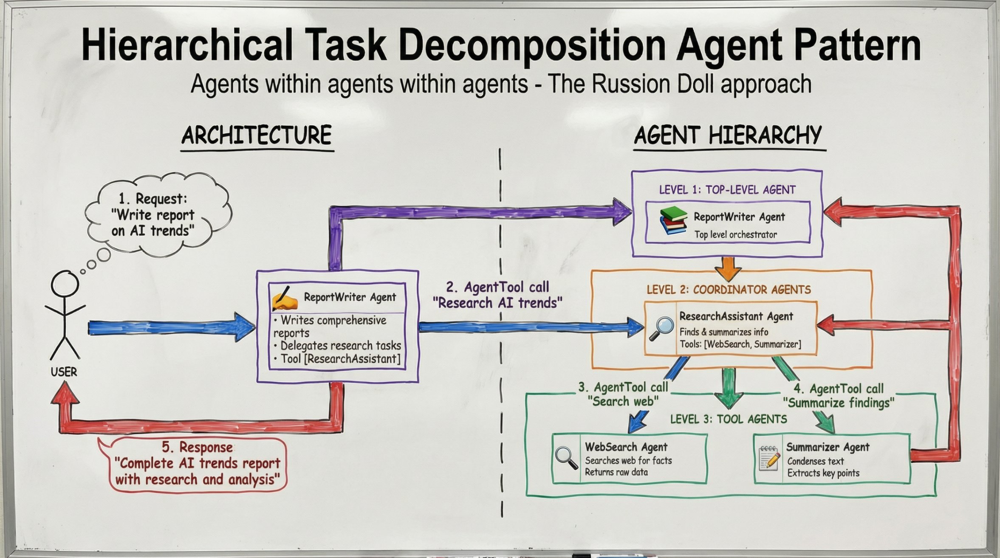
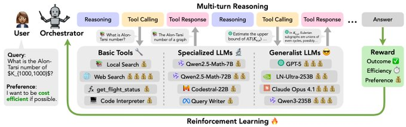

# Demiarch: Product Requirements Document

## Table of Contents

1. [Overview](#1-overview)
2. [Architecture](#2-architecture)
3. [Database Schema](#3-database-schema)
4. [Plugin System](#4-plugin-system)
5. [Multi-Project Support](#5-multi-project-support)
6. [Agent System](#6-agent-system)
7. [LLM Integration](#7-llm-integration)
8. [Cost Management](#8-cost-management)
9. [Error Handling & Network Resilience](#9-error-handling--network-resilience)
10. [CLI Commands](#10-cli-commands)
11. [GUI Specifications](#11-gui-specifications)
12. [Security](#12-security)
13. [Testing Strategy](#13-testing-strategy)
14. [Performance Targets](#14-performance-targets)
15. [Operations & Maintenance](#15-operations--maintenance)

---

## 1. Overview

### 1.1 Vision

Demiarch is a local-first, open-source AI app builder that generates code into users' local repositories through conversational AI.

### 1.2 Core Philosophy

**Code Generation Tool, Not App Runner**
- Demiarch generates code; users run their own projects
- All data stays local (SQLite database)
- No accounts required, no telemetry by default
- User owns everything, can edit freely
- AI respects user edits during regeneration

**Explicit Over Implicit**
- No automatic git operations
- No background processes
- User controls when to sync, commit, push
- Every operation is a deliberate user action

### 1.3 Key Features

| Feature | Description |
|---------|-------------|
| Conversational Discovery | Chat with AI to define project requirements |
| Document Generation | Auto-generate PRD, Architecture, UX docs |
| Phase Planning | Break projects into phases with user stories |
| Multi-Framework | Support all major web, mobile, desktop frameworks |
| Russian Doll Agents | Hierarchical agent delegation for code generation |
| Conflict Resolution | Smart handling of user edits vs AI regeneration |
| Multi-Project | Work on 3-5 projects concurrently with cross-project context |
| Recovery System | Checkpoints and rollback for safe experimentation |
| **Learned Skills** | Auto-extract debugging knowledge as reusable, persistent skills |
| **Progressive Disclosure** | Token-efficient context retrieval (~10x savings via layered summaries) |
| **Dynamic Model Routing** | RL-optimized selection of specialized vs generalist models per task |
| **Lifecycle Hooks** | Extensible hook system for session, generation, and error events |

---

## 2. Architecture

### 2.1 System Overview

```
┌─────────────────────────────────────────────────────────────────┐
│                      User Interfaces                            │
│  ┌─────────────┐  ┌─────────────┐  ┌─────────────┐             │
│  │  CLI (TUI)  │  │  GUI (Tauri)│  │  Future API │             │
│  └──────┬──────┘  └──────┬──────┘  └──────┬──────┘             │
└─────────┼────────────────┼────────────────┼─────────────────────┘
          │                │                │
          ▼                ▼                ▼
┌─────────────────────────────────────────────────────────────────┐
│                    Commands Library (Core)                      │
│  ┌──────────┐ ┌──────────┐ ┌──────────┐ ┌──────────┐          │
│  │ Project  │ │ Generate │ │  Watch   │ │  Sync    │          │
│  └──────────┘ └──────────┘ └──────────┘ └──────────┘          │
└─────────────────────────────────────────────────────────────────┘
          │
          ▼
┌─────────────────────────────────────────────────────────────────┐
│                      Core Systems                               │
│  ┌────────────┐ ┌────────────┐ ┌────────────┐ ┌────────────┐  │
│  │Orchestrator│ │Agent Pool  │ │Plugin Mgr  │ │Lock Manager│  │
│  └────────────┘ └────────────┘ └────────────┘ └────────────┘  │
│  ┌────────────┐ ┌────────────┐ ┌────────────┐ ┌────────────┐  │
│  │Code Gen    │ │Conflict Res│ │Recovery Mgr│ │Session Mgr │  │
│  └────────────┘ └────────────┘ └────────────┘ └────────────┘  │
└─────────────────────────────────────────────────────────────────┘
          │
          ▼
┌─────────────────────────────────────────────────────────────────┐
│                      Data Layer                                 │
│  ┌────────────────────┐  ┌────────────────────┐                │
│  │  SQLite (Primary)  │  │  JSONL (Git Sync)  │                │
│  └────────────────────┘  └────────────────────┘                │
└─────────────────────────────────────────────────────────────────┘
```

### 2.2 Tech Stack

**Backend (Rust)**
```toml
[dependencies]
# Async runtime
tokio = { version = "1.41", features = ["full"] }

# Database
sqlx = { version = "0.8", features = ["sqlite", "runtime-tokio"] }
rusqlite = { version = "0.32", features = ["bundled"] }  # For extension loading

# Serialization
serde = { version = "1.0", features = ["derive"] }
serde_json = "1.0"

# Utilities
uuid = { version = "1.11", features = ["v4", "serde"] }
chrono = { version = "0.4", features = ["serde"] }
hex = "0.4"
base64 = "0.22"

# HTTP
reqwest = { version = "0.12", features = ["json", "rustls-tls"] }

# UI
tauri = "2.1"
clap = { version = "4.5", features = ["derive"] }
ratatui = "0.29"

# Git
git2 = "0.19"

# Logging
tracing = "0.1"
tracing-subscriber = { version = "0.3", features = ["env-filter"] }

# Error handling
thiserror = "2.0"
anyhow = "1.0"

# Caching
lru = "0.12"
moka = { version = "0.12", features = ["future"] }  # Async cache

# Plugin sandbox (WASM)
wasmtime = "27.0"

# Cryptography - Security Critical
ed25519-dalek = "2.1"           # License signing
aes-gcm = "0.10"                # API key encryption
argon2 = "0.5"                  # Key derivation (CRITICAL: replaces raw machine ID)
sha2 = "0.10"                   # Hashing for audit
rand = "0.8"                    # Secure random generation
zeroize = "1.8"                 # Secure memory wiping

# Rate limiting
governor = "0.7"

# Signature verification for updates
ring = "0.17"                   # For update signature verification
```

**Frontend (React + TypeScript)**
```json
{
  "dependencies": {
    "react": "^18.3.0",
    "typescript": "^5.6.0",
    "@tauri-apps/api": "^2.1.0",
    "zustand": "^5.0.0",
    "tailwindcss": "^3.4.0",
    "@radix-ui/react-dialog": "^1.1.0",
    "@radix-ui/react-dropdown-menu": "^2.1.0",
    "@radix-ui/react-tabs": "^1.1.0",
    "@radix-ui/react-toast": "^1.2.0",
    "monaco-editor": "^0.52.0",
    "react-diff-viewer-continued": "^3.4.0",
    "lucide-react": "^0.460.0",
    "dompurify": "^3.2.0"
  }
}
```

### 2.3 CLI as Library Pattern

All commands are library functions, reusable by CLI, GUI, and future APIs:

```rust
// src/commands/mod.rs - Public API
pub mod project;
pub mod generate;
pub mod sync;
pub mod watch;

// Used by CLI
use demiarch::commands::project;
project::create("my-app", Framework::NextJS).await?;

// Used by Tauri GUI
#[tauri::command]
async fn create_project(name: String, framework: String) -> Result<Project, String> {
    demiarch::commands::project::create(&name, framework.parse()?).await
        .map_err(|e| e.to_string())
}
```

### 2.4 Storage Pattern: SQLite + JSONL

**SQLite**: Primary storage for fast queries and transactions
**JSONL**: Git-friendly export format (one record per line)

```bash
# Normal workflow
demiarch create "Add auth"     # Writes to SQLite, sets dirty=1
demiarch generate feat-abc     # Writes to SQLite, sets dirty=1

# Explicit sync (never automatic)
demiarch sync --flush-only     # Export SQLite → JSONL, sets dirty=0
git add .demiarch/ && git commit -m "Add auth feature"

# After git pull on another machine
demiarch sync --import-only    # Import JSONL → SQLite
```

---

## 3. Database Schema

### 3.1 Core Tables

```sql
-- ============================================================
-- PROJECTS & PREFERENCES
-- ============================================================

CREATE TABLE projects (
    id TEXT PRIMARY KEY,
    name TEXT NOT NULL UNIQUE,
    description TEXT,
    status TEXT DEFAULT 'discovery' CHECK (status IN ('discovery', 'planning', 'building', 'complete', 'archived')),
    framework TEXT NOT NULL,
    github_repo_url TEXT NOT NULL,
    openrouter_api_key_encrypted TEXT,
    schema_version INTEGER DEFAULT 1,
    created_at TEXT DEFAULT (datetime('now')),
    updated_at TEXT DEFAULT (datetime('now'))
);

CREATE TABLE user_preferences (
    id TEXT PRIMARY KEY DEFAULT 'default',
    theme TEXT DEFAULT 'system' CHECK (theme IN ('light', 'dark', 'system')),
    default_framework TEXT,
    llm_model TEXT DEFAULT 'anthropic/claude-sonnet-4-20250514',
    locale TEXT DEFAULT 'en-US',
    timezone TEXT DEFAULT 'UTC',
    backup_interval_seconds INTEGER DEFAULT 3600,
    checkpoint_retention_days INTEGER DEFAULT 30,
    checkpoint_max_per_project INTEGER DEFAULT 10,
    cost_daily_limit_usd REAL DEFAULT 10.0,
    cost_alert_threshold REAL DEFAULT 0.8,
    memory_max_mb INTEGER DEFAULT 512,
    created_at TEXT DEFAULT (datetime('now')),
    updated_at TEXT DEFAULT (datetime('now'))
);

-- ============================================================
-- DOCUMENTS & PHASES
-- ============================================================

CREATE TABLE project_documents (
    id TEXT PRIMARY KEY,
    project_id TEXT NOT NULL REFERENCES projects(id) ON DELETE CASCADE,
    doc_type TEXT NOT NULL CHECK (doc_type IN ('prd', 'architecture', 'ux', 'phases', 'readme')),
    content TEXT NOT NULL,
    version INTEGER DEFAULT 1,
    created_at TEXT DEFAULT (datetime('now'))
);

CREATE TABLE phases (
    id TEXT PRIMARY KEY,
    project_id TEXT NOT NULL REFERENCES projects(id) ON DELETE CASCADE,
    name TEXT NOT NULL,
    description TEXT,
    status TEXT DEFAULT 'pending' CHECK (status IN ('pending', 'in_progress', 'complete', 'skipped')),
    order_index INTEGER NOT NULL,
    created_at TEXT DEFAULT (datetime('now'))
);

CREATE TABLE features (
    id TEXT PRIMARY KEY,
    phase_id TEXT NOT NULL REFERENCES phases(id) ON DELETE CASCADE,
    project_id TEXT NOT NULL REFERENCES projects(id) ON DELETE CASCADE,
    name TEXT NOT NULL,
    description TEXT,
    acceptance_criteria TEXT,
    status TEXT DEFAULT 'pending' CHECK (status IN ('pending', 'ready', 'in_progress', 'complete', 'blocked', 'skipped')),
    priority INTEGER DEFAULT 3 CHECK (priority BETWEEN 1 AND 5),
    labels TEXT DEFAULT '[]',  -- JSON array
    dependencies TEXT DEFAULT '[]',  -- JSON array of feature IDs
    estimated_tokens INTEGER,
    actual_tokens INTEGER,
    created_at TEXT DEFAULT (datetime('now')),
    updated_at TEXT DEFAULT (datetime('now'))
);

-- ============================================================
-- CHAT & AGENTS
-- ============================================================

CREATE TABLE chat_messages (
    id TEXT PRIMARY KEY,
    project_id TEXT NOT NULL REFERENCES projects(id) ON DELETE CASCADE,
    role TEXT NOT NULL CHECK (role IN ('user', 'assistant', 'system')),
    content TEXT NOT NULL,
    token_count INTEGER,
    model TEXT,
    created_at TEXT DEFAULT (datetime('now'))
);

CREATE TABLE agent_executions (
    id TEXT PRIMARY KEY,
    project_id TEXT NOT NULL REFERENCES projects(id) ON DELETE CASCADE,
    feature_id TEXT REFERENCES features(id) ON DELETE SET NULL,
    parent_agent_id TEXT REFERENCES agent_executions(id) ON DELETE CASCADE,
    agent_type TEXT NOT NULL CHECK (agent_type IN ('orchestrator', 'planner', 'coder', 'reviewer', 'tester')),
    status TEXT DEFAULT 'pending' CHECK (status IN ('pending', 'running', 'success', 'failed', 'cancelled')),
    input_context TEXT,
    output_result TEXT,
    error_message TEXT,
    prompt_tokens INTEGER DEFAULT 0,
    completion_tokens INTEGER DEFAULT 0,
    cost_usd REAL DEFAULT 0.0,
    started_at TEXT,
    completed_at TEXT,
    created_at TEXT DEFAULT (datetime('now'))
);

-- ============================================================
-- CODE GENERATION & CONFLICTS
-- ============================================================

CREATE TABLE generated_code (
    id TEXT PRIMARY KEY,
    feature_id TEXT NOT NULL REFERENCES features(id) ON DELETE CASCADE,
    project_id TEXT NOT NULL REFERENCES projects(id) ON DELETE CASCADE,
    file_path TEXT NOT NULL,
    content TEXT NOT NULL,
    original_checksum TEXT NOT NULL,
    current_checksum TEXT NOT NULL,
    user_modified INTEGER DEFAULT 0,
    conflict_status TEXT DEFAULT 'none' CHECK (conflict_status IN ('none', 'pending', 'resolved_keep_user', 'resolved_keep_ai', 'resolved_merged')),
    language TEXT,
    created_at TEXT DEFAULT (datetime('now')),
    updated_at TEXT DEFAULT (datetime('now')),
    UNIQUE(feature_id, file_path)
);

CREATE TABLE user_code_edits (
    id TEXT PRIMARY KEY,
    generated_code_id TEXT NOT NULL REFERENCES generated_code(id) ON DELETE CASCADE,
    edit_type TEXT NOT NULL CHECK (edit_type IN ('modify', 'delete', 'rename')),
    old_content TEXT,
    new_content TEXT,
    old_path TEXT,
    new_path TEXT,
    detected_at TEXT DEFAULT (datetime('now'))
);

-- ============================================================
-- RECOVERY & BACKUPS
-- ============================================================

CREATE TABLE checkpoints (
    id TEXT PRIMARY KEY,
    project_id TEXT NOT NULL REFERENCES projects(id) ON DELETE CASCADE,
    feature_id TEXT REFERENCES features(id) ON DELETE SET NULL,
    description TEXT,
    snapshot_data TEXT NOT NULL,  -- JSON: full state snapshot
    size_bytes INTEGER,
    signature TEXT,  -- ed25519 signature for integrity verification
    created_at TEXT DEFAULT (datetime('now')),
    expires_at TEXT
);

CREATE TABLE backups (
    id TEXT PRIMARY KEY,
    project_id TEXT REFERENCES projects(id) ON DELETE SET NULL,
    backup_type TEXT NOT NULL CHECK (backup_type IN ('full', 'incremental', 'project')),
    file_path TEXT NOT NULL,
    size_bytes INTEGER,
    checksum TEXT NOT NULL,
    encrypted INTEGER DEFAULT 0,
    created_at TEXT DEFAULT (datetime('now'))
);

-- ============================================================
-- PLUGINS & LICENSING
-- ============================================================

CREATE TABLE installed_plugins (
    id TEXT PRIMARY KEY,
    name TEXT NOT NULL UNIQUE,
    version TEXT NOT NULL,
    source TEXT NOT NULL CHECK (source IN ('builtin', 'local', 'registry', 'github')),
    source_url TEXT,
    enabled INTEGER DEFAULT 1,
    pricing_model TEXT DEFAULT 'free' CHECK (pricing_model IN ('free', 'paid', 'usage', 'trial', 'watermark')),
    api_version TEXT NOT NULL,
    checksum TEXT,
    installed_at TEXT DEFAULT (datetime('now')),
    updated_at TEXT DEFAULT (datetime('now'))
);

CREATE TABLE plugin_licenses (
    id TEXT PRIMARY KEY,
    plugin_id TEXT NOT NULL REFERENCES installed_plugins(id) ON DELETE CASCADE,
    license_key TEXT NOT NULL,
    license_type TEXT NOT NULL CHECK (license_type IN ('perpetual', 'subscription', 'trial')),
    tier TEXT,
    issued_at TEXT NOT NULL,
    expires_at TEXT,
    signature TEXT NOT NULL,
    validated_at TEXT,
    validation_status TEXT DEFAULT 'pending' CHECK (validation_status IN ('pending', 'valid', 'invalid', 'expired'))
);

CREATE TABLE plugin_usage (
    id TEXT PRIMARY KEY,
    plugin_id TEXT NOT NULL REFERENCES installed_plugins(id) ON DELETE CASCADE,
    project_id TEXT REFERENCES projects(id) ON DELETE SET NULL,
    action TEXT NOT NULL,
    usage_count INTEGER DEFAULT 1,
    period_start TEXT NOT NULL,
    period_end TEXT NOT NULL,
    created_at TEXT DEFAULT (datetime('now'))
);

-- ============================================================
-- COST TRACKING
-- ============================================================

CREATE TABLE llm_usage (
    id TEXT PRIMARY KEY,
    project_id TEXT REFERENCES projects(id) ON DELETE SET NULL,
    agent_execution_id TEXT REFERENCES agent_executions(id) ON DELETE SET NULL,
    model TEXT NOT NULL,
    prompt_tokens INTEGER NOT NULL,
    completion_tokens INTEGER NOT NULL,
    total_tokens INTEGER GENERATED ALWAYS AS (prompt_tokens + completion_tokens) STORED,
    cost_usd REAL NOT NULL,
    cached_tokens INTEGER DEFAULT 0,
    request_timestamp TEXT DEFAULT (datetime('now'))
);

CREATE TABLE cost_alerts (
    id TEXT PRIMARY KEY,
    project_id TEXT REFERENCES projects(id) ON DELETE CASCADE,
    alert_type TEXT NOT NULL CHECK (alert_type IN ('daily_threshold', 'daily_limit', 'project_limit', 'feature_limit')),
    threshold_usd REAL NOT NULL,
    current_usd REAL NOT NULL,
    acknowledged INTEGER DEFAULT 0,
    created_at TEXT DEFAULT (datetime('now'))
);

-- ============================================================
-- MULTI-PROJECT SUPPORT
-- ============================================================

CREATE TABLE global_sessions (
    id TEXT PRIMARY KEY,
    user_id TEXT DEFAULT 'default',
    status TEXT DEFAULT 'active' CHECK (status IN ('active', 'paused', 'completed')),
    current_project_id TEXT REFERENCES projects(id) ON DELETE SET NULL,
    active_project_ids TEXT DEFAULT '[]',  -- JSON array
    context_data TEXT DEFAULT '{}',  -- JSON: context windows, active agents
    started_at TEXT DEFAULT (datetime('now')),
    paused_at TEXT,
    resumed_at TEXT,
    completed_at TEXT
);

CREATE TABLE cross_project_refs (
    id TEXT PRIMARY KEY,
    source_project_id TEXT NOT NULL REFERENCES projects(id) ON DELETE CASCADE,
    target_project_id TEXT NOT NULL REFERENCES projects(id) ON DELETE CASCADE,
    ref_type TEXT NOT NULL CHECK (ref_type IN ('code', 'pattern', 'architecture', 'dependency')),
    description TEXT,
    metadata TEXT DEFAULT '{}',  -- JSON
    created_at TEXT DEFAULT (datetime('now'))
);

CREATE TABLE resource_locks (
    id TEXT PRIMARY KEY,
    project_id TEXT NOT NULL REFERENCES projects(id) ON DELETE CASCADE,
    feature_id TEXT REFERENCES features(id) ON DELETE CASCADE,
    agent_id TEXT NOT NULL,
    resource_type TEXT NOT NULL CHECK (resource_type IN ('file', 'database', 'llm', 'feature')),
    resource_key TEXT NOT NULL,
    acquired_at TEXT DEFAULT (datetime('now')),
    expires_at TEXT,
    released_at TEXT,
    UNIQUE(project_id, resource_type, resource_key, released_at)
);

-- ============================================================
-- LEARNED SKILLS & KNOWLEDGE EXTRACTION
-- (Inspired by Claudeception's autonomous skill extraction)
-- ============================================================

CREATE TABLE learned_skills (
    id TEXT PRIMARY KEY,
    project_id TEXT REFERENCES projects(id) ON DELETE SET NULL,  -- NULL = global skill
    name TEXT NOT NULL,
    description TEXT NOT NULL,  -- Critical for retrieval; specific, error-focused
    problem TEXT NOT NULL,
    trigger_conditions TEXT NOT NULL,  -- JSON array of error patterns/scenarios
    solution TEXT NOT NULL,
    verification TEXT,
    category TEXT DEFAULT 'debugging' CHECK (category IN ('debugging', 'pattern', 'workaround', 'optimization', 'integration')),
    quality_score REAL DEFAULT 0.0 CHECK (quality_score >= 0.0 AND quality_score <= 1.0),  -- RL-updated quality metric (0.0-1.0)
    usage_count INTEGER DEFAULT 0,
    success_count INTEGER DEFAULT 0,
    last_used_at TEXT,
    source_agent_id TEXT REFERENCES agent_executions(id) ON DELETE SET NULL,
    version INTEGER DEFAULT 1,
    is_verified INTEGER DEFAULT 0,
    created_at TEXT DEFAULT (datetime('now')),
    updated_at TEXT DEFAULT (datetime('now'))
);

CREATE TABLE skill_embeddings (
    id TEXT PRIMARY KEY,
    skill_id TEXT NOT NULL REFERENCES learned_skills(id) ON DELETE CASCADE,
    embedding_model TEXT NOT NULL,
    embedding BLOB NOT NULL,  -- Vector embedding for semantic search
    created_at TEXT DEFAULT (datetime('now'))
);

CREATE TABLE skill_activations (
    id TEXT PRIMARY KEY,
    skill_id TEXT NOT NULL REFERENCES learned_skills(id) ON DELETE CASCADE,
    agent_execution_id TEXT REFERENCES agent_executions(id) ON DELETE SET NULL,
    activation_type TEXT NOT NULL CHECK (activation_type IN ('automatic', 'explicit', 'suggested')),
    trigger_matched TEXT,  -- Which trigger condition matched
    outcome TEXT CHECK (outcome IN ('success', 'failure', 'partial', 'skipped')),
    feedback TEXT,
    created_at TEXT DEFAULT (datetime('now'))
);

-- ============================================================
-- CONTEXT MEMORY & PROGRESSIVE DISCLOSURE
-- (Inspired by Claude-mem's token-efficient retrieval)
-- ============================================================

CREATE TABLE context_summaries (
    id TEXT PRIMARY KEY,
    project_id TEXT NOT NULL REFERENCES projects(id) ON DELETE CASCADE,
    session_id TEXT REFERENCES global_sessions(id) ON DELETE SET NULL,
    summary_type TEXT NOT NULL CHECK (summary_type IN ('session', 'feature', 'conversation', 'agent_execution')),
    source_id TEXT,  -- ID of the summarized entity
    summary_text TEXT NOT NULL,
    detail_level INTEGER DEFAULT 1 CHECK (detail_level BETWEEN 1 AND 3),  -- 1=index, 2=timeline, 3=full
    token_count INTEGER,
    parent_summary_id TEXT REFERENCES context_summaries(id) ON DELETE SET NULL,
    created_at TEXT DEFAULT (datetime('now'))
);

CREATE TABLE context_embeddings (
    id TEXT PRIMARY KEY,
    summary_id TEXT NOT NULL REFERENCES context_summaries(id) ON DELETE CASCADE,
    embedding_model TEXT NOT NULL,
    embedding BLOB NOT NULL,
    created_at TEXT DEFAULT (datetime('now'))
);

-- ============================================================
-- MODEL ROUTING & REINFORCEMENT LEARNING
-- (Inspired by multi-turn reasoning orchestration patterns)
-- ============================================================

CREATE TABLE model_routing_rules (
    id TEXT PRIMARY KEY,
    task_type TEXT NOT NULL CHECK (task_type IN ('code_generation', 'code_review', 'debugging', 'planning', 'documentation', 'testing', 'math', 'general')),
    model_id TEXT NOT NULL,
    priority INTEGER DEFAULT 1,
    min_quality_score REAL DEFAULT 0.0,
    max_cost_per_1k REAL,
    is_specialized INTEGER DEFAULT 0,  -- 1 for task-specific models
    enabled INTEGER DEFAULT 1,
    created_at TEXT DEFAULT (datetime('now'))
);

CREATE TABLE model_performance (
    id TEXT PRIMARY KEY,
    model_id TEXT NOT NULL,
    task_type TEXT NOT NULL,
    outcome TEXT NOT NULL CHECK (outcome IN ('success', 'failure', 'partial')),
    quality_score REAL,  -- User feedback or automated eval
    latency_ms INTEGER,
    tokens_used INTEGER,
    cost_usd REAL,
    created_at TEXT DEFAULT (datetime('now'))
);

CREATE TABLE routing_decisions (
    id TEXT PRIMARY KEY,
    agent_execution_id TEXT REFERENCES agent_executions(id) ON DELETE CASCADE,
    task_type TEXT NOT NULL,
    selected_model TEXT NOT NULL,
    selection_reason TEXT,  -- 'specialized', 'cost_optimal', 'quality_optimal', 'fallback'
    alternatives_considered TEXT,  -- JSON array of other models considered
    created_at TEXT DEFAULT (datetime('now'))
);

-- ============================================================
-- LIFECYCLE HOOKS
-- (Inspired by Claude-mem's hook-based architecture)
-- ============================================================

CREATE TABLE lifecycle_hooks (
    id TEXT PRIMARY KEY,
    hook_type TEXT NOT NULL CHECK (hook_type IN ('session_start', 'session_end', 'pre_generation', 'post_generation', 'post_tool_use', 'on_error', 'on_checkpoint')),
    name TEXT NOT NULL,
    description TEXT,
    handler_type TEXT NOT NULL CHECK (handler_type IN ('internal', 'plugin', 'script')),
    handler_config TEXT NOT NULL,  -- JSON: plugin_id, script_path, or internal handler name
    priority INTEGER DEFAULT 100,
    enabled INTEGER DEFAULT 1,
    created_at TEXT DEFAULT (datetime('now'))
);

CREATE TABLE hook_executions (
    id TEXT PRIMARY KEY,
    hook_id TEXT NOT NULL REFERENCES lifecycle_hooks(id) ON DELETE CASCADE,
    session_id TEXT REFERENCES global_sessions(id) ON DELETE SET NULL,
    trigger_context TEXT,  -- JSON: what triggered this hook
    result TEXT CHECK (result IN ('success', 'failure', 'skipped')),
    output TEXT,
    duration_ms INTEGER,
    created_at TEXT DEFAULT (datetime('now'))
);

-- ============================================================
-- OFFLINE QUEUE & OPERATIONS
-- ============================================================

CREATE TABLE queued_operations (
    id TEXT PRIMARY KEY,
    operation_type TEXT NOT NULL CHECK (operation_type IN ('llm_request', 'sync', 'backup', 'plugin_action')),
    payload TEXT NOT NULL,  -- JSON: operation-specific data
    status TEXT DEFAULT 'pending' CHECK (status IN ('pending', 'processing', 'completed', 'failed')),
    retry_count INTEGER DEFAULT 0,
    max_retries INTEGER DEFAULT 3,
    last_error TEXT,
    created_at TEXT DEFAULT (datetime('now')),
    processed_at TEXT
);

-- ============================================================
-- CHAT SESSIONS (Groups chat messages by session)
-- ============================================================

CREATE TABLE chat_sessions (
    id TEXT PRIMARY KEY,
    project_id TEXT NOT NULL REFERENCES projects(id) ON DELETE CASCADE,
    global_session_id TEXT REFERENCES global_sessions(id) ON DELETE SET NULL,
    title TEXT,
    status TEXT DEFAULT 'active' CHECK (status IN ('active', 'archived')),
    message_count INTEGER DEFAULT 0,
    total_tokens INTEGER DEFAULT 0,
    created_at TEXT DEFAULT (datetime('now')),
    updated_at TEXT DEFAULT (datetime('now'))
);

-- Update chat_messages to reference chat_sessions
-- Note: Add session_id column via migration if upgrading existing schema
-- ALTER TABLE chat_messages ADD COLUMN session_id TEXT REFERENCES chat_sessions(id);

-- ============================================================
-- PLUGIN CONFIGURATION (Per-plugin settings storage)
-- ============================================================

CREATE TABLE plugin_config (
    id TEXT PRIMARY KEY,
    plugin_id TEXT NOT NULL REFERENCES installed_plugins(id) ON DELETE CASCADE,
    config_key TEXT NOT NULL,
    config_value TEXT NOT NULL,  -- JSON value
    is_secret INTEGER DEFAULT 0,  -- 1 if encrypted
    created_at TEXT DEFAULT (datetime('now')),
    updated_at TEXT DEFAULT (datetime('now')),
    UNIQUE(plugin_id, config_key)
);

-- ============================================================
-- AUDIT LOG (Security and compliance tracking)
-- ============================================================

CREATE TABLE audit_log (
    id TEXT PRIMARY KEY,
    event_type TEXT NOT NULL CHECK (event_type IN (
        'project_created', 'project_deleted', 'project_archived',
        'feature_generated', 'feature_deleted',
        'api_key_changed', 'api_key_accessed',
        'plugin_installed', 'plugin_removed', 'plugin_enabled', 'plugin_disabled',
        'backup_created', 'backup_restored',
        'config_changed', 'login', 'export', 'import'
    )),
    entity_type TEXT,  -- 'project', 'feature', 'plugin', etc.
    entity_id TEXT,
    details TEXT,  -- JSON: event-specific details (sanitized, no secrets)
    ip_address TEXT,  -- For future multi-user support
    user_agent TEXT,
    created_at TEXT DEFAULT (datetime('now'))
);

-- ============================================================
-- CONFLICT RESOLUTION HISTORY
-- ============================================================

CREATE TABLE conflict_resolutions (
    id TEXT PRIMARY KEY,
    generated_code_id TEXT NOT NULL REFERENCES generated_code(id) ON DELETE CASCADE,
    resolution_type TEXT NOT NULL CHECK (resolution_type IN ('keep_user', 'keep_ai', 'merge', 'manual')),
    user_content_before TEXT,
    ai_content_before TEXT,
    merged_content TEXT,
    resolved_by TEXT DEFAULT 'user',  -- 'user', 'auto', 'ai'
    created_at TEXT DEFAULT (datetime('now'))
);

-- ============================================================
-- API KEY ROTATION TRACKING
-- ============================================================

CREATE TABLE api_key_history (
    id TEXT PRIMARY KEY,
    key_type TEXT NOT NULL CHECK (key_type IN ('openrouter', 'plugin')),
    key_identifier TEXT NOT NULL,  -- Last 4 chars or hash, never full key
    plugin_id TEXT REFERENCES installed_plugins(id) ON DELETE CASCADE,
    rotated_at TEXT DEFAULT (datetime('now')),
    rotated_reason TEXT CHECK (rotated_reason IN ('manual', 'scheduled', 'compromised', 'expired')),
    previous_key_hash TEXT  -- SHA-256 hash for audit, not the key itself
);

-- ============================================================
-- RATE LIMITING PER PROJECT
-- ============================================================

CREATE TABLE project_rate_limits (
    id TEXT PRIMARY KEY,
    project_id TEXT NOT NULL REFERENCES projects(id) ON DELETE CASCADE,
    limit_type TEXT NOT NULL CHECK (limit_type IN ('daily_cost', 'hourly_requests', 'concurrent_agents')),
    limit_value REAL NOT NULL,
    current_value REAL DEFAULT 0,
    reset_at TEXT,  -- When the limit resets
    created_at TEXT DEFAULT (datetime('now')),
    UNIQUE(project_id, limit_type)
);

-- ============================================================
-- GENERATION CLEANUP TRACKING (for rollback on failure)
-- ============================================================

CREATE TABLE generation_transactions (
    id TEXT PRIMARY KEY,
    feature_id TEXT NOT NULL REFERENCES features(id) ON DELETE CASCADE,
    agent_execution_id TEXT REFERENCES agent_executions(id) ON DELETE SET NULL,
    status TEXT DEFAULT 'in_progress' CHECK (status IN ('in_progress', 'completed', 'failed', 'rolled_back')),
    files_created TEXT DEFAULT '[]',  -- JSON array of file paths
    files_modified TEXT DEFAULT '[]',  -- JSON array of {path, original_checksum}
    started_at TEXT DEFAULT (datetime('now')),
    completed_at TEXT,
    rolled_back_at TEXT,
    rollback_reason TEXT
);

-- ============================================================
-- METADATA & SYNC
-- ============================================================

CREATE TABLE metadata (
    key TEXT PRIMARY KEY,
    value TEXT NOT NULL,
    updated_at TEXT DEFAULT (datetime('now'))
);

-- Initialize metadata
INSERT INTO metadata (key, value) VALUES
    ('dirty', '0'),
    ('schema_version', '1'),
    ('last_sync_at', NULL),
    ('last_backup_at', NULL);

-- ============================================================
-- INDEXES
-- ============================================================

-- Projects
CREATE INDEX idx_projects_status ON projects(status);
CREATE INDEX idx_projects_framework ON projects(framework);

-- Features
CREATE INDEX idx_features_phase ON features(phase_id);
CREATE INDEX idx_features_project ON features(project_id);
CREATE INDEX idx_features_status ON features(status);
CREATE INDEX idx_features_priority ON features(priority);
CREATE INDEX idx_features_status_priority ON features(status, priority);

-- Agents
CREATE INDEX idx_agents_project ON agent_executions(project_id);
CREATE INDEX idx_agents_feature ON agent_executions(feature_id);
CREATE INDEX idx_agents_parent ON agent_executions(parent_agent_id);
CREATE INDEX idx_agents_status ON agent_executions(status);

-- Generated Code
CREATE INDEX idx_generated_code_feature ON generated_code(feature_id);
CREATE INDEX idx_generated_code_project ON generated_code(project_id);
CREATE INDEX idx_generated_code_conflict ON generated_code(conflict_status) WHERE conflict_status != 'none';

-- Chat
CREATE INDEX idx_chat_project ON chat_messages(project_id);
CREATE INDEX idx_chat_created ON chat_messages(created_at);

-- Checkpoints
CREATE INDEX idx_checkpoints_project ON checkpoints(project_id);
CREATE INDEX idx_checkpoints_expires ON checkpoints(expires_at) WHERE expires_at IS NOT NULL;

-- LLM Usage
CREATE INDEX idx_llm_usage_project ON llm_usage(project_id);
CREATE INDEX idx_llm_usage_timestamp ON llm_usage(request_timestamp);
CREATE INDEX idx_llm_usage_project_day ON llm_usage(project_id, date(request_timestamp));

-- Locks
CREATE INDEX idx_locks_active ON resource_locks(project_id, resource_type, resource_key) WHERE released_at IS NULL;

-- Learned Skills
CREATE INDEX idx_skills_project ON learned_skills(project_id);
CREATE INDEX idx_skills_category ON learned_skills(category);
CREATE INDEX idx_skills_quality ON learned_skills(quality_score DESC);
CREATE INDEX idx_skills_usage ON learned_skills(usage_count DESC);
CREATE INDEX idx_skill_activations_skill ON skill_activations(skill_id);
CREATE INDEX idx_skill_activations_outcome ON skill_activations(outcome);

-- Context & Progressive Disclosure
CREATE INDEX idx_context_summaries_project ON context_summaries(project_id);
CREATE INDEX idx_context_summaries_session ON context_summaries(session_id);
CREATE INDEX idx_context_summaries_type ON context_summaries(summary_type);
CREATE INDEX idx_context_summaries_level ON context_summaries(detail_level);

-- Model Routing
CREATE INDEX idx_routing_rules_task ON model_routing_rules(task_type);
CREATE INDEX idx_model_performance_model ON model_performance(model_id);
CREATE INDEX idx_model_performance_task ON model_performance(task_type);
CREATE INDEX idx_routing_decisions_agent ON routing_decisions(agent_execution_id);

-- Lifecycle Hooks
CREATE INDEX idx_hooks_type ON lifecycle_hooks(hook_type);
CREATE INDEX idx_hook_executions_hook ON hook_executions(hook_id);
CREATE INDEX idx_hook_executions_session ON hook_executions(session_id);

-- Queued Operations
CREATE INDEX idx_queued_ops_status ON queued_operations(status);
CREATE INDEX idx_queued_ops_type ON queued_operations(operation_type);
CREATE INDEX idx_queued_ops_created ON queued_operations(created_at);

-- Chat Sessions
CREATE INDEX idx_chat_sessions_project ON chat_sessions(project_id);
CREATE INDEX idx_chat_sessions_global ON chat_sessions(global_session_id);

-- Plugin Config
CREATE INDEX idx_plugin_config_plugin ON plugin_config(plugin_id);

-- Audit Log
CREATE INDEX idx_audit_log_type ON audit_log(event_type);
CREATE INDEX idx_audit_log_entity ON audit_log(entity_type, entity_id);
CREATE INDEX idx_audit_log_created ON audit_log(created_at);

-- Conflict Resolutions
CREATE INDEX idx_conflict_resolutions_code ON conflict_resolutions(generated_code_id);

-- API Key History
CREATE INDEX idx_api_key_history_type ON api_key_history(key_type);
CREATE INDEX idx_api_key_history_rotated ON api_key_history(rotated_at);

-- Project Rate Limits
CREATE INDEX idx_project_rate_limits_project ON project_rate_limits(project_id);
CREATE INDEX idx_project_rate_limits_reset ON project_rate_limits(reset_at);

-- Generation Transactions
CREATE INDEX idx_gen_transactions_feature ON generation_transactions(feature_id);
CREATE INDEX idx_gen_transactions_status ON generation_transactions(status);
```

### 3.2 Vector Search Extension

**Required Extension:** SQLite does not natively support vector operations. Install one of:

```toml
# Option 1: sqlite-vss (recommended)
# https://github.com/asg017/sqlite-vss
[dependencies]
sqlite-vss = "0.1"

# Option 2: sqlite-vec (newer, pure Rust)
# https://github.com/asg017/sqlite-vec
sqlite-vec = "0.1"
```

**Initialization:**
```rust
use rusqlite::Connection;

pub fn init_vector_extension(conn: &Connection) -> Result<()> {
    // Load the vector extension
    unsafe {
        conn.load_extension_enable()?;
        conn.load_extension("vector0", None)?;  // or "vss0" for sqlite-vss
        conn.load_extension_disable()?;
    }
    Ok(())
}

/// Vector distance function wrapper
/// Embeddings are stored as BLOB (f32 array, 1536 dimensions for text-embedding-3-small)
pub fn vector_distance(a: &[f32], b: &[f32]) -> f32 {
    // Cosine distance: 1 - cosine_similarity
    let dot: f32 = a.iter().zip(b.iter()).map(|(x, y)| x * y).sum();
    let norm_a: f32 = a.iter().map(|x| x * x).sum::<f32>().sqrt();
    let norm_b: f32 = b.iter().map(|x| x * x).sum::<f32>().sqrt();
    1.0 - (dot / (norm_a * norm_b))
}
```

**Embedding Column Specification:**
- Model: `text-embedding-3-small` (OpenAI) or equivalent
- Dimensions: 1536 (configurable)
- Storage: BLOB containing packed f32 array (1536 * 4 = 6144 bytes)
- Distance metric: Cosine distance (lower = more similar)

### 3.3 Migration Strategy

```sql
-- migrations/V1__initial.sql
-- (All tables above)

-- migrations/V2__example_future.sql
BEGIN TRANSACTION;

-- Add new column with default
ALTER TABLE features ADD COLUMN estimated_complexity TEXT DEFAULT 'medium';

-- Migrate existing data
UPDATE features SET estimated_complexity = 'high' WHERE priority <= 2;

-- Update schema version
UPDATE metadata SET value = '2', updated_at = datetime('now') WHERE key = 'schema_version';

COMMIT;
```

**Migration Runner:**
```rust
pub async fn run_migrations(pool: &SqlitePool) -> Result<()> {
    let current: i32 = sqlx::query_scalar("SELECT value FROM metadata WHERE key = 'schema_version'")
        .fetch_one(pool).await?.parse()?;

    let migrations = vec![
        (2, include_str!("../migrations/V2__example.sql")),
        // Add future migrations here
    ];

    for (version, sql) in migrations {
        if version > current {
            sqlx::raw_sql(sql).execute(pool).await?;
            info!("Applied migration V{}", version);
        }
    }
    Ok(())
}
```

---

## 4. Plugin System

### 4.1 Plugin Architecture

```rust
/// Core trait all framework plugins must implement
#[async_trait]
pub trait FrameworkPlugin: Send + Sync {
    fn manifest(&self) -> &PluginManifest;
    async fn generate_component(&self, spec: &ComponentSpec) -> Result<GeneratedFiles>;
    async fn generate_api_route(&self, spec: &ApiRouteSpec) -> Result<GeneratedFiles>;
    async fn generate_model(&self, spec: &ModelSpec) -> Result<GeneratedFiles>;
    async fn validate_code(&self, code: &str, file_type: FileType) -> Result<ValidationReport>;
    fn project_structure(&self) -> &ProjectStructure;
    fn required_dependencies(&self) -> Vec<Dependency>;
}

#[derive(Debug, Serialize, Deserialize)]
pub struct PluginManifest {
    pub name: String,
    pub version: String,
    pub api_version: String,
    pub min_demiarch_version: String,
    pub max_demiarch_version: Option<String>,
    pub framework_type: FrameworkType,
    pub pricing: PricingModel,
    pub capabilities: PluginCapabilities,
}

#[derive(Debug, Serialize, Deserialize)]
pub struct PluginCapabilities {
    pub read_files: bool,
    pub write_files: bool,
    pub network: bool,
    pub execute_commands: bool,
    pub max_memory_mb: u32,
    pub max_cpu_seconds: u32,
}
```

### 4.2 Built-in Plugins

| Framework | Type | Status |
|-----------|------|--------|
| Next.js 14+ | Web | Built-in |
| React + Vite | Web | Built-in |
| Vue 3 + Vite | Web | Built-in |
| SvelteKit | Web | Built-in |
| Nuxt 3 | Web | Built-in |
| React Native | Mobile | Built-in |
| Flutter | Mobile | Built-in |
| iOS (Swift) | Mobile | Built-in |
| Android (Kotlin) | Mobile | Built-in |
| Node.js/Express | Backend | Built-in |
| Python/FastAPI | Backend | Built-in |
| Go/Gin | Backend | Built-in |

### 4.3 Pricing Models

```rust
#[derive(Debug, Serialize, Deserialize)]
pub enum PricingModel {
    Free,
    Paid { tiers: Vec<PricingTier> },
    UsageBased { free_quota: u32, period: Period, overage_price_usd: f64 },
    Trial { trial_days: u32, price_usd: f64 },
    Watermark { removal_price_usd: f64 },
}
```

### 4.4 Plugin Security Sandbox (WASM)

```rust
use wasmtime::*;

pub struct PluginSandbox {
    engine: Engine,
    linker: Linker<SandboxState>,
}

impl PluginSandbox {
    pub fn new(capabilities: PluginCapabilities) -> Result<Self> {
        let mut config = Config::new();
        config.consume_fuel(true);  // CPU limiting
        config.max_wasm_stack(1024 * 1024);  // 1MB stack

        let engine = Engine::new(&config)?;
        let mut linker = Linker::new(&engine);

        // Only link allowed capabilities
        if capabilities.read_files {
            linker.func_wrap("env", "read_file", Self::sandbox_read_file)?;
        }
        if capabilities.write_files {
            linker.func_wrap("env", "write_file", Self::sandbox_write_file)?;
        }
        // Network/execute NOT linked by default

        Ok(Self { engine, linker })
    }

    pub async fn execute_plugin(
        &mut self,
        wasm_bytes: &[u8],
        function: &str,
        input: &[u8],
        timeout_secs: u64,
    ) -> Result<Vec<u8>> {
        let module = Module::new(&self.engine, wasm_bytes)?;
        let mut store = Store::new(&self.engine, SandboxState::default());
        store.set_fuel(timeout_secs * 1_000_000)?;

        let instance = self.linker.instantiate(&mut store, &module)?;
        let func = instance.get_typed_func::<(i32, i32), i32>(&mut store, function)?;

        tokio::time::timeout(
            Duration::from_secs(timeout_secs),
            async { func.call_async(&mut store, (input.as_ptr() as i32, input.len() as i32)).await }
        ).await??;

        Ok(self.read_output(&store))
    }
}
```

### 4.5 Offline License Verification

```rust
use ed25519_dalek::{Verifier, VerifyingKey, Signature};

pub struct LicenseVerifier {
    public_key: VerifyingKey,
}

impl LicenseVerifier {
    pub fn verify(&self, license: &PluginLicense) -> Result<LicenseStatus> {
        let message = format!("{}:{}:{}:{}", 
            license.plugin_id, license.license_key, license.tier,
            license.expires_at.map(|t| t.to_rfc3339()).unwrap_or_default()
        );
        let signature = Signature::from_bytes(&license.signature)?;
        self.public_key.verify(message.as_bytes(), &signature)?;

        if let Some(expires) = license.expires_at {
            if expires < Utc::now() {
                return Ok(LicenseStatus::Expired);
            }
        }
        Ok(LicenseStatus::Valid { tier: license.tier.clone() })
    }
}
```

---

## 5. Multi-Project Support

### 5.1 Session Management

```rust
pub struct SessionManager {
    sessions: RwLock<HashMap<String, Session>>,
    db: SqlitePool,
}

pub struct Session {
    pub id: String,
    pub status: SessionStatus,
    pub current_project_id: Option<String>,
    pub active_project_ids: Vec<String>,
    pub agents: HashMap<String, Vec<String>>,
    pub context_windows: HashMap<String, ContextWindow>,
    pub started_at: DateTime<Utc>,
}

impl SessionManager {
    pub async fn create_session(&self) -> Result<String> {
        let session = Session {
            id: Uuid::new_v4().to_string(),
            status: SessionStatus::Active,
            ..Default::default()
        };
        sqlx::query!(
            "INSERT INTO global_sessions (id, status, started_at) VALUES (?, 'active', ?)",
            session.id, session.started_at
        ).execute(&self.db).await?;
        
        let id = session.id.clone();
        self.sessions.write().await.insert(id.clone(), session);
        Ok(id)
    }

    pub async fn switch_project(&self, session_id: &str, project_id: &str) -> Result<()> {
        let mut sessions = self.sessions.write().await;
        let session = sessions.get_mut(session_id).ok_or(Error::SessionNotFound)?;
        session.active_project_ids.retain(|id| id != project_id);
        session.active_project_ids.insert(0, project_id.to_string());
        session.current_project_id = Some(project_id.to_string());
        Ok(())
    }

    pub async fn recover_session(&self, session_id: &str) -> Result<Session> {
        let row = sqlx::query!("SELECT * FROM global_sessions WHERE id = ?", session_id)
            .fetch_one(&self.db).await?;
        // Reconstruct session from database
        Ok(Session::from_row(row))
    }
}
```

### 5.2 Lock Manager (Correct Implementation)

```rust
use tokio::sync::{RwLock, Semaphore, OwnedSemaphorePermit};

#[derive(Debug, Clone, Hash, Eq, PartialEq)]
pub struct LockKey {
    pub project_id: String,
    pub resource_type: ResourceType,
    pub resource_key: String,
}

#[derive(Debug, Clone, Hash, Eq, PartialEq)]
pub enum ResourceType { File, Database, LLM, Feature }

pub struct LockManager {
    locks: Arc<RwLock<HashMap<LockKey, Arc<Semaphore>>>>,
    holders: Arc<RwLock<HashMap<LockKey, LockInfo>>>,
    db: SqlitePool,
}

pub struct LockInfo {
    pub holder_agent_id: String,
    pub acquired_at: DateTime<Utc>,
    pub permit: OwnedSemaphorePermit,
}

impl LockManager {
    pub async fn acquire(&self, agent_id: &str, key: LockKey, timeout_secs: u64) -> Result<LockGuard> {
        let semaphore = {
            let mut locks = self.locks.write().await;
            locks.entry(key.clone())
                .or_insert_with(|| Arc::new(Semaphore::new(1)))
                .clone()
        };

        let permit = tokio::time::timeout(
            Duration::from_secs(timeout_secs),
            semaphore.clone().acquire_owned()
        ).await.map_err(|_| Error::LockTimeout(key.clone()))??;

        let info = LockInfo {
            holder_agent_id: agent_id.to_string(),
            acquired_at: Utc::now(),
            permit,
        };

        // Persist for crash recovery
        sqlx::query!(
            "INSERT INTO resource_locks (id, project_id, agent_id, resource_type, resource_key, acquired_at)
             VALUES (?, ?, ?, ?, ?, ?)",
            Uuid::new_v4().to_string(), key.project_id, agent_id,
            format!("{:?}", key.resource_type), key.resource_key, info.acquired_at
        ).execute(&self.db).await?;

        self.holders.write().await.insert(key.clone(), info);
        Ok(LockGuard { key, manager: Arc::new(self.clone()) })
    }

    pub async fn release(&self, key: &LockKey) -> Result<()> {
        self.holders.write().await.remove(key);
        sqlx::query!(
            "UPDATE resource_locks SET released_at = datetime('now')
             WHERE project_id = ? AND resource_type = ? AND resource_key = ? AND released_at IS NULL",
            key.project_id, format!("{:?}", key.resource_type), key.resource_key
        ).execute(&self.db).await?;
        Ok(())
    }
}

pub struct LockGuard {
    key: LockKey,
    manager: Arc<LockManager>,
}

impl LockGuard {
    pub async fn release(self) -> Result<()> {
        self.manager.release(&self.key).await
    }
}

impl Drop for LockGuard {
    fn drop(&mut self) {
        // Non-blocking release via spawn
        let key = self.key.clone();
        let manager = self.manager.clone();
        tokio::spawn(async move {
            let _ = manager.release(&key).await;
        });
    }
}
```

### 5.3 Cross-Project Search

```rust
pub struct CrossProjectCoordinator {
    session_manager: Arc<SessionManager>,
    lock_manager: Arc<LockManager>,
    db: SqlitePool,
}

impl CrossProjectCoordinator {
    pub async fn search(&self, query: &str, project_ids: &[String]) -> Result<Vec<SearchResult>> {
        let futures: Vec<_> = project_ids.iter()
            .map(|pid| search_project(&self.db, pid, query))
            .collect();
        
        let results = futures::future::join_all(futures).await;
        Ok(results.into_iter().filter_map(Result::ok).flatten().collect())
    }

    pub async fn share_context(&self, from: &str, to: &str, ref_type: &str) -> Result<String> {
        let id = Uuid::new_v4().to_string();
        sqlx::query!(
            "INSERT INTO cross_project_refs (id, source_project_id, target_project_id, ref_type) VALUES (?, ?, ?, ?)",
            id, from, to, ref_type
        ).execute(&self.db).await?;
        Ok(id)
    }
}
```

---

## 6. Agent System

### 6.1 Russian Doll Architecture

The agent system follows the **Hierarchical Task Decomposition Agent Pattern** - "Agents within agents within agents."



**Three-Level Hierarchy:**

| Level | Agent Type | Role | Delegates To |
|-------|------------|------|--------------|
| **Level 1: Top-Level** | Orchestrator | Coordinates overall code generation for a feature | Planner |
| **Level 2: Coordinator** | Planner | Breaks features into tasks, delegates to workers | Coder, Reviewer, Tester |
| **Level 3: Tool Agents** | Coder, Reviewer, Tester | Execute specific tasks, return results up the chain | (leaf nodes) |

**Execution Flow:**
1. User requests feature generation
2. **Orchestrator** receives request, spawns **Planner** via `AgentTool` call
3. **Planner** decomposes feature into tasks, spawns **Coder** agents
4. **Coder** generates code, **Reviewer** validates, **Tester** creates tests
5. Results bubble back up through the hierarchy
6. **Orchestrator** returns complete feature implementation

```rust
#[derive(Debug, Clone)]
pub enum AgentType {
    Orchestrator,  // Level 1: Top-level coordinator
    Planner,       // Level 2: Breaks features into tasks
    Coder,         // Level 3: Generates code
    Reviewer,      // Level 3: Reviews generated code
    Tester,        // Level 3: Generates tests
}

pub struct Agent {
    pub id: String,
    pub agent_type: AgentType,
    pub parent_id: Option<String>,
    pub project_id: String,
    pub feature_id: Option<String>,
    pub context: AgentContext,
}

impl Agent {
    pub async fn spawn_child(&self, agent_type: AgentType, task: &str, db: &SqlitePool) -> Result<Agent> {
        let child = Agent {
            id: Uuid::new_v4().to_string(),
            agent_type,
            parent_id: Some(self.id.clone()),
            project_id: self.project_id.clone(),
            feature_id: self.feature_id.clone(),
            context: AgentContext::new_for_task(task),
        };
        sqlx::query!(
            "INSERT INTO agent_executions (id, project_id, feature_id, parent_agent_id, agent_type, status)
             VALUES (?, ?, ?, ?, ?, 'pending')",
            child.id, child.project_id, child.feature_id, child.parent_id, format!("{:?}", child.agent_type)
        ).execute(db).await?;
        Ok(child)
    }
}
```

### 6.2 Context Management

```rust
pub struct ContextManager {
    max_tokens: usize,
    reserved_for_response: usize,
}

impl ContextManager {
    pub fn new(max_tokens: usize) -> Self {
        Self { max_tokens, reserved_for_response: max_tokens / 4 }
    }

    pub fn add_message(&self, context: &mut AgentContext, message: ChatMessage) {
        let tokens = count_tokens(&message.content);
        let available = self.max_tokens - self.reserved_for_response;

        // Prune oldest non-system messages
        while context.current_tokens + tokens > available && context.messages.len() > 1 {
            if let Some(pos) = context.messages.iter().position(|m| m.role != "system") {
                let removed = context.messages.remove(pos);
                context.current_tokens -= count_tokens(&removed.content);
            } else { break; }
        }
        context.messages.push(message);
        context.current_tokens += tokens;
    }

    pub async fn summarize_if_needed(&self, ctx: &mut AgentContext, llm: &LLMClient) -> Result<()> {
        if ctx.messages.len() < 10 { return Ok(()); }

        let to_summarize: Vec<_> = ctx.messages.iter()
            .enumerate()
            .filter(|(_, m)| m.role != "system")
            .take(ctx.messages.len() / 2)
            .map(|(i, _)| i)
            .collect();

        let summary = llm.summarize(&ctx.messages, &to_summarize).await?;
        for i in to_summarize.into_iter().rev() { ctx.messages.remove(i); }
        ctx.messages.insert(1, ChatMessage::system(&format!("[Summary: {}]", summary)));
        ctx.current_tokens = ctx.messages.iter().map(|m| count_tokens(&m.content)).sum();
        Ok(())
    }
}
```

### 6.3 Progressive Disclosure (Token-Efficient Retrieval)

Inspired by Claude-mem's approach, context is retrieved in layers to minimize token usage (~10x savings):

```rust
/// Detail levels for progressive disclosure
#[derive(Debug, Clone, Copy)]
pub enum DetailLevel {
    Index = 1,    // ~50-100 tokens: IDs, titles, timestamps
    Timeline = 2, // ~200-500 tokens: summaries with key actions
    Full = 3,     // ~500-2000 tokens: complete context
}

pub struct ProgressiveContextRetriever {
    db: SqlitePool,
    embedding_client: EmbeddingClient,
}

impl ProgressiveContextRetriever {
    /// Layer 1: Get compact index of relevant context (~50-100 tokens)
    pub async fn get_index(&self, project_id: &str, query: &str) -> Result<Vec<ContextIndex>> {
        let query_embedding = self.embedding_client.embed(query).await?;

        sqlx::query_as!(ContextIndex,
            r#"SELECT cs.id, cs.summary_type, cs.source_id,
                      substr(cs.summary_text, 1, 100) as preview,
                      cs.created_at
               FROM context_summaries cs
               JOIN context_embeddings ce ON cs.id = ce.summary_id
               WHERE cs.project_id = ? AND cs.detail_level = 1
               ORDER BY vector_distance(ce.embedding, ?) ASC
               LIMIT 20"#,
            project_id, query_embedding
        ).fetch_all(&self.db).await
    }

    /// Layer 2: Get timeline view for selected items (~200-500 tokens each)
    pub async fn get_timeline(&self, context_ids: &[String]) -> Result<Vec<ContextTimeline>> {
        sqlx::query_as!(ContextTimeline,
            "SELECT id, summary_type, source_id, summary_text, token_count, created_at
             FROM context_summaries
             WHERE id IN (SELECT value FROM json_each(?)) AND detail_level = 2",
            serde_json::to_string(context_ids)?
        ).fetch_all(&self.db).await
    }

    /// Layer 3: Get full details for specific items (~500-2000 tokens each)
    pub async fn get_full(&self, context_ids: &[String]) -> Result<Vec<ContextFull>> {
        sqlx::query_as!(ContextFull,
            "SELECT * FROM context_summaries
             WHERE id IN (SELECT value FROM json_each(?)) AND detail_level = 3",
            serde_json::to_string(context_ids)?
        ).fetch_all(&self.db).await
    }

    /// Smart retrieval: starts at index, expands based on relevance
    pub async fn smart_retrieve(
        &self,
        project_id: &str,
        query: &str,
        max_tokens: usize
    ) -> Result<RetrievedContext> {
        let mut total_tokens = 0;
        let mut result = RetrievedContext::default();

        // Layer 1: Always fetch index
        let index = self.get_index(project_id, query).await?;
        total_tokens += index.iter().map(|i| i.preview.len() / 4).sum::<usize>();
        result.index = index.clone();

        if total_tokens >= max_tokens { return Ok(result); }

        // Layer 2: Fetch timeline for top matches
        let top_ids: Vec<_> = index.iter().take(5).map(|i| i.id.clone()).collect();
        let timeline = self.get_timeline(&top_ids).await?;
        total_tokens += timeline.iter().filter_map(|t| t.token_count).sum::<usize>() as usize;
        result.timeline = timeline;

        if total_tokens >= max_tokens { return Ok(result); }

        // Layer 3: Fetch full for top 2 most relevant
        let full_ids: Vec<_> = index.iter().take(2).map(|i| i.id.clone()).collect();
        result.full = self.get_full(&full_ids).await?;

        Ok(result)
    }
}

/// Create summaries at all detail levels when context is stored
pub async fn create_layered_summaries(
    db: &SqlitePool,
    llm: &LLMClient,
    project_id: &str,
    source_type: &str,
    source_id: &str,
    full_content: &str,
) -> Result<()> {
    // Level 3: Store full content
    let full_id = Uuid::new_v4().to_string();
    sqlx::query!(
        "INSERT INTO context_summaries (id, project_id, summary_type, source_id, summary_text, detail_level, token_count)
         VALUES (?, ?, ?, ?, ?, 3, ?)",
        full_id, project_id, source_type, source_id, full_content, count_tokens(full_content)
    ).execute(db).await?;

    // Level 2: Generate timeline summary
    let timeline_summary = llm.summarize_to_length(full_content, 500).await?;
    let timeline_id = Uuid::new_v4().to_string();
    sqlx::query!(
        "INSERT INTO context_summaries (id, project_id, summary_type, source_id, summary_text, detail_level, token_count, parent_summary_id)
         VALUES (?, ?, ?, ?, ?, 2, ?, ?)",
        timeline_id, project_id, source_type, source_id, timeline_summary,
        count_tokens(&timeline_summary), full_id
    ).execute(db).await?;

    // Level 1: Generate index entry
    let index_summary = llm.summarize_to_length(full_content, 100).await?;
    sqlx::query!(
        "INSERT INTO context_summaries (id, project_id, summary_type, source_id, summary_text, detail_level, token_count, parent_summary_id)
         VALUES (?, ?, ?, ?, ?, 1, ?, ?)",
        Uuid::new_v4().to_string(), project_id, source_type, source_id, index_summary,
        count_tokens(&index_summary), timeline_id
    ).execute(db).await?;

    Ok(())
}
```

### 6.4 Learned Skills System

Inspired by Claudeception, agents autonomously extract debugging knowledge as reusable skills:

```rust
pub struct SkillExtractor {
    db: SqlitePool,
    llm: LLMClient,
    embedding_client: EmbeddingClient,
}

#[derive(Debug)]
pub struct ExtractedSkill {
    pub name: String,
    pub description: String,  // Critical for retrieval - must be specific
    pub problem: String,
    pub trigger_conditions: Vec<String>,  // Error patterns that activate this skill
    pub solution: String,
    pub verification: Option<String>,
    pub category: SkillCategory,
}

#[derive(Debug)]
pub enum SkillCategory {
    Debugging,      // Error fixes, workarounds
    Pattern,        // Code patterns, idioms
    Workaround,     // Platform/library quirks
    Optimization,   // Performance improvements
    Integration,    // API/service integrations
}

impl SkillExtractor {
    /// Quality gate: only extract skills meeting strict criteria
    fn should_extract(&self, context: &AgentContext) -> bool {
        // Must have required actual investigation (not trivial)
        let investigation_depth = context.messages.iter()
            .filter(|m| m.role == "assistant")
            .count();
        if investigation_depth < 3 { return false; }

        // Must address a reusable scenario
        let has_error_pattern = context.messages.iter()
            .any(|m| m.content.contains("error") || m.content.contains("Error"));

        // Must have been verified to work
        let has_verification = context.messages.iter()
            .any(|m| m.content.contains("fixed") || m.content.contains("resolved")
                  || m.content.contains("working"));

        has_error_pattern && has_verification
    }

    /// Extract skill from successful debugging session
    pub async fn extract_skill(
        &self,
        agent_execution_id: &str,
        context: &AgentContext,
    ) -> Result<Option<String>> {
        if !self.should_extract(context) {
            return Ok(None);
        }

        // Use LLM to extract structured skill
        let prompt = format!(
            r#"Analyze this debugging session and extract a reusable skill.

            Session:
            {}

            Extract:
            1. name: Short identifier (e.g., "prisma-connection-pool-fix")
            2. description: Specific, error-focused for retrieval (e.g., "Fix for PrismaClientKnownRequestError P2024 in serverless")
            3. problem: What was broken
            4. trigger_conditions: Exact error messages/patterns that should activate this skill (JSON array)
            5. solution: Step-by-step fix
            6. verification: How to confirm it worked
            7. category: debugging|pattern|workaround|optimization|integration

            Return as JSON."#,
            context.to_string()
        );

        let response = self.llm.complete(&prompt).await?;
        let skill: ExtractedSkill = serde_json::from_str(&response)?;

        // Store skill
        let skill_id = Uuid::new_v4().to_string();
        sqlx::query!(
            r#"INSERT INTO learned_skills
               (id, name, description, problem, trigger_conditions, solution, verification, category, source_agent_id, is_verified)
               VALUES (?, ?, ?, ?, ?, ?, ?, ?, ?, 1)"#,
            skill_id, skill.name, skill.description, skill.problem,
            serde_json::to_string(&skill.trigger_conditions)?,
            skill.solution, skill.verification,
            format!("{:?}", skill.category).to_lowercase(),
            agent_execution_id
        ).execute(&self.db).await?;

        // Generate and store embedding for semantic search
        let embedding = self.embedding_client.embed(&format!(
            "{} {} {}",
            skill.description, skill.problem, skill.trigger_conditions.join(" ")
        )).await?;

        sqlx::query!(
            "INSERT INTO skill_embeddings (id, skill_id, embedding_model, embedding) VALUES (?, ?, ?, ?)",
            Uuid::new_v4().to_string(), skill_id, "text-embedding-3-small", embedding
        ).execute(&self.db).await?;

        Ok(Some(skill_id))
    }
}

pub struct SkillMatcher {
    db: SqlitePool,
    embedding_client: EmbeddingClient,
}

impl SkillMatcher {
    /// Find relevant skills for current context (hybrid: semantic + keyword)
    pub async fn find_matching_skills(
        &self,
        error_message: &str,
        project_id: Option<&str>,
        limit: usize,
    ) -> Result<Vec<MatchedSkill>> {
        let embedding = self.embedding_client.embed(error_message).await?;

        // Hybrid search: semantic similarity + trigger pattern matching
        let skills = sqlx::query_as!(MatchedSkill,
            r#"SELECT ls.id, ls.name, ls.description, ls.solution, ls.quality_score,
                      ls.success_count * 1.0 / NULLIF(ls.usage_count, 0) as success_rate
               FROM learned_skills ls
               JOIN skill_embeddings se ON ls.id = se.skill_id
               WHERE ls.is_verified = 1
                 AND (ls.project_id IS NULL OR ls.project_id = ?)
                 AND (
                   -- Semantic match
                   vector_distance(se.embedding, ?) < 0.5
                   -- OR trigger pattern match
                   OR EXISTS (
                     SELECT 1 FROM json_each(ls.trigger_conditions)
                     WHERE ? LIKE '%' || value || '%'
                   )
                 )
               ORDER BY
                 ls.quality_score DESC,
                 vector_distance(se.embedding, ?) ASC
               LIMIT ?"#,
            project_id, embedding, error_message, embedding, limit as i32
        ).fetch_all(&self.db).await?;

        Ok(skills)
    }

    /// Record skill activation outcome for RL feedback
    pub async fn record_activation(
        &self,
        skill_id: &str,
        agent_execution_id: &str,
        activation_type: &str,
        outcome: &str,
    ) -> Result<()> {
        sqlx::query!(
            "INSERT INTO skill_activations (id, skill_id, agent_execution_id, activation_type, outcome)
             VALUES (?, ?, ?, ?, ?)",
            Uuid::new_v4().to_string(), skill_id, agent_execution_id, activation_type, outcome
        ).execute(&self.db).await?;

        // Update skill quality score based on outcome
        let quality_delta = match outcome {
            "success" => 0.1,
            "partial" => 0.02,
            "failure" => -0.05,
            _ => 0.0,
        };

        sqlx::query!(
            "UPDATE learned_skills SET
               quality_score = MIN(1.0, MAX(0.0, quality_score + ?)),
               usage_count = usage_count + 1,
               success_count = success_count + CASE WHEN ? = 'success' THEN 1 ELSE 0 END,
               last_used_at = datetime('now')
             WHERE id = ?",
            quality_delta, outcome, skill_id
        ).execute(&self.db).await?;

        Ok(())
    }
}
```

### 6.5 Lifecycle Hooks System

Inspired by Claude-mem's hook-based architecture, provide extensible event handlers for key system events:

```rust
#[derive(Debug, Clone)]
pub enum HookType {
    SessionStart,      // When a new session begins
    SessionEnd,        // When a session ends
    PreGeneration,     // Before code generation starts
    PostGeneration,    // After code generation completes
    PostToolUse,       // After any tool/agent action
    OnError,           // When an error occurs
    OnCheckpoint,      // When a checkpoint is created
}

#[derive(Debug, Clone)]
pub enum HandlerType {
    Internal(String),           // Built-in handler name
    Plugin(String),             // Plugin ID
    Script(PathBuf),            // External script path
}

pub struct LifecycleHookManager {
    db: SqlitePool,
    handlers: HashMap<HookType, Vec<HookHandler>>,
}

pub struct HookHandler {
    pub id: String,
    pub name: String,
    pub hook_type: HookType,
    pub handler_type: HandlerType,
    pub priority: i32,  // Lower = runs first
    pub enabled: bool,
}

#[derive(Debug, Clone, Serialize)]
pub struct HookContext {
    pub session_id: Option<String>,
    pub project_id: Option<String>,
    pub agent_execution_id: Option<String>,
    pub event_data: serde_json::Value,
    pub timestamp: DateTime<Utc>,
}

impl LifecycleHookManager {
    pub async fn new(db: SqlitePool) -> Result<Self> {
        let handlers = Self::load_handlers(&db).await?;
        Ok(Self { db, handlers })
    }

    /// Register a new hook handler
    pub async fn register_hook(
        &mut self,
        hook_type: HookType,
        name: &str,
        handler_type: HandlerType,
        priority: i32,
    ) -> Result<String> {
        let id = Uuid::new_v4().to_string();
        let handler_config = match &handler_type {
            HandlerType::Internal(name) => json!({"type": "internal", "name": name}),
            HandlerType::Plugin(plugin_id) => json!({"type": "plugin", "plugin_id": plugin_id}),
            HandlerType::Script(path) => json!({"type": "script", "path": path.to_string_lossy()}),
        };

        sqlx::query!(
            "INSERT INTO lifecycle_hooks (id, hook_type, name, handler_type, handler_config, priority)
             VALUES (?, ?, ?, ?, ?, ?)",
            id, format!("{:?}", hook_type).to_lowercase(), name,
            format!("{:?}", handler_type).split('(').next().unwrap().to_lowercase(),
            handler_config.to_string(), priority
        ).execute(&self.db).await?;

        let handler = HookHandler {
            id: id.clone(),
            name: name.to_string(),
            hook_type: hook_type.clone(),
            handler_type,
            priority,
            enabled: true,
        };

        self.handlers.entry(hook_type).or_default().push(handler);
        self.handlers.values_mut().for_each(|v| v.sort_by_key(|h| h.priority));

        Ok(id)
    }

    /// Trigger all handlers for a hook type
    pub async fn trigger(&self, hook_type: HookType, context: HookContext) -> Result<Vec<HookResult>> {
        let handlers = self.handlers.get(&hook_type).cloned().unwrap_or_default();
        let mut results = Vec::new();

        for handler in handlers.iter().filter(|h| h.enabled) {
            let start = Instant::now();
            let result = self.execute_handler(handler, &context).await;
            let duration = start.elapsed();

            // Record execution
            sqlx::query!(
                "INSERT INTO hook_executions (id, hook_id, session_id, trigger_context, result, duration_ms)
                 VALUES (?, ?, ?, ?, ?, ?)",
                Uuid::new_v4().to_string(), handler.id, context.session_id,
                serde_json::to_string(&context.event_data)?,
                if result.is_ok() { "success" } else { "failure" },
                duration.as_millis() as i32
            ).execute(&self.db).await?;

            results.push(HookResult {
                handler_id: handler.id.clone(),
                success: result.is_ok(),
                output: result.ok(),
                duration_ms: duration.as_millis() as u32,
            });
        }

        Ok(results)
    }

    async fn execute_handler(&self, handler: &HookHandler, context: &HookContext) -> Result<String> {
        match &handler.handler_type {
            HandlerType::Internal(name) => {
                self.run_internal_handler(name, context).await
            }
            HandlerType::Plugin(plugin_id) => {
                self.run_plugin_handler(plugin_id, context).await
            }
            HandlerType::Script(path) => {
                self.run_script_handler(path, context).await
            }
        }
    }

    async fn run_internal_handler(&self, name: &str, context: &HookContext) -> Result<String> {
        match name {
            "skill_extraction" => {
                // Auto-extract skills after successful debugging
                if let Some(agent_id) = &context.agent_execution_id {
                    // Trigger skill extraction logic
                    Ok(format!("Skill extraction triggered for agent {}", agent_id))
                } else {
                    Ok("No agent context for skill extraction".to_string())
                }
            }
            "context_summarization" => {
                // Create layered summaries for progressive disclosure
                Ok("Context summarization triggered".to_string())
            }
            "cost_check" => {
                // Check budget before generation
                Ok("Cost check passed".to_string())
            }
            _ => Err(Error::InvalidInput(format!("Unknown internal handler: {}", name))),
        }
    }

    async fn run_script_handler(&self, path: &Path, context: &HookContext) -> Result<String> {
        let context_json = serde_json::to_string(context)?;
        let output = tokio::process::Command::new(path)
            .arg(&context_json)
            .output()
            .await?;

        if output.status.success() {
            Ok(String::from_utf8_lossy(&output.stdout).to_string())
        } else {
            Err(Error::HookFailed(String::from_utf8_lossy(&output.stderr).to_string()))
        }
    }
}

/// Built-in hooks for common workflows
pub fn register_default_hooks(manager: &mut LifecycleHookManager) -> Result<()> {
    // Auto-extract skills after successful agent execution
    manager.register_hook(
        HookType::PostGeneration,
        "auto_skill_extraction",
        HandlerType::Internal("skill_extraction".to_string()),
        100,
    )?;

    // Summarize context for progressive disclosure
    manager.register_hook(
        HookType::SessionEnd,
        "context_summarization",
        HandlerType::Internal("context_summarization".to_string()),
        50,
    )?;

    // Check cost budget before generation
    manager.register_hook(
        HookType::PreGeneration,
        "budget_check",
        HandlerType::Internal("cost_check".to_string()),
        10,  // High priority (runs early)
    )?;

    Ok(())
}
```

---

## 7. LLM Integration

### 7.1 Client Configuration

```rust
pub struct LLMClient {
    http_client: reqwest::Client,
    config: LLMConfig,
    rate_limiter: RateLimiter,
    retry_policy: RetryPolicy,
}

#[derive(Debug, Clone)]
pub struct LLMConfig {
    pub api_base_url: String,  // https://openrouter.ai/api/v1
    pub api_key: String,
    pub default_model: String,
    pub fallback_models: Vec<String>,
    pub max_tokens_per_request: usize,
    pub temperature: f32,
    pub timeout_secs: u64,
}

impl Default for LLMConfig {
    fn default() -> Self {
        Self {
            api_base_url: "https://openrouter.ai/api/v1".to_string(),
            api_key: String::new(),
            default_model: "anthropic/claude-sonnet-4-20250514".to_string(),
            fallback_models: vec![
                "anthropic/claude-3-5-haiku-latest".to_string(),
                "openai/gpt-4o".to_string(),
            ],
            max_tokens_per_request: 8192,
            temperature: 0.7,
            timeout_secs: 120,
        }
    }
}
```

### 7.2 Rate Limiting

```rust
use governor::{Quota, RateLimiter as Governor, clock::DefaultClock};

pub struct RateLimiter {
    limiter: Governor<String, DefaultKeyedStateStore<String>, DefaultClock>,
    requests_per_minute: u32,
    tokens_per_minute: u32,
    current_tokens: AtomicU32,
}

impl RateLimiter {
    pub fn new(rpm: u32, tpm: u32) -> Self {
        let quota = Quota::per_minute(NonZeroU32::new(rpm).unwrap());
        Self {
            limiter: Governor::keyed(quota),
            requests_per_minute: rpm,
            tokens_per_minute: tpm,
            current_tokens: AtomicU32::new(0),
        }
    }

    pub async fn wait_for_capacity(&self, model: &str, estimated_tokens: u32) -> Result<()> {
        // Check token budget
        let current = self.current_tokens.load(Ordering::Relaxed);
        if current + estimated_tokens > self.tokens_per_minute {
            let wait_time = Duration::from_secs(60);
            tokio::time::sleep(wait_time).await;
            self.current_tokens.store(0, Ordering::Relaxed);
        }

        // Wait for request rate limit
        self.limiter.until_key_ready(&model.to_string()).await;
        self.current_tokens.fetch_add(estimated_tokens, Ordering::Relaxed);
        Ok(())
    }
}
```

### 7.3 Retry with Exponential Backoff

```rust
pub struct RetryPolicy {
    pub max_retries: u32,
    pub initial_delay_ms: u64,
    pub max_delay_ms: u64,
    pub backoff_multiplier: f64,
    pub retryable_errors: Vec<ErrorType>,
}

impl Default for RetryPolicy {
    fn default() -> Self {
        Self {
            max_retries: 3,
            initial_delay_ms: 1000,
            max_delay_ms: 30000,
            backoff_multiplier: 2.0,
            retryable_errors: vec![
                ErrorType::RateLimit,
                ErrorType::Timeout,
                ErrorType::ServerError,
                ErrorType::NetworkError,
            ],
        }
    }
}

impl LLMClient {
    pub async fn complete_with_retry(&self, request: &CompletionRequest) -> Result<CompletionResponse> {
        let mut delay = Duration::from_millis(self.retry_policy.initial_delay_ms);
        let mut last_error = None;

        for attempt in 0..=self.retry_policy.max_retries {
            match self.complete_internal(request).await {
                Ok(response) => return Ok(response),
                Err(e) if self.is_retryable(&e) && attempt < self.retry_policy.max_retries => {
                    tracing::warn!("LLM request failed (attempt {}): {}, retrying in {:?}", attempt + 1, e, delay);
                    last_error = Some(e);
                    tokio::time::sleep(delay).await;
                    delay = Duration::from_millis(
                        (delay.as_millis() as f64 * self.retry_policy.backoff_multiplier) as u64
                    ).min(Duration::from_millis(self.retry_policy.max_delay_ms));
                }
                Err(e) => return Err(e),
            }
        }
        Err(last_error.unwrap_or(Error::MaxRetriesExceeded))
    }

    fn is_retryable(&self, error: &Error) -> bool {
        self.retry_policy.retryable_errors.contains(&error.error_type())
    }
}
```

### 7.4 Model Fallback

```rust
impl LLMClient {
    pub async fn complete_with_fallback(&self, request: &CompletionRequest) -> Result<CompletionResponse> {
        let models = std::iter::once(&self.config.default_model)
            .chain(self.config.fallback_models.iter());

        let mut last_error = None;
        for model in models {
            let mut req = request.clone();
            req.model = model.clone();

            match self.complete_with_retry(&req).await {
                Ok(response) => {
                    if model != &self.config.default_model {
                        tracing::info!("Used fallback model: {}", model);
                    }
                    return Ok(response);
                }
                Err(e) => {
                    tracing::warn!("Model {} failed: {}", model, e);
                    last_error = Some(e);
                }
            }
        }
        Err(last_error.unwrap_or(Error::AllModelsFailed))
    }
}
```

### 7.5 Dynamic Model Routing with RL Optimization

Inspired by multi-turn reasoning orchestration patterns, route tasks to specialized vs generalist models based on task type and learned performance.



**Key Concepts from the Pattern:**
- **Basic Tools**: Local search, web search, code interpreter
- **Specialized LLMs**: Task-specific models (Codestral for code, Qwen-Math for math)
- **Generalist LLMs**: Fallback models (Claude, GPT-4o)
- **Reinforcement Learning**: Optimize model selection based on outcome/efficiency/cost preference

```rust
#[derive(Debug, Clone)]
pub enum TaskType {
    CodeGeneration,
    CodeReview,
    Debugging,
    Planning,
    Documentation,
    Testing,
    Math,
    General,
}

/// Model categories for routing decisions
#[derive(Debug, Clone)]
pub struct ModelRegistry {
    /// Specialized models optimized for specific tasks
    pub specialized: HashMap<TaskType, Vec<ModelConfig>>,
    /// Generalist models as fallback
    pub generalist: Vec<ModelConfig>,
}

#[derive(Debug, Clone)]
pub struct ModelConfig {
    pub model_id: String,
    pub cost_per_1k_tokens: f64,
    pub avg_quality_score: f64,
    pub avg_latency_ms: u32,
}

impl Default for ModelRegistry {
    fn default() -> Self {
        let mut specialized = HashMap::new();

        // Code-specialized models
        specialized.insert(TaskType::CodeGeneration, vec![
            ModelConfig {
                model_id: "codestral-22b".to_string(),
                cost_per_1k_tokens: 0.001,
                avg_quality_score: 0.85,
                avg_latency_ms: 800,
            },
        ]);

        // Math-specialized models
        specialized.insert(TaskType::Math, vec![
            ModelConfig {
                model_id: "qwen2.5-math-72b".to_string(),
                cost_per_1k_tokens: 0.002,
                avg_quality_score: 0.95,
                avg_latency_ms: 1200,
            },
        ]);

        Self {
            specialized,
            generalist: vec![
                ModelConfig {
                    model_id: "anthropic/claude-sonnet-4-20250514".to_string(),
                    cost_per_1k_tokens: 0.009,
                    avg_quality_score: 0.92,
                    avg_latency_ms: 1000,
                },
                ModelConfig {
                    model_id: "openai/gpt-4o".to_string(),
                    cost_per_1k_tokens: 0.010,
                    avg_quality_score: 0.90,
                    avg_latency_ms: 900,
                },
            ],
        }
    }
}

pub struct ModelRouter {
    db: SqlitePool,
    registry: ModelRegistry,
    preference: RoutingPreference,
}

#[derive(Debug, Clone)]
pub enum RoutingPreference {
    Quality,           // Maximize quality, ignore cost
    CostEfficient,     // Minimize cost while meeting quality threshold
    Balanced,          // Balance quality and cost
    Latency,           // Minimize response time
}

impl ModelRouter {
    /// Select optimal model based on task type, preference, and learned performance
    pub async fn select_model(
        &self,
        task_type: TaskType,
        agent_execution_id: &str,
    ) -> Result<RoutingDecision> {
        // Get performance history for this task type
        let performance = self.get_task_performance(&task_type).await?;

        // Check for specialized model
        let candidates = if let Some(specialized) = self.registry.specialized.get(&task_type) {
            specialized.iter()
                .filter(|m| self.meets_quality_threshold(m, &performance))
                .collect::<Vec<_>>()
        } else {
            vec![]
        };

        let (selected, reason) = if !candidates.is_empty() && self.should_use_specialized(&task_type, &performance) {
            // Use specialized model
            let best = self.rank_by_preference(&candidates);
            (best.model_id.clone(), "specialized")
        } else {
            // Fall back to generalist
            let best = self.rank_by_preference(
                &self.registry.generalist.iter().collect::<Vec<_>>()
            );
            (best.model_id.clone(), "generalist_fallback")
        };

        // Record routing decision
        let decision_id = Uuid::new_v4().to_string();
        sqlx::query!(
            "INSERT INTO routing_decisions (id, agent_execution_id, task_type, selected_model, selection_reason)
             VALUES (?, ?, ?, ?, ?)",
            decision_id, agent_execution_id, format!("{:?}", task_type), selected, reason
        ).execute(&self.db).await?;

        Ok(RoutingDecision {
            model_id: selected,
            reason: reason.to_string(),
        })
    }

    /// Update model performance based on task outcome (RL feedback)
    pub async fn record_performance(
        &self,
        model_id: &str,
        task_type: &TaskType,
        outcome: TaskOutcome,
    ) -> Result<()> {
        sqlx::query!(
            "INSERT INTO model_performance (id, model_id, task_type, outcome, quality_score, latency_ms, tokens_used, cost_usd)
             VALUES (?, ?, ?, ?, ?, ?, ?, ?)",
            Uuid::new_v4().to_string(), model_id, format!("{:?}", task_type),
            format!("{:?}", outcome.result), outcome.quality_score,
            outcome.latency_ms, outcome.tokens_used, outcome.cost_usd
        ).execute(&self.db).await?;

        Ok(())
    }

    fn rank_by_preference(&self, candidates: &[&ModelConfig]) -> &ModelConfig {
        match self.preference {
            RoutingPreference::Quality => {
                candidates.iter().max_by(|a, b|
                    a.avg_quality_score.partial_cmp(&b.avg_quality_score).unwrap()
                ).unwrap()
            }
            RoutingPreference::CostEfficient => {
                candidates.iter().min_by(|a, b|
                    a.cost_per_1k_tokens.partial_cmp(&b.cost_per_1k_tokens).unwrap()
                ).unwrap()
            }
            RoutingPreference::Balanced => {
                // Score = quality / cost (higher is better)
                candidates.iter().max_by(|a, b| {
                    let score_a = a.avg_quality_score / a.cost_per_1k_tokens;
                    let score_b = b.avg_quality_score / b.cost_per_1k_tokens;
                    score_a.partial_cmp(&score_b).unwrap()
                }).unwrap()
            }
            RoutingPreference::Latency => {
                candidates.iter().min_by_key(|m| m.avg_latency_ms).unwrap()
            }
        }
    }

    async fn get_task_performance(&self, task_type: &TaskType) -> Result<TaskPerformanceStats> {
        let stats = sqlx::query_as!(TaskPerformanceStats,
            r#"SELECT
                 model_id,
                 AVG(quality_score) as avg_quality,
                 AVG(latency_ms) as avg_latency,
                 COUNT(*) as sample_count,
                 SUM(CASE WHEN outcome = 'success' THEN 1 ELSE 0 END) * 1.0 / COUNT(*) as success_rate
               FROM model_performance
               WHERE task_type = ?
               GROUP BY model_id
               HAVING sample_count >= 5"#,
            format!("{:?}", task_type)
        ).fetch_all(&self.db).await?;

        Ok(TaskPerformanceStats { by_model: stats })
    }

    fn should_use_specialized(&self, task_type: &TaskType, perf: &TaskPerformanceStats) -> bool {
        // Use specialized if it has better success rate than generalist for this task
        // This is the RL component - learned from historical performance
        if let Some(specialized_perf) = perf.by_model.iter()
            .find(|p| self.registry.specialized.get(task_type)
                .map(|s| s.iter().any(|m| m.model_id == p.model_id))
                .unwrap_or(false))
        {
            specialized_perf.success_rate.unwrap_or(0.0) >= 0.7
        } else {
            true  // No data yet, try specialized
        }
    }
}
```

---

## 8. Cost Management

### 8.1 Cost Tracking

```rust
pub struct CostTracker {
    db: SqlitePool,
    pricing: HashMap<String, ModelPricing>,
}

#[derive(Debug, Clone)]
pub struct ModelPricing {
    pub prompt_per_1k: f64,
    pub completion_per_1k: f64,
    pub cached_prompt_per_1k: f64,
}

impl CostTracker {
    pub fn new(db: SqlitePool) -> Self {
        let mut pricing = HashMap::new();
        // Prices as of 2025 (update periodically)
        pricing.insert("anthropic/claude-sonnet-4-20250514".to_string(), ModelPricing {
            prompt_per_1k: 0.003,
            completion_per_1k: 0.015,
            cached_prompt_per_1k: 0.0003,
        });
        pricing.insert("anthropic/claude-3-5-haiku-latest".to_string(), ModelPricing {
            prompt_per_1k: 0.0008,
            completion_per_1k: 0.004,
            cached_prompt_per_1k: 0.00008,
        });
        pricing.insert("openai/gpt-4o".to_string(), ModelPricing {
            prompt_per_1k: 0.005,
            completion_per_1k: 0.015,
            cached_prompt_per_1k: 0.0025,
        });
        Self { db, pricing }
    }

    pub fn calculate_cost(&self, model: &str, prompt_tokens: u32, completion_tokens: u32, cached_tokens: u32) -> f64 {
        let pricing = self.pricing.get(model).unwrap_or(&ModelPricing {
            prompt_per_1k: 0.01, completion_per_1k: 0.03, cached_prompt_per_1k: 0.001
        });
        let prompt_cost = (prompt_tokens as f64 / 1000.0) * pricing.prompt_per_1k;
        let completion_cost = (completion_tokens as f64 / 1000.0) * pricing.completion_per_1k;
        let cached_cost = (cached_tokens as f64 / 1000.0) * pricing.cached_prompt_per_1k;
        prompt_cost + completion_cost + cached_cost
    }

    pub async fn record_usage(&self, usage: &LLMUsage) -> Result<()> {
        let cost = self.calculate_cost(&usage.model, usage.prompt_tokens, usage.completion_tokens, usage.cached_tokens);
        sqlx::query!(
            "INSERT INTO llm_usage (id, project_id, agent_execution_id, model, prompt_tokens, completion_tokens, cached_tokens, cost_usd)
             VALUES (?, ?, ?, ?, ?, ?, ?, ?)",
            Uuid::new_v4().to_string(), usage.project_id, usage.agent_execution_id, usage.model,
            usage.prompt_tokens, usage.completion_tokens, usage.cached_tokens, cost
        ).execute(&self.db).await?;
        Ok(())
    }
}
```

### 8.2 Budget Enforcement

```rust
pub struct BudgetEnforcer {
    db: SqlitePool,
}

impl BudgetEnforcer {
    pub async fn check_daily_budget(&self, project_id: &str) -> Result<BudgetStatus> {
        let prefs = sqlx::query!("SELECT cost_daily_limit_usd, cost_alert_threshold FROM user_preferences WHERE id = 'default'")
            .fetch_one(&self.db).await?;

        let today_cost: f64 = sqlx::query_scalar!(
            "SELECT COALESCE(SUM(cost_usd), 0) FROM llm_usage WHERE project_id = ? AND date(request_timestamp) = date('now')",
            project_id
        ).fetch_one(&self.db).await?.unwrap_or(0.0);

        let limit = prefs.cost_daily_limit_usd;
        let threshold = prefs.cost_alert_threshold;

        if today_cost >= limit {
            return Ok(BudgetStatus::Exceeded { current: today_cost, limit });
        }
        if today_cost >= limit * threshold {
            self.create_alert(project_id, "daily_threshold", limit * threshold, today_cost).await?;
            return Ok(BudgetStatus::Warning { current: today_cost, limit, threshold_pct: threshold });
        }
        Ok(BudgetStatus::Ok { current: today_cost, limit })
    }

    pub async fn estimate_and_check(&self, project_id: &str, estimated_tokens: u32, model: &str) -> Result<CostCheck> {
        let status = self.check_daily_budget(project_id).await?;
        let estimated_cost = CostTracker::estimate_cost(model, estimated_tokens);

        match status {
            BudgetStatus::Exceeded { .. } => Ok(CostCheck::Blocked { reason: "Daily budget exceeded".to_string() }),
            BudgetStatus::Warning { current, limit, .. } if current + estimated_cost > limit => {
                Ok(CostCheck::WouldExceed { current, estimated: estimated_cost, limit })
            }
            _ => Ok(CostCheck::Allowed { estimated_cost }),
        }
    }

    async fn create_alert(&self, project_id: &str, alert_type: &str, threshold: f64, current: f64) -> Result<()> {
        sqlx::query!(
            "INSERT INTO cost_alerts (id, project_id, alert_type, threshold_usd, current_usd) VALUES (?, ?, ?, ?, ?)",
            Uuid::new_v4().to_string(), project_id, alert_type, threshold, current
        ).execute(&self.db).await?;
        Ok(())
    }
}
```

### 8.3 Cost Dashboard

```bash
$ demiarch costs --project my-app

Cost Summary for my-app
========================

Today:     $7.50 / $10.00 (75%) ⚠️
This Week: $45.00
This Month: $120.00

By Model:
  claude-sonnet-4:  $80.00 (67%)
  claude-3.5-haiku: $30.00 (25%)
  gpt-4o:           $10.00 (8%)

Top Features by Cost:
  1. feat-auth-system:    $25.00 (2,500 tokens)
  2. feat-user-dashboard: $18.00 (1,800 tokens)
  3. feat-api-endpoints:  $12.00 (1,200 tokens)
```

---

## 9. Error Handling & Network Resilience

### 9.1 Error Types

```rust
use thiserror::Error;

#[derive(Error, Debug)]
pub enum DemiarchError {
    // ============================================================
    // User-facing errors (with helpful messages)
    // ============================================================

    #[error("Feature '{0}' not found. Run `demiarch features list` to see all features.")]
    FeatureNotFound(String),

    #[error("Project '{0}' not found. Run `demiarch projects list` to see all projects.")]
    ProjectNotFound(String),

    #[error("Network error: {0}. Check your internet connection.")]
    NetworkError(#[from] reqwest::Error),

    #[error("LLM API error: {0}. Check your API key with `demiarch config get openrouter_api_key`.")]
    LLMError(String),

    #[error("Rate limited. Waiting {0} seconds before retry.")]
    RateLimited(u64),

    #[error("Daily budget exceeded (${0:.2}/${1:.2}). Increase limit with `demiarch config set cost_daily_limit_usd {2}`.")]
    BudgetExceeded(f64, f64, f64),

    #[error("Lock timeout: Resource '{0:?}' is held by another agent. Try again later.")]
    LockTimeout(LockKey),

    #[error("Database error: {0}")]
    DatabaseError(#[from] sqlx::Error),

    // ============================================================
    // Plugin errors
    // ============================================================

    #[error("Plugin '{0}' not found. Install with `demiarch plugin install {0}`.")]
    PluginNotFound(String),

    #[error("Plugin validation failed: {0}")]
    PluginValidationFailed(String),

    #[error("License expired for plugin '{0}'. Renew at {1}")]
    LicenseExpired(String, String),

    #[error("License error: {0}")]
    LicenseError(String),

    #[error("Plugin execution failed: {0}")]
    PluginExecutionFailed(String),

    #[error("Plugin timeout: execution exceeded time limit")]
    PluginTimeout,

    // ============================================================
    // Configuration errors
    // ============================================================

    #[error("Configuration error: {0}")]
    ConfigError(String),

    #[error("User cancelled operation")]
    UserCancelled,

    #[error("Invalid input: {0}")]
    InvalidInput(String),

    // ============================================================
    // Security errors (NEW)
    // ============================================================

    #[error("Security violation: {0}")]
    SecurityViolation(String),

    #[error("Cryptographic error: {0}")]
    CryptoError(String),

    #[error("Update verification failed: {0}")]
    UpdateVerificationFailed(String),

    #[error("Update failed: {0}")]
    UpdateFailed(String),

    // ============================================================
    // Hook errors (NEW)
    // ============================================================

    #[error("Hook execution error: {0}")]
    HookError(String),

    #[error("Hook timeout after {0} seconds")]
    HookTimeout(u64),

    // ============================================================
    // Import/Export errors (NEW)
    // ============================================================

    #[error("Import error: {0}")]
    ImportError(String),

    #[error("Export error: {0}")]
    ExportError(String),

    // ============================================================
    // Skill errors
    // ============================================================

    #[error("Skill '{0}' not found. Run `demiarch skills list` to see all skills.")]
    SkillNotFound(String),

    #[error("Skill extraction failed: {0}")]
    SkillExtractionFailed(String),

    #[error("No matching skills found for the current context")]
    NoMatchingSkills,

    // ============================================================
    // Context/Memory errors
    // ============================================================

    #[error("Context retrieval failed: {0}. Run `demiarch context rebuild` to fix.")]
    ContextRetrievalFailed(String),

    #[error("Embedding generation failed: {0}")]
    EmbeddingFailed(String),

    // ============================================================
    // Model routing errors
    // ============================================================

    #[error("Model routing failed: {0}")]
    RoutingFailed(String),

    #[error("No suitable model available for task type '{0}'")]
    NoSuitableModel(String),

    // ============================================================
    // Generation errors (NEW)
    // ============================================================

    #[error("Generation rolled back: {0}")]
    GenerationRolledBack(String),

    #[error("Agent cancelled during execution")]
    AgentCancelled,
}

impl DemiarchError {
    pub fn suggestion(&self) -> Option<String> {
        match self {
            Self::FeatureNotFound(_) => Some("demiarch features list".to_string()),
            Self::ProjectNotFound(_) => Some("demiarch projects list".to_string()),
            Self::NetworkError(_) => Some("Check internet connection".to_string()),
            Self::LLMError(_) => Some("demiarch config get openrouter_api_key".to_string()),
            Self::BudgetExceeded(_, _, suggested) => Some(format!("demiarch config set cost_daily_limit_usd {}", suggested)),
            Self::PluginNotFound(name) => Some(format!("demiarch plugin install {}", name)),
            Self::SkillNotFound(_) => Some("demiarch skills list".to_string()),
            Self::ContextRetrievalFailed(_) => Some("demiarch context rebuild".to_string()),
            Self::CryptoError(_) => Some("Check API key encryption settings".to_string()),
            Self::HookError(_) => Some("demiarch hooks list --check".to_string()),
            Self::ImportError(_) => Some("Validate JSONL file format".to_string()),
            Self::NoSuitableModel(_) => Some("demiarch routing status".to_string()),
            _ => None,
        }
    }

    pub fn error_code(&self) -> &'static str {
        match self {
            // Core errors (E001-E099)
            Self::FeatureNotFound(_) => "E001",
            Self::ProjectNotFound(_) => "E002",

            // Network errors (E100-E199)
            Self::NetworkError(_) => "E100",
            Self::LLMError(_) => "E101",
            Self::RateLimited(_) => "E102",

            // Budget errors (E200-E299)
            Self::BudgetExceeded(..) => "E200",

            // Lock errors (E300-E399)
            Self::LockTimeout(_) => "E300",

            // Database errors (E400-E499)
            Self::DatabaseError(_) => "E400",

            // Plugin errors (E500-E599)
            Self::PluginNotFound(_) => "E500",
            Self::PluginValidationFailed(_) => "E501",
            Self::LicenseExpired(..) => "E502",
            Self::LicenseError(_) => "E503",
            Self::PluginExecutionFailed(_) => "E504",
            Self::PluginTimeout => "E505",

            // Config errors (E600-E699)
            Self::ConfigError(_) => "E600",

            // User action errors (E700-E799)
            Self::UserCancelled => "E700",

            // Input validation errors (E800-E899)
            Self::InvalidInput(_) => "E800",

            // Skill errors (E900-E999)
            Self::SkillNotFound(_) => "E900",
            Self::SkillExtractionFailed(_) => "E901",
            Self::NoMatchingSkills => "E902",

            // Hook errors (E1000-E1099)
            Self::HookError(_) => "E1000",
            Self::HookTimeout(_) => "E1001",

            // Routing errors (E1100-E1199)
            Self::RoutingFailed(_) => "E1100",
            Self::NoSuitableModel(_) => "E1101",

            // Context errors (E1200-E1299)
            Self::ContextRetrievalFailed(_) => "E1200",
            Self::EmbeddingFailed(_) => "E1201",

            // Security errors (E1300-E1399)
            Self::SecurityViolation(_) => "E1300",
            Self::CryptoError(_) => "E1301",
            Self::UpdateVerificationFailed(_) => "E1302",
            Self::UpdateFailed(_) => "E1303",

            // Import/Export errors (E1400-E1499)
            Self::ImportError(_) => "E1400",
            Self::ExportError(_) => "E1401",

            // Generation errors (E1500-E1599)
            Self::GenerationRolledBack(_) => "E1500",
            Self::AgentCancelled => "E1501",
        }
    }

    /// Returns true if this error is recoverable (can be retried)
    pub fn is_recoverable(&self) -> bool {
        matches!(self,
            Self::NetworkError(_) |
            Self::RateLimited(_) |
            Self::LockTimeout(_) |
            Self::HookTimeout(_) |
            Self::PluginTimeout
        )
    }

    /// Returns true if this error should be logged as security-relevant
    pub fn is_security_relevant(&self) -> bool {
        matches!(self,
            Self::SecurityViolation(_) |
            Self::CryptoError(_) |
            Self::UpdateVerificationFailed(_) |
            Self::LicenseError(_)
        )
    }
}
```

### 9.2 Offline Mode

```rust
pub enum NetworkMode {
    Online,
    Offline,
    Degraded { available_features: HashSet<Feature> },
}

pub struct NetworkMonitor {
    mode: RwLock<NetworkMode>,
    last_check: RwLock<Option<Instant>>,
}

impl NetworkMonitor {
    pub async fn check_connectivity(&self) -> NetworkMode {
        let result = tokio::time::timeout(
            Duration::from_secs(5),
            reqwest::get("https://openrouter.ai/api/v1/models")
        ).await;

        let mode = match result {
            Ok(Ok(response)) if response.status().is_success() => NetworkMode::Online,
            Ok(Ok(_)) => NetworkMode::Degraded { available_features: HashSet::new() },
            _ => NetworkMode::Offline,
        };

        *self.mode.write().await = mode.clone();
        *self.last_check.write().await = Some(Instant::now());
        mode
    }

    pub async fn get_mode(&self) -> NetworkMode {
        let last = self.last_check.read().await;
        if last.map(|t| t.elapsed() > Duration::from_secs(60)).unwrap_or(true) {
            drop(last);
            self.check_connectivity().await
        } else {
            self.mode.read().await.clone()
        }
    }
}
```

### 9.3 Operation Queue (Offline Support)

```rust
pub struct OperationQueue {
    queue: RwLock<VecDeque<QueuedOperation>>,
    db: SqlitePool,
}

#[derive(Debug, Clone, Serialize, Deserialize)]
pub struct QueuedOperation {
    pub id: String,
    pub operation_type: OperationType,
    pub payload: serde_json::Value,
    pub created_at: DateTime<Utc>,
    pub retry_count: u32,
}

impl OperationQueue {
    pub async fn enqueue(&self, op: QueuedOperation) -> Result<()> {
        // Persist to database
        sqlx::query!(
            "INSERT INTO queued_operations (id, operation_type, payload, created_at) VALUES (?, ?, ?, ?)",
            op.id, format!("{:?}", op.operation_type), op.payload.to_string(), op.created_at
        ).execute(&self.db).await?;

        self.queue.write().await.push_back(op);
        Ok(())
    }

    pub async fn flush(&self, network: &NetworkMonitor) -> Result<FlushResult> {
        if matches!(network.get_mode().await, NetworkMode::Offline) {
            return Ok(FlushResult::Offline);
        }

        let mut succeeded = 0;
        let mut failed = 0;

        while let Some(op) = self.queue.write().await.pop_front() {
            match self.execute_operation(&op).await {
                Ok(_) => {
                    sqlx::query!("DELETE FROM queued_operations WHERE id = ?", op.id)
                        .execute(&self.db).await?;
                    succeeded += 1;
                }
                Err(e) => {
                    tracing::warn!("Queued operation failed: {}", e);
                    if op.retry_count < 3 {
                        let mut retry = op.clone();
                        retry.retry_count += 1;
                        self.queue.write().await.push_back(retry);
                    }
                    failed += 1;
                }
            }
        }

        Ok(FlushResult::Completed { succeeded, failed })
    }
}
```

---

## 10. CLI Commands

### 10.1 Command Structure

```bash
demiarch <command> [subcommand] [options]

# All commands support:
#   --json         Output as JSON (for AI/scripting)
#   --quiet        Suppress non-essential output
#   --verbose      Show detailed output
#   --help         Show help for command
```

### 10.2 Project Management

```bash
# Create new project
demiarch new <name> --framework <framework> --repo <github-url>
demiarch new my-app --framework nextjs --repo https://github.com/user/my-app

# List projects
demiarch projects list [--status <status>] [--json]
demiarch projects list --status building --json

# Switch active project
demiarch projects switch <project-id>

# Show project status
demiarch projects status [project-id]

# Archive/delete
demiarch projects archive <project-id>
demiarch projects delete <project-id> [--force]
```

### 10.3 Feature Management

```bash
# Create feature
demiarch features create <title> [--phase <phase-id>] [--priority <1-5>]
demiarch features create "Add user authentication" --priority 1

# List features
demiarch features list [--status <status>] [--phase <phase-id>] [--json]
demiarch features list --status ready --json | jq '.[0]'

# Update feature
demiarch features update <feature-id> [--status <status>] [--priority <n>]

# Show feature details
demiarch features show <feature-id>

# Delete feature
demiarch features delete <feature-id>
```

### 10.4 Code Generation

```bash
# Generate code for feature
demiarch generate <feature-id> [--dry-run] [--force]
demiarch generate feat-abc123

# Generate all ready features in phase
demiarch generate --phase <phase-id>

# Generate with specific model
demiarch generate <feature-id> --model anthropic/claude-sonnet-4-20250514
```

### 10.5 Sync & Export

```bash
# Export SQLite to JSONL (git-friendly)
demiarch sync --flush-only

# Import JSONL to SQLite (after git pull)
demiarch sync --import-only

# Show sync status
demiarch sync status

# Export project
demiarch export <project-id> [--format jsonl|zip] [--output <path>]

# Import project
demiarch import <path> [--validate]
```

### 10.6 Recovery & Backup

```bash
# Create checkpoint
demiarch checkpoint create [--description <text>]

# List checkpoints
demiarch checkpoint list [--project <id>]

# Restore from checkpoint
demiarch checkpoint restore <checkpoint-id>

# Backup database
demiarch backup [--encrypt]

# Restore from backup
demiarch restore <backup-path>
```

### 10.7 Watch Mode (TUI Dashboard)

```bash
# Start TUI monitor
demiarch watch [--project <id>]

# Keyboard shortcuts in watch mode:
#   q     - Quit
#   p     - Pause/resume agents
#   c     - Cancel current operation
#   r     - Refresh
#   1-5   - Switch tabs
#   ?     - Help
```

### 10.8 Configuration

```bash
# List all config
demiarch config list

# Get specific value
demiarch config get <key>
demiarch config get openrouter_api_key

# Set value
demiarch config set <key> <value>
demiarch config set cost_daily_limit_usd 20.0

# Reset to default
demiarch config reset <key>
demiarch config reset --all
```

### 10.9 Plugin Management

```bash
# Install plugin
demiarch plugin install <name|url>
demiarch plugin install nextjs-advanced
demiarch plugin install https://github.com/user/my-plugin

# List plugins
demiarch plugin list [--enabled|--disabled]

# Enable/disable
demiarch plugin enable <name>
demiarch plugin disable <name>

# Update
demiarch plugin update <name>
demiarch plugin update --all

# Remove
demiarch plugin remove <name>

# Validate
demiarch plugin validate <name>
```

### 10.10 Cost & Usage

```bash
# Show costs
demiarch costs [--project <id>] [--period day|week|month]
demiarch costs --project my-app --period week

# Show usage
demiarch usage [--project <id>]

# Set budget
demiarch config set cost_daily_limit_usd 10.0
demiarch config set cost_alert_threshold 0.8
```

### 10.11 Multi-Project

```bash
# List all projects with agents
demiarch agents status --all

# Search across projects
demiarch search --all-projects <query>

# Share context
demiarch share-context <from-project> <to-project>

# Sessions
demiarch sessions list
demiarch sessions resume <session-id>
demiarch sessions pause
```

### 10.12 Learned Skills

```bash
# List learned skills
demiarch skills list [--project <id>] [--category <category>] [--json]
demiarch skills list --category debugging

# Show skill details
demiarch skills show <skill-id>

# Search skills by error message
demiarch skills search "PrismaClientKnownRequestError"

# Manually extract skill from current session
demiarch skills extract [--description <text>]

# Verify/validate a skill
demiarch skills verify <skill-id>

# Delete a skill
demiarch skills delete <skill-id>

# Export/import skills (for sharing)
demiarch skills export [--project <id>] > skills.json
demiarch skills import skills.json

# Show skill statistics
demiarch skills stats
# Output:
# Learned Skills Statistics
# =========================
# Total skills: 47
# By category:
#   debugging: 32 (68%)
#   pattern: 8 (17%)
#   workaround: 5 (11%)
#   optimization: 2 (4%)
# Avg success rate: 84%
# Most used: prisma-connection-pool-fix (23 activations)
```

### 10.13 Model Routing

```bash
# Show current routing configuration
demiarch routing status

# Output:
# Model Routing Configuration
# ===========================
# Preference: balanced
#
# Task Routing:
#   code_generation → codestral-22b (specialized)
#   math → qwen2.5-math-72b (specialized)
#   debugging → claude-sonnet-4 (generalist)
#   planning → claude-sonnet-4 (generalist)

# Set routing preference
demiarch routing set-preference <quality|cost_efficient|balanced|latency>
demiarch routing set-preference cost_efficient

# Show model performance stats
demiarch routing performance [--task <task-type>]
demiarch routing performance --task code_generation

# Add/remove specialized model
demiarch routing add-model <task-type> <model-id> [--cost <cost>]
demiarch routing remove-model <task-type> <model-id>

# Show routing decisions history
demiarch routing history [--limit <n>]
```

### 10.14 Lifecycle Hooks

```bash
# List registered hooks
demiarch hooks list [--type <hook-type>]
demiarch hooks list --type post_generation

# Register a new hook
demiarch hooks register <hook-type> <name> --handler <type:value> [--priority <n>]
demiarch hooks register post_generation my-hook --handler script:/path/to/hook.sh --priority 50
demiarch hooks register session_start notify --handler plugin:slack-notifier --priority 100

# Enable/disable hook
demiarch hooks enable <hook-id>
demiarch hooks disable <hook-id>

# Remove hook
demiarch hooks remove <hook-id>

# Show hook execution history
demiarch hooks history [--hook <hook-id>] [--limit <n>]

# Test a hook manually
demiarch hooks test <hook-id> [--context <json>]
```

### 10.15 Context & Memory

```bash
# Show context memory stats
demiarch context stats [--project <id>]

# Output:
# Context Memory Statistics
# =========================
# Project: my-app
# Total summaries: 234
#   Level 1 (index): 156
#   Level 2 (timeline): 52
#   Level 3 (full): 26
# Storage used: 12.4 MB
# Estimated token savings: ~85%

# Search context memory
demiarch context search <query> [--project <id>] [--level <1|2|3>]
demiarch context search "authentication flow" --level 2

# Clear old context (with retention policy)
demiarch context prune [--older-than <days>] [--dry-run]
demiarch context prune --older-than 30 --dry-run

# Force re-summarization
demiarch context rebuild [--project <id>]
```

### 10.16 Diagnostics

```bash
# Health check
demiarch doctor

# Output:
# Demiarch Health Check
# =====================
# ✅ Database: OK (45MB)
# ✅ Configuration: Valid
# ✅ API Key: Valid
# ✅ Network: Online
# ⚠️  Disk: 85% used
# ✅ Plugins: 5 enabled

# Debug info
demiarch debug --export > debug-info.json

# Database maintenance
demiarch db vacuum
demiarch db analyze
demiarch db integrity-check
```

---

## 11. GUI Specifications

### 11.1 Core Layout

```
┌─────────────────────────────────────────────────────────────────────────┐
│  ┌─────────┐  Demiarch                              [Project ▾] [⚙️]   │
│  │  Logo   │  my-app                                                   │
├──┴─────────┴────────────────────────────────────────────────────────────┤
│                                                                         │
│  ┌──────────────┐ ┌────────────────────────────────────────────────┐   │
│  │              │ │                                                │   │
│  │   Sidebar    │ │              Main Content Area                 │   │
│  │              │ │                                                │   │
│  │  • Dashboard │ │   (Chat / Features / Code / Agents / Docs)    │   │
│  │  • Chat      │ │                                                │   │
│  │  • Features  │ │                                                │   │
│  │  • Phases    │ │                                                │   │
│  │  • Code      │ │                                                │   │
│  │  • Agents    │ │                                                │   │
│  │  • Docs      │ │                                                │   │
│  │  • Settings  │ │                                                │   │
│  │              │ │                                                │   │
│  └──────────────┘ └────────────────────────────────────────────────┘   │
│                                                                         │
├─────────────────────────────────────────────────────────────────────────┤
│  Status: Ready │ Agents: 3 active │ Cost: $2.50 today │ ● Online      │
└─────────────────────────────────────────────────────────────────────────┘
```

### 11.2 Key Components

```typescript
// Project Switcher
interface ProjectSwitcherProps {
  projects: Project[];
  activeProjectId: string;
  onSwitch: (projectId: string) => void;
  onNew: () => void;
}

// Feature List with Status
interface FeatureListProps {
  features: Feature[];
  onSelect: (featureId: string) => void;
  onGenerate: (featureId: string) => void;
  onEdit: (featureId: string) => void;
}

// Agent Monitor
interface AgentMonitorProps {
  agents: Agent[];
  onPause: (agentId: string) => void;
  onCancel: (agentId: string) => void;
}

// Conflict Resolver
interface ConflictResolverProps {
  conflict: CodeConflict;
  onResolve: (resolution: 'keep_user' | 'keep_ai' | 'merge', mergedContent?: string) => void;
}

// Cost Dashboard
interface CostDashboardProps {
  dailyCost: number;
  dailyLimit: number;
  weeklyHistory: DailyCost[];
  byModel: ModelCost[];
  byFeature: FeatureCost[];
}
```

### 11.3 Chat Interface

```typescript
// Chat with AI for project discovery
export function ChatInterface({ projectId }: { projectId: string }) {
  const [messages, setMessages] = useState<ChatMessage[]>([]);
  const [input, setInput] = useState('');
  const [isGenerating, setIsGenerating] = useState(false);

  const sendMessage = async () => {
    if (!input.trim()) return;
    
    const userMessage = { role: 'user', content: input };
    setMessages(prev => [...prev, userMessage]);
    setInput('');
    setIsGenerating(true);

    try {
      const response = await invoke('chat_message', { projectId, message: input });
      setMessages(prev => [...prev, { role: 'assistant', content: response }]);
    } finally {
      setIsGenerating(false);
    }
  };

  return (
    <div className="flex flex-col h-full">
      <div className="flex-1 overflow-y-auto p-4 space-y-4">
        {messages.map((msg, i) => (
          <ChatBubble key={i} message={msg} />
        ))}
        {isGenerating && <TypingIndicator />}
      </div>
      <div className="border-t p-4">
        <div className="flex gap-2">
          <Input
            value={input}
            onChange={e => setInput(e.target.value)}
            onKeyDown={e => e.key === 'Enter' && sendMessage()}
            placeholder="Describe your project..."
          />
          <Button onClick={sendMessage} disabled={isGenerating}>Send</Button>
        </div>
      </div>
    </div>
  );
}
```

### 11.4 Code Diff Viewer

```typescript
import ReactDiffViewer from 'react-diff-viewer-continued';

export function ConflictResolver({ conflict, onResolve }: ConflictResolverProps) {
  const [mergedContent, setMergedContent] = useState(conflict.aiContent);

  return (
    <div className="space-y-4">
      <div className="flex justify-between items-center">
        <h2 className="text-lg font-semibold">Resolve Conflict: {conflict.filePath}</h2>
        <div className="space-x-2">
          <Button variant="outline" onClick={() => onResolve('keep_user')}>Keep Your Changes</Button>
          <Button variant="outline" onClick={() => onResolve('keep_ai')}>Keep AI Changes</Button>
          <Button onClick={() => onResolve('merge', mergedContent)}>Use Merged</Button>
        </div>
      </div>

      <ReactDiffViewer
        oldValue={conflict.userContent}
        newValue={conflict.aiContent}
        splitView={true}
        leftTitle="Your Changes"
        rightTitle="AI Generated"
      />

      <div>
        <h3 className="font-medium mb-2">Edit Merged Result:</h3>
        <MonacoEditor
          value={mergedContent}
          onChange={setMergedContent}
          language={conflict.language}
          height="300px"
        />
      </div>
    </div>
  );
}
```

### 11.5 Accessibility

```typescript
// All interactive elements must:
// - Have proper ARIA labels
// - Support keyboard navigation
// - Have sufficient color contrast (WCAG AA)
// - Support screen readers

<Button
  aria-label="Generate code for feature"
  onClick={handleGenerate}
  onKeyDown={e => e.key === 'Enter' && handleGenerate()}
>
  Generate
</Button>

// Keyboard shortcuts (configurable)
const shortcuts = {
  'Ctrl+N': 'New project',
  'Ctrl+G': 'Generate feature',
  'Ctrl+S': 'Sync',
  'Ctrl+,': 'Settings',
  'Escape': 'Cancel',
};
```

---

## 12. Security

### 12.1 API Key Encryption

**SECURITY CRITICAL:** API keys are encrypted using AES-256-GCM with keys derived via Argon2id from machine-specific entropy plus a user-provided passphrase.

```rust
use aes_gcm::{Aes256Gcm, Key, Nonce};
use aes_gcm::aead::{Aead, KeyInit, OsRng};
use argon2::{Argon2, Algorithm, Version, Params};
use sha2::{Sha256, Digest};
use zeroize::Zeroize;
use rand::RngCore;
use std::collections::HashSet;
use std::sync::RwLock;

/// Tracks used nonces to prevent reuse (critical for AES-GCM security)
static USED_NONCES: RwLock<HashSet<[u8; 12]>> = RwLock::new(HashSet::new());

pub struct KeyEncryption {
    cipher: Aes256Gcm,
    salt: [u8; 32],  // Stored alongside encrypted data
}

impl KeyEncryption {
    /// Create new encryption instance
    /// passphrase: Optional user-provided secret for additional security
    pub fn new(passphrase: Option<&str>) -> Result<Self> {
        let machine_id = Self::get_machine_id()?;
        let salt = Self::generate_salt();
        let key = Self::derive_key(&machine_id, passphrase, &salt)?;
        let cipher = Aes256Gcm::new(&key);
        Ok(Self { cipher, salt })
    }

    /// Load existing encryption instance with stored salt
    pub fn load(salt: [u8; 32], passphrase: Option<&str>) -> Result<Self> {
        let machine_id = Self::get_machine_id()?;
        let key = Self::derive_key(&machine_id, passphrase, &salt)?;
        let cipher = Aes256Gcm::new(&key);
        Ok(Self { cipher, salt })
    }

    /// Derive encryption key using Argon2id (memory-hard KDF)
    fn derive_key(machine_id: &[u8], passphrase: Option<&str>, salt: &[u8; 32]) -> Result<Key<Aes256Gcm>> {
        // Combine machine ID with optional passphrase
        let mut input = machine_id.to_vec();
        if let Some(pass) = passphrase {
            input.extend_from_slice(pass.as_bytes());
        }

        // Argon2id parameters (OWASP recommended for 2024+)
        let params = Params::new(
            64 * 1024,  // 64 MB memory
            3,          // 3 iterations
            4,          // 4 parallel lanes
            Some(32),   // 32-byte output
        ).map_err(|e| Error::CryptoError(format!("Invalid Argon2 params: {}", e)))?;

        let argon2 = Argon2::new(Algorithm::Argon2id, Version::V0x13, params);
        let mut key_bytes = [0u8; 32];

        argon2.hash_password_into(&input, salt, &mut key_bytes)
            .map_err(|e| Error::CryptoError(format!("Key derivation failed: {}", e)))?;

        // Zeroize sensitive input
        input.zeroize();

        Ok(*Key::<Aes256Gcm>::from_slice(&key_bytes))
    }

    fn generate_salt() -> [u8; 32] {
        let mut salt = [0u8; 32];
        OsRng.fill_bytes(&mut salt);
        salt
    }

    /// Generate a unique nonce with collision detection
    fn generate_unique_nonce() -> Result<[u8; 12]> {
        let mut nonce = [0u8; 12];
        let mut attempts = 0;
        const MAX_ATTEMPTS: u32 = 100;

        loop {
            OsRng.fill_bytes(&mut nonce);

            let mut used = USED_NONCES.write()
                .map_err(|_| Error::CryptoError("Nonce lock poisoned".to_string()))?;

            if !used.contains(&nonce) {
                used.insert(nonce);
                return Ok(nonce);
            }

            attempts += 1;
            if attempts >= MAX_ATTEMPTS {
                return Err(Error::CryptoError("Nonce generation failed after max attempts".to_string()));
            }
        }
    }

    pub fn encrypt(&self, api_key: &str) -> Result<String> {
        let nonce_bytes = Self::generate_unique_nonce()?;
        let nonce = Nonce::from_slice(&nonce_bytes);

        let ciphertext = self.cipher.encrypt(nonce, api_key.as_bytes())
            .map_err(|e| Error::CryptoError(format!("Encryption failed: {}", e)))?;

        // Format: salt:nonce:ciphertext (all hex-encoded)
        Ok(format!("{}:{}:{}",
            hex::encode(self.salt),
            hex::encode(nonce_bytes),
            hex::encode(ciphertext)
        ))
    }

    pub fn decrypt(&self, encrypted: &str) -> Result<String> {
        let parts: Vec<&str> = encrypted.split(':').collect();
        if parts.len() != 3 {
            return Err(Error::CryptoError("Invalid encrypted format".to_string()));
        }

        let stored_salt = hex::decode(parts[0])
            .map_err(|_| Error::CryptoError("Invalid salt encoding".to_string()))?;

        // Verify salt matches
        if stored_salt != self.salt {
            return Err(Error::CryptoError("Salt mismatch - wrong encryption key".to_string()));
        }

        let nonce_bytes = hex::decode(parts[1])
            .map_err(|_| Error::CryptoError("Invalid nonce encoding".to_string()))?;
        let nonce = Nonce::from_slice(&nonce_bytes);

        let ciphertext = hex::decode(parts[2])
            .map_err(|_| Error::CryptoError("Invalid ciphertext encoding".to_string()))?;

        let plaintext = self.cipher.decrypt(nonce, ciphertext.as_ref())
            .map_err(|_| Error::CryptoError("Decryption failed - invalid key or corrupted data".to_string()))?;

        String::from_utf8(plaintext)
            .map_err(|_| Error::CryptoError("Decrypted data is not valid UTF-8".to_string()))
    }

    /// Platform-specific machine ID retrieval
    fn get_machine_id() -> Result<Vec<u8>> {
        #[cfg(target_os = "linux")]
        {
            std::fs::read("/etc/machine-id")
                .or_else(|_| std::fs::read("/var/lib/dbus/machine-id"))
                .map_err(|e| Error::CryptoError(format!("Failed to read machine ID: {}", e)))
        }

        #[cfg(target_os = "macos")]
        {
            use std::process::Command;
            let output = Command::new("ioreg")
                .args(["-rd1", "-c", "IOPlatformExpertDevice"])
                .output()
                .map_err(|e| Error::CryptoError(format!("Failed to get machine ID: {}", e)))?;

            // Extract IOPlatformUUID from output
            let stdout = String::from_utf8_lossy(&output.stdout);
            for line in stdout.lines() {
                if line.contains("IOPlatformUUID") {
                    if let Some(uuid) = line.split('"').nth(3) {
                        return Ok(uuid.as_bytes().to_vec());
                    }
                }
            }
            Err(Error::CryptoError("IOPlatformUUID not found".to_string()))
        }

        #[cfg(target_os = "windows")]
        {
            use winreg::enums::*;
            use winreg::RegKey;

            let hklm = RegKey::predef(HKEY_LOCAL_MACHINE);
            let crypto_key = hklm.open_subkey("SOFTWARE\\Microsoft\\Cryptography")
                .map_err(|e| Error::CryptoError(format!("Failed to open registry: {}", e)))?;

            let machine_guid: String = crypto_key.get_value("MachineGuid")
                .map_err(|e| Error::CryptoError(format!("Failed to read MachineGuid: {}", e)))?;

            Ok(machine_guid.into_bytes())
        }

        #[cfg(not(any(target_os = "linux", target_os = "macos", target_os = "windows")))]
        {
            Err(Error::CryptoError("Unsupported platform for machine ID".to_string()))
        }
    }
}

impl Drop for KeyEncryption {
    fn drop(&mut self) {
        // Zeroize salt on drop for security
        self.salt.zeroize();
    }
}
```

### 12.2 Input Validation

```rust
use std::path::{Path, PathBuf};
use percent_encoding::percent_decode_str;

pub struct InputValidator;

impl InputValidator {
    /// Validate and canonicalize file path (prevent traversal attacks)
    /// Returns the validated canonical path within project bounds
    pub fn validate_path(path: &str, project_root: &Path) -> Result<PathBuf> {
        // Decode URL-encoded paths (prevent %2e%2e attacks)
        let decoded = percent_decode_str(path)
            .decode_utf8()
            .map_err(|_| Error::InvalidInput("Invalid UTF-8 in path".to_string()))?;
        let decoded_path = decoded.as_ref();

        // Check for obvious traversal patterns (pre-canonicalization)
        let suspicious_patterns = ["..", "..\\", "../", "..%", "%2e%2e", "%252e"];
        for pattern in suspicious_patterns {
            if decoded_path.to_lowercase().contains(pattern) {
                return Err(Error::SecurityViolation("Path traversal attempt detected".to_string()));
            }
        }

        // Build the full path
        let full_path = if Path::new(decoded_path).is_absolute() {
            PathBuf::from(decoded_path)
        } else {
            project_root.join(decoded_path)
        };

        // Canonicalize to resolve symlinks and get absolute path
        let canonical = full_path.canonicalize()
            .map_err(|e| Error::InvalidInput(format!("Cannot resolve path: {}", e)))?;

        // Verify the canonical path is within project root
        let canonical_root = project_root.canonicalize()
            .map_err(|e| Error::InvalidInput(format!("Cannot resolve project root: {}", e)))?;

        if !canonical.starts_with(&canonical_root) {
            return Err(Error::SecurityViolation(
                "Path resolves outside project directory".to_string()
            ));
        }

        // Additional checks for sensitive paths
        let path_str = canonical.to_string_lossy().to_lowercase();
        let blocked_paths = [
            ".git/config", ".env", "credentials", "secrets",
            ".ssh", ".gnupg", ".aws", "id_rsa", "id_ed25519"
        ];
        for blocked in blocked_paths {
            if path_str.contains(blocked) {
                return Err(Error::SecurityViolation(
                    format!("Access to sensitive path '{}' is blocked", blocked)
                ));
            }
        }

        Ok(canonical)
    }

    /// Validate feature input
    pub fn validate_feature(input: &CreateFeatureInput) -> Result<()> {
        // Title validation
        let title = input.title.trim();
        if title.is_empty() {
            return Err(Error::InvalidInput("Title cannot be empty".to_string()));
        }
        if title.len() > 200 {
            return Err(Error::InvalidInput("Title must be 200 characters or less".to_string()));
        }
        if !Self::is_safe_text(title) {
            return Err(Error::InvalidInput("Title contains invalid characters".to_string()));
        }

        // Description validation
        if let Some(ref desc) = input.description {
            if desc.len() > 10000 {
                return Err(Error::InvalidInput("Description must be 10000 characters or less".to_string()));
            }
        }

        // Priority validation
        if !(1..=5).contains(&input.priority) {
            return Err(Error::InvalidInput("Priority must be between 1 and 5".to_string()));
        }

        // Labels validation (prevent injection)
        for label in &input.labels {
            if !Self::is_safe_label(label) {
                return Err(Error::InvalidInput(format!("Invalid label: {}", label)));
            }
        }

        Ok(())
    }

    /// Check for safe text (no control characters or null bytes)
    fn is_safe_text(text: &str) -> bool {
        !text.chars().any(|c| c.is_control() && c != '\n' && c != '\t')
    }

    /// Check for safe label format
    fn is_safe_label(label: &str) -> bool {
        !label.is_empty()
            && label.len() <= 50
            && label.chars().all(|c| c.is_alphanumeric() || matches!(c, '-' | '_' | ' '))
    }

    /// Sanitize SQL identifier (for dynamic table/column names - use sparingly!)
    pub fn sanitize_sql_identifier(name: &str) -> Result<String> {
        // Only allow alphanumeric and underscore
        if name.is_empty() || name.len() > 64 {
            return Err(Error::InvalidInput("Invalid identifier length".to_string()));
        }
        if !name.chars().all(|c| c.is_ascii_alphanumeric() || c == '_') {
            return Err(Error::InvalidInput("Invalid characters in identifier".to_string()));
        }
        if name.chars().next().map(|c| c.is_numeric()).unwrap_or(true) {
            return Err(Error::InvalidInput("Identifier cannot start with number".to_string()));
        }
        Ok(name.to_string())
    }
}
```

### 12.3 Plugin Security

```rust
use wasmtime::*;
use std::time::Duration;

pub struct PluginSecurityScanner {
    vulnerability_db: VulnerabilityDatabase,
}

impl PluginSecurityScanner {
    pub async fn scan(&self, plugin_path: &Path) -> Result<SecurityReport> {
        let mut report = SecurityReport::default();

        // 1. Static analysis - check for dangerous patterns
        let content = std::fs::read_to_string(plugin_path)?;
        report.static_analysis = self.static_analysis(&content);

        // 2. Dependency audit
        report.dependency_audit = self.audit_dependencies(plugin_path).await?;

        // 3. WASM validation (if applicable)
        if plugin_path.extension().map(|e| e == "wasm").unwrap_or(false) {
            report.wasm_validation = self.validate_wasm(plugin_path)?;
        }

        // 4. Calculate risk score
        report.risk_score = self.calculate_risk_score(&report);
        report.approved = report.risk_score < 0.7;  // Block high-risk plugins

        Ok(report)
    }

    fn static_analysis(&self, content: &str) -> StaticAnalysisResult {
        let mut warnings = Vec::new();

        // Pattern-based detection with context
        let dangerous_patterns = [
            (r"eval\s*\(", "Dynamic code execution", Severity::Critical),
            (r"exec\s*\(", "Shell command execution", Severity::Critical),
            (r"system\s*\(", "System command execution", Severity::Critical),
            (r"__import__\s*\(", "Dynamic import", Severity::High),
            (r"subprocess\.", "Subprocess execution", Severity::High),
            (r"os\.system", "OS command execution", Severity::Critical),
            (r"child_process", "Child process spawning", Severity::Critical),
            (r"require\s*\(\s*['\"]child_process", "Child process import", Severity::Critical),
            (r"\.innerHTML\s*=", "Potential XSS via innerHTML", Severity::Medium),
            (r"document\.write", "Potential XSS via document.write", Severity::Medium),
            (r"fetch\s*\(|XMLHttpRequest|axios\.", "Network access", Severity::Low),
            (r"localStorage|sessionStorage", "Browser storage access", Severity::Low),
        ];

        for (pattern, description, severity) in dangerous_patterns {
            let regex = regex::Regex::new(pattern).unwrap();
            for mat in regex.find_iter(content) {
                warnings.push(SecurityWarning {
                    severity,
                    pattern: pattern.to_string(),
                    description: description.to_string(),
                    location: mat.start(),
                    context: content[mat.start().saturating_sub(20)..mat.end().saturating_add(20).min(content.len())].to_string(),
                });
            }
        }

        StaticAnalysisResult { warnings }
    }

    fn validate_wasm(&self, wasm_path: &Path) -> Result<WasmValidationResult> {
        let wasm_bytes = std::fs::read(wasm_path)?;

        // Validate WASM module structure
        wasmparser::validate(&wasm_bytes)
            .map_err(|e| Error::PluginValidationFailed(format!("Invalid WASM: {}", e)))?;

        // Check for dangerous imports
        let parser = wasmparser::Parser::new(0);
        let mut imports = Vec::new();
        let mut has_memory_grow = false;

        for payload in parser.parse_all(&wasm_bytes) {
            match payload? {
                wasmparser::Payload::ImportSection(reader) => {
                    for import in reader {
                        let import = import?;
                        imports.push(format!("{}::{}", import.module, import.name));
                    }
                }
                wasmparser::Payload::CodeSectionEntry(body) => {
                    // Check for memory.grow instruction
                    let mut reader = body.get_operators_reader()?;
                    while !reader.eof() {
                        if matches!(reader.read()?, wasmparser::Operator::MemoryGrow { .. }) {
                            has_memory_grow = true;
                        }
                    }
                }
                _ => {}
            }
        }

        Ok(WasmValidationResult {
            valid: true,
            imports,
            has_memory_grow,
            estimated_memory_mb: 0,  // Calculated from memory section
        })
    }
}

/// Enhanced WASM sandbox with strict resource limits
pub struct PluginSandbox {
    engine: Engine,
    linker: Linker<SandboxState>,
    config: SandboxConfig,
}

#[derive(Clone)]
pub struct SandboxConfig {
    pub max_memory_bytes: u64,
    pub max_fuel: u64,
    pub max_execution_time: Duration,
    pub allowed_imports: HashSet<String>,
}

impl Default for SandboxConfig {
    fn default() -> Self {
        Self {
            max_memory_bytes: 64 * 1024 * 1024,  // 64MB
            max_fuel: 10_000_000,
            max_execution_time: Duration::from_secs(30),
            allowed_imports: HashSet::from([
                "env::log".to_string(),
                "env::read_file".to_string(),
                "env::write_file".to_string(),
            ]),
        }
    }
}

impl PluginSandbox {
    pub fn new(capabilities: PluginCapabilities, config: SandboxConfig) -> Result<Self> {
        let mut engine_config = Config::new();
        engine_config.consume_fuel(true);
        engine_config.epoch_interruption(true);
        engine_config.max_wasm_stack(512 * 1024);  // 512KB stack

        let engine = Engine::new(&engine_config)?;
        let mut linker = Linker::new(&engine);

        // Only link explicitly allowed capabilities
        if capabilities.read_files {
            linker.func_wrap("env", "read_file", Self::sandbox_read_file)?;
        }
        if capabilities.write_files {
            linker.func_wrap("env", "write_file", Self::sandbox_write_file)?;
        }
        // Network and execute are NEVER linked - plugins cannot access network or execute commands

        Ok(Self { engine, linker, config })
    }

    pub async fn execute_plugin(
        &mut self,
        wasm_bytes: &[u8],
        function: &str,
        input: &[u8],
    ) -> Result<Vec<u8>> {
        let module = Module::new(&self.engine, wasm_bytes)?;

        // Create store with resource limits
        let mut store = Store::new(&self.engine, SandboxState::default());
        store.set_fuel(self.config.max_fuel)?;
        store.limiter(|state| &mut state.limiter);

        // Configure memory limits
        store.data_mut().limiter = StoreLimits::new()
            .memory_size(self.config.max_memory_bytes as usize)
            .instances(1)
            .tables(1)
            .memories(1);

        let instance = self.linker.instantiate(&mut store, &module)?;
        let func = instance.get_typed_func::<(i32, i32), i32>(&mut store, function)?;

        // Execute with timeout
        let result = tokio::time::timeout(
            self.config.max_execution_time,
            async {
                func.call_async(&mut store, (input.as_ptr() as i32, input.len() as i32)).await
            }
        ).await
        .map_err(|_| Error::PluginTimeout)?
        .map_err(|e| Error::PluginExecutionFailed(e.to_string()))?;

        Ok(self.read_output(&store, result))
    }
}
```

### 12.4 License Signature Security

```rust
use ed25519_dalek::{Verifier, VerifyingKey, Signature, SigningKey};
use sha2::{Sha256, Digest};

/// Secure license verification with delimiter-safe encoding
pub struct LicenseVerifier {
    public_key: VerifyingKey,
}

#[derive(Debug, Serialize, Deserialize)]
pub struct PluginLicense {
    pub plugin_id: String,
    pub license_key: String,
    pub tier: String,
    pub issued_at: DateTime<Utc>,
    pub expires_at: Option<DateTime<Utc>>,
    pub signature: Vec<u8>,
}

impl LicenseVerifier {
    pub fn new(public_key_bytes: &[u8; 32]) -> Result<Self> {
        let public_key = VerifyingKey::from_bytes(public_key_bytes)
            .map_err(|e| Error::LicenseError(format!("Invalid public key: {}", e)))?;
        Ok(Self { public_key })
    }

    pub fn verify(&self, license: &PluginLicense) -> Result<LicenseStatus> {
        // Validate fields don't contain delimiter (prevents injection)
        if license.plugin_id.contains('\0') || license.tier.contains('\0') {
            return Err(Error::LicenseError("Invalid characters in license fields".to_string()));
        }

        // Create canonical message with length-prefixed fields (prevents delimiter injection)
        let message = self.create_canonical_message(license);

        let signature = Signature::from_slice(&license.signature)
            .map_err(|e| Error::LicenseError(format!("Invalid signature format: {}", e)))?;

        self.public_key.verify(&message, &signature)
            .map_err(|_| Error::LicenseError("Signature verification failed".to_string()))?;

        // Check expiration
        if let Some(expires) = license.expires_at {
            if expires < Utc::now() {
                return Ok(LicenseStatus::Expired {
                    expired_at: expires,
                    tier: license.tier.clone(),
                });
            }
        }

        Ok(LicenseStatus::Valid { tier: license.tier.clone() })
    }

    /// Create canonical message with length-prefixed fields
    /// Format: [4-byte len][plugin_id][4-byte len][license_key][4-byte len][tier][8-byte timestamp][8-byte expires]
    fn create_canonical_message(&self, license: &PluginLicense) -> Vec<u8> {
        let mut message = Vec::new();

        // Plugin ID with length prefix
        message.extend_from_slice(&(license.plugin_id.len() as u32).to_le_bytes());
        message.extend_from_slice(license.plugin_id.as_bytes());

        // License key with length prefix
        message.extend_from_slice(&(license.license_key.len() as u32).to_le_bytes());
        message.extend_from_slice(license.license_key.as_bytes());

        // Tier with length prefix
        message.extend_from_slice(&(license.tier.len() as u32).to_le_bytes());
        message.extend_from_slice(license.tier.as_bytes());

        // Issued timestamp (8 bytes)
        message.extend_from_slice(&license.issued_at.timestamp().to_le_bytes());

        // Expires timestamp (8 bytes, 0 if none)
        let expires_ts = license.expires_at.map(|t| t.timestamp()).unwrap_or(0);
        message.extend_from_slice(&expires_ts.to_le_bytes());

        message
    }
}

/// For license issuers
pub struct LicenseSigner {
    signing_key: SigningKey,
}

impl LicenseSigner {
    pub fn sign(&self, license: &mut PluginLicense) -> Result<()> {
        let verifier = LicenseVerifier {
            public_key: self.signing_key.verifying_key()
        };
        let message = verifier.create_canonical_message(license);

        use ed25519_dalek::Signer;
        let signature = self.signing_key.sign(&message);
        license.signature = signature.to_bytes().to_vec();

        Ok(())
    }
}
```

### 12.5 Update Signature Verification

```rust
use ring::signature::{self, UnparsedPublicKey, ED25519};

/// Verify update binary signature before installation
pub struct UpdateVerifier {
    public_key: UnparsedPublicKey<Vec<u8>>,
}

impl UpdateVerifier {
    /// Initialize with the official Demiarch public key
    pub fn new() -> Self {
        // This key should be embedded at compile time
        const PUBLIC_KEY: &[u8] = include_bytes!("../keys/update_signing_key.pub");
        Self {
            public_key: UnparsedPublicKey::new(&ED25519, PUBLIC_KEY.to_vec()),
        }
    }

    /// Verify update package before installation
    pub async fn verify_update(&self, update_path: &Path, signature_path: &Path) -> Result<bool> {
        let update_bytes = tokio::fs::read(update_path).await?;
        let signature_bytes = tokio::fs::read(signature_path).await?;

        self.public_key.verify(&update_bytes, &signature_bytes)
            .map(|_| true)
            .map_err(|_| Error::UpdateVerificationFailed(
                "Update signature verification failed - possible tampering".to_string()
            ))
    }

    /// Verify checksum matches expected value
    pub fn verify_checksum(data: &[u8], expected_sha256: &str) -> Result<bool> {
        let mut hasher = Sha256::new();
        hasher.update(data);
        let hash = hasher.finalize();
        let actual = hex::encode(hash);

        if actual != expected_sha256.to_lowercase() {
            return Err(Error::UpdateVerificationFailed(
                format!("Checksum mismatch: expected {}, got {}", expected_sha256, actual)
            ));
        }

        Ok(true)
    }
}

impl Updater {
    pub async fn download_and_install(&self, update: &UpdateInfo) -> Result<()> {
        let verifier = UpdateVerifier::new();

        // 1. Download to temp file
        let temp_dir = std::env::temp_dir().join("demiarch-update");
        tokio::fs::create_dir_all(&temp_dir).await?;

        let binary_path = temp_dir.join("demiarch");
        let sig_path = temp_dir.join("demiarch.sig");

        // Download binary
        let binary_bytes = reqwest::get(&update.download_url).await?.bytes().await?;
        tokio::fs::write(&binary_path, &binary_bytes).await?;

        // Download signature
        let sig_url = format!("{}.sig", update.download_url);
        let sig_bytes = reqwest::get(&sig_url).await?.bytes().await?;
        tokio::fs::write(&sig_path, &sig_bytes).await?;

        // 2. Verify signature (CRITICAL - do not skip!)
        verifier.verify_update(&binary_path, &sig_path).await?;

        // 3. Verify checksum
        UpdateVerifier::verify_checksum(&binary_bytes, &update.checksum)?;

        // 4. Replace current binary atomically
        let current_exe = std::env::current_exe()?;
        let backup_path = current_exe.with_extension("backup");

        // Backup current
        tokio::fs::rename(&current_exe, &backup_path).await?;

        // Install new
        if let Err(e) = tokio::fs::rename(&binary_path, &current_exe).await {
            // Restore backup on failure
            tokio::fs::rename(&backup_path, &current_exe).await?;
            return Err(Error::UpdateFailed(format!("Installation failed: {}", e)));
        }

        // 5. Set executable permissions (Unix)
        #[cfg(unix)]
        {
            use std::os::unix::fs::PermissionsExt;
            let mut perms = tokio::fs::metadata(&current_exe).await?.permissions();
            perms.set_mode(0o755);
            tokio::fs::set_permissions(&current_exe, perms).await?;
        }

        // 6. Cleanup
        let _ = tokio::fs::remove_dir_all(&temp_dir).await;

        tracing::info!("Update installed successfully: {} -> {}", self.current_version, update.latest);
        Ok(())
    }
}
```

### 12.6 Hook Sandboxing

```rust
use std::process::Stdio;

/// Secure execution of lifecycle hook scripts
pub struct HookExecutor {
    allowed_hooks_dir: PathBuf,
    timeout: Duration,
}

impl HookExecutor {
    pub fn new(config_dir: &Path) -> Self {
        Self {
            allowed_hooks_dir: config_dir.join("hooks"),
            timeout: Duration::from_secs(30),
        }
    }

    /// Execute a hook script with sandboxing
    pub async fn run_script_handler(&self, script_path: &Path, context: &HookContext) -> Result<String> {
        // 1. Validate script is in allowed directory
        let canonical_script = script_path.canonicalize()
            .map_err(|e| Error::HookError(format!("Cannot resolve script path: {}", e)))?;

        let canonical_allowed = self.allowed_hooks_dir.canonicalize()
            .map_err(|e| Error::HookError(format!("Cannot resolve hooks directory: {}", e)))?;

        if !canonical_script.starts_with(&canonical_allowed) {
            return Err(Error::SecurityViolation(
                format!("Hook script must be in {}", self.allowed_hooks_dir.display())
            ));
        }

        // 2. Check script permissions and ownership (Unix)
        #[cfg(unix)]
        {
            use std::os::unix::fs::MetadataExt;
            let metadata = tokio::fs::metadata(&canonical_script).await?;

            // Script must be owned by current user or root
            let current_uid = unsafe { libc::getuid() };
            if metadata.uid() != current_uid && metadata.uid() != 0 {
                return Err(Error::SecurityViolation(
                    "Hook script must be owned by current user".to_string()
                ));
            }

            // Script must not be world-writable
            if metadata.mode() & 0o002 != 0 {
                return Err(Error::SecurityViolation(
                    "Hook script must not be world-writable".to_string()
                ));
            }
        }

        // 3. Prepare context as JSON (sanitized)
        let context_json = serde_json::to_string(&context.sanitize())?;

        // 4. Execute with restricted environment
        let output = tokio::time::timeout(
            self.timeout,
            self.execute_sandboxed(&canonical_script, &context_json)
        ).await
        .map_err(|_| Error::HookTimeout(self.timeout.as_secs()))?
        .map_err(|e| Error::HookError(format!("Hook execution failed: {}", e)))?;

        if output.status.success() {
            Ok(String::from_utf8_lossy(&output.stdout).to_string())
        } else {
            Err(Error::HookError(String::from_utf8_lossy(&output.stderr).to_string()))
        }
    }

    #[cfg(target_os = "linux")]
    async fn execute_sandboxed(&self, script: &Path, context_json: &str) -> std::io::Result<std::process::Output> {
        // Use bubblewrap for sandboxing on Linux
        tokio::process::Command::new("bwrap")
            .args([
                "--ro-bind", "/usr", "/usr",
                "--ro-bind", "/lib", "/lib",
                "--ro-bind", "/lib64", "/lib64",
                "--ro-bind", script.to_str().unwrap(), "/hook.sh",
                "--proc", "/proc",
                "--dev", "/dev",
                "--unshare-net",  // No network access
                "--unshare-pid",  // Isolated PID namespace
                "--die-with-parent",
                "/hook.sh",
            ])
            .env_clear()
            .env("DEMIARCH_CONTEXT", context_json)
            .env("PATH", "/usr/bin:/bin")
            .stdout(Stdio::piped())
            .stderr(Stdio::piped())
            .output()
            .await
    }

    #[cfg(not(target_os = "linux"))]
    async fn execute_sandboxed(&self, script: &Path, context_json: &str) -> std::io::Result<std::process::Output> {
        // Fallback for non-Linux: restricted environment but no namespace isolation
        tracing::warn!("Running hook without sandbox (not Linux) - reduced security");

        tokio::process::Command::new(script)
            .env_clear()
            .env("DEMIARCH_CONTEXT", context_json)
            .env("PATH", "/usr/bin:/bin:/usr/local/bin")
            .env("HOME", std::env::var("HOME").unwrap_or_default())
            .current_dir(&self.allowed_hooks_dir)
            .stdout(Stdio::piped())
            .stderr(Stdio::piped())
            .output()
            .await
    }
}

impl HookContext {
    /// Sanitize context before passing to external scripts
    fn sanitize(&self) -> SanitizedHookContext {
        SanitizedHookContext {
            session_id: self.session_id.clone(),
            project_id: self.project_id.clone(),
            agent_execution_id: self.agent_execution_id.clone(),
            // Redact potentially sensitive event data
            event_type: self.event_data.get("type").and_then(|v| v.as_str()).map(String::from),
            timestamp: self.timestamp,
            // Do not include: API keys, file contents, user data
        }
    }
}
```

### 12.7 JSONL Import Validation

```rust
/// Secure JSONL import with validation
pub struct JsonlImporter {
    db: SqlitePool,
}

impl JsonlImporter {
    /// Import JSONL with full validation
    pub async fn import(&self, path: &Path) -> Result<ImportResult> {
        let content = tokio::fs::read_to_string(path).await?;
        let mut result = ImportResult::default();
        let mut seen_ids: HashMap<String, String> = HashMap::new();  // id -> type

        // First pass: validate all records
        let mut records: Vec<JsonlRecord> = Vec::new();
        for (line_num, line) in content.lines().enumerate() {
            if line.trim().is_empty() {
                continue;
            }

            let record: JsonlRecord = serde_json::from_str(line)
                .map_err(|e| Error::ImportError(format!("Line {}: {}", line_num + 1, e)))?;

            // Validate record
            self.validate_record(&record, &seen_ids, line_num)?;

            // Track ID to detect duplicates
            seen_ids.insert(record.id.clone(), record.record_type.clone());
            records.push(record);
        }

        // Second pass: validate references
        for record in &records {
            self.validate_references(record, &seen_ids)?;
        }

        // Third pass: import in dependency order
        let ordered = self.topological_sort(&records)?;

        for record in ordered {
            match self.import_record(&record).await {
                Ok(_) => result.imported += 1,
                Err(e) => {
                    result.errors.push(format!("{}: {}", record.id, e));
                    result.failed += 1;
                }
            }
        }

        Ok(result)
    }

    fn validate_record(&self, record: &JsonlRecord, seen_ids: &HashMap<String, String>, line_num: usize) -> Result<()> {
        // Check for duplicate IDs
        if seen_ids.contains_key(&record.id) {
            return Err(Error::ImportError(format!(
                "Line {}: Duplicate ID '{}' (first seen as {})",
                line_num + 1, record.id, seen_ids[&record.id]
            )));
        }

        // Validate ID format (UUID)
        if uuid::Uuid::parse_str(&record.id).is_err() {
            return Err(Error::ImportError(format!(
                "Line {}: Invalid ID format '{}'",
                line_num + 1, record.id
            )));
        }

        // Validate record type
        let valid_types = [
            "project", "phase", "feature", "generated_code", "chat_message",
            "learned_skill", "context_summary", "model_routing_rule", "lifecycle_hook"
        ];
        if !valid_types.contains(&record.record_type.as_str()) {
            return Err(Error::ImportError(format!(
                "Line {}: Unknown record type '{}'",
                line_num + 1, record.record_type
            )));
        }

        // Scan for potentially malicious content
        let json_str = serde_json::to_string(&record.data)?;
        if json_str.contains("<script") || json_str.contains("javascript:") {
            return Err(Error::ImportError(format!(
                "Line {}: Record contains potentially malicious content",
                line_num + 1
            )));
        }

        Ok(())
    }

    fn validate_references(&self, record: &JsonlRecord, seen_ids: &HashMap<String, String>) -> Result<()> {
        // Check that referenced IDs exist
        let references = record.extract_references();
        for (ref_field, ref_id) in references {
            if !seen_ids.contains_key(&ref_id) {
                return Err(Error::ImportError(format!(
                    "Record '{}' references non-existent {} '{}'",
                    record.id, ref_field, ref_id
                )));
            }
        }
        Ok(())
    }
}
```

### 12.8 Data Privacy

```yaml
# Privacy guarantees:
data_storage: local_only       # All data in local SQLite
telemetry: opt_in_only         # No telemetry by default
api_keys: encrypted            # AES-256-GCM with Argon2id key derivation
network_calls:
  - openrouter_api             # Only for LLM calls
  - plugin_registry            # Only when installing plugins (optional)
  - update_check               # Check for updates (can be disabled)
no_tracking: true              # No analytics, no user tracking
user_data_export: full         # User can export all data anytime
user_data_delete: complete     # User can delete all data anytime

# Security measures:
key_derivation: argon2id       # Memory-hard KDF for encryption keys
nonce_tracking: enabled        # Prevent nonce reuse in AES-GCM
path_validation: canonical     # Canonicalize + symlink resolution
hook_sandboxing: bubblewrap    # Linux namespace isolation for hooks
update_verification: ed25519   # Signature verification for updates
import_validation: full        # Reference + schema validation for JSONL

# Audit logging:
audit_events:
  - api_key_access             # Log when API key is decrypted
  - plugin_install             # Log plugin installations
  - export_import              # Log data exports/imports
  - config_changes             # Log configuration changes
```

### 12.9 Generated Code Secrets Scanning

```rust
/// Scan generated code for accidentally included secrets
pub struct SecretsScanner {
    patterns: Vec<SecretPattern>,
}

#[derive(Clone)]
struct SecretPattern {
    name: &'static str,
    regex: regex::Regex,
    severity: Severity,
}

impl Default for SecretsScanner {
    fn default() -> Self {
        let patterns = vec![
            SecretPattern {
                name: "AWS Access Key",
                regex: regex::Regex::new(r"AKIA[0-9A-Z]{16}").unwrap(),
                severity: Severity::Critical,
            },
            SecretPattern {
                name: "AWS Secret Key",
                regex: regex::Regex::new(r"(?i)aws_secret_access_key\s*[=:]\s*['\"]?[A-Za-z0-9/+=]{40}").unwrap(),
                severity: Severity::Critical,
            },
            SecretPattern {
                name: "GitHub Token",
                regex: regex::Regex::new(r"gh[pousr]_[A-Za-z0-9_]{36,}").unwrap(),
                severity: Severity::Critical,
            },
            SecretPattern {
                name: "OpenAI API Key",
                regex: regex::Regex::new(r"sk-[A-Za-z0-9]{48,}").unwrap(),
                severity: Severity::Critical,
            },
            SecretPattern {
                name: "Anthropic API Key",
                regex: regex::Regex::new(r"sk-ant-[A-Za-z0-9-]{80,}").unwrap(),
                severity: Severity::Critical,
            },
            SecretPattern {
                name: "Private Key",
                regex: regex::Regex::new(r"-----BEGIN (RSA |EC |OPENSSH )?PRIVATE KEY-----").unwrap(),
                severity: Severity::Critical,
            },
            SecretPattern {
                name: "Generic Secret",
                regex: regex::Regex::new(r#"(?i)(password|secret|token|api_key)\s*[=:]\s*['"][^'"]{8,}['"]"#).unwrap(),
                severity: Severity::High,
            },
            SecretPattern {
                name: "Connection String",
                regex: regex::Regex::new(r"(?i)(mongodb|postgres|mysql|redis)://[^'\"\s]+").unwrap(),
                severity: Severity::High,
            },
        ];

        Self { patterns }
    }
}

impl SecretsScanner {
    /// Scan code for secrets before writing to disk
    pub fn scan(&self, content: &str, file_path: &str) -> Vec<SecretFinding> {
        let mut findings = Vec::new();

        for pattern in &self.patterns {
            for mat in pattern.regex.find_iter(content) {
                findings.push(SecretFinding {
                    pattern_name: pattern.name,
                    severity: pattern.severity,
                    file_path: file_path.to_string(),
                    line: content[..mat.start()].lines().count(),
                    matched: Self::redact_secret(mat.as_str()),
                });
            }
        }

        findings
    }

    /// Redact the middle portion of a secret for logging
    fn redact_secret(secret: &str) -> String {
        if secret.len() <= 8 {
            return "*".repeat(secret.len());
        }
        let visible = 4;
        format!(
            "{}{}{}",
            &secret[..visible],
            "*".repeat(secret.len() - visible * 2),
            &secret[secret.len() - visible..]
        )
    }

    /// Block generation if critical secrets found
    pub fn check_and_warn(&self, content: &str, file_path: &str) -> Result<Vec<SecretFinding>> {
        let findings = self.scan(content, file_path);

        let critical: Vec<_> = findings.iter()
            .filter(|f| f.severity == Severity::Critical)
            .collect();

        if !critical.is_empty() {
            tracing::error!(
                "SECURITY: Found {} critical secrets in generated code for {}",
                critical.len(),
                file_path
            );
            return Err(Error::SecurityViolation(format!(
                "Generated code contains {} secrets - generation blocked. Review and remove secrets.",
                critical.len()
            )));
        }

        if !findings.is_empty() {
            tracing::warn!(
                "SECURITY: Found {} potential secrets in generated code for {}",
                findings.len(),
                file_path
            );
        }

        Ok(findings)
    }
}
```

---

## 13. Testing Strategy

### 13.1 Test Categories

| Category | Framework | Coverage Target |
|----------|-----------|-----------------|
| Unit Tests | `cargo test` | 80% |
| Integration Tests | `cargo test --test '*'` | 70% |
| E2E Tests | Custom + Tauri | Critical paths |
| Performance Tests | Criterion | Key operations |
| Fuzz Tests | cargo-fuzz | Parser/validators |

### 13.2 Test Helpers

```rust
//! Test utilities and helpers for Demiarch tests
//! Located in: tests/common/mod.rs

use sqlx::{SqlitePool, sqlite::SqlitePoolOptions};
use tempfile::{TempDir, tempdir};
use uuid::Uuid;

/// Create an in-memory SQLite database for testing
pub async fn test_db() -> SqlitePool {
    let pool = SqlitePoolOptions::new()
        .max_connections(5)
        .connect("sqlite::memory:")
        .await
        .expect("Failed to create test database");

    // Run migrations
    sqlx::migrate!("./migrations")
        .run(&pool)
        .await
        .expect("Failed to run migrations");

    // Insert default metadata
    sqlx::query("INSERT OR IGNORE INTO metadata (key, value) VALUES ('dirty', '0')")
        .execute(&pool)
        .await
        .ok();

    pool
}

/// Create a test database with a temporary file (for tests that need persistence)
pub async fn test_db_persistent() -> (SqlitePool, TempDir) {
    let temp_dir = tempdir().expect("Failed to create temp dir");
    let db_path = temp_dir.path().join("test.db");

    let pool = SqlitePoolOptions::new()
        .max_connections(5)
        .connect(&format!("sqlite:{}?mode=rwc", db_path.display()))
        .await
        .expect("Failed to create test database");

    sqlx::migrate!("./migrations")
        .run(&pool)
        .await
        .expect("Failed to run migrations");

    (pool, temp_dir)
}

/// Test context with common utilities for integration tests
pub struct TestContext {
    pub db: SqlitePool,
    pub temp_dir: TempDir,
    pub project_root: std::path::PathBuf,
}

impl TestContext {
    /// Create a new test context with empty database
    pub async fn new() -> Self {
        let temp_dir = tempdir().expect("Failed to create temp dir");
        let project_root = temp_dir.path().to_path_buf();

        // Create project directory structure
        std::fs::create_dir_all(project_root.join("src")).ok();
        std::fs::create_dir_all(project_root.join(".demiarch")).ok();

        let db_path = project_root.join(".demiarch/demiarch.db");
        let pool = SqlitePoolOptions::new()
            .max_connections(5)
            .connect(&format!("sqlite:{}?mode=rwc", db_path.display()))
            .await
            .expect("Failed to create test database");

        sqlx::migrate!("./migrations")
            .run(&pool)
            .await
            .expect("Failed to run migrations");

        Self {
            db: pool,
            temp_dir,
            project_root,
        }
    }

    /// Create a test context with N pre-existing features
    pub async fn with_features(count: usize) -> Self {
        let ctx = Self::new().await;

        // Create a project first
        let project_id = Uuid::new_v4().to_string();
        sqlx::query!(
            "INSERT INTO projects (id, name, framework, status, repo_path) VALUES (?, ?, ?, ?, ?)",
            project_id, "test-project", "nextjs", "building", "/tmp/test"
        )
        .execute(&ctx.db)
        .await
        .expect("Failed to create test project");

        // Create features
        for i in 0..count {
            let feature_id = Uuid::new_v4().to_string();
            sqlx::query!(
                "INSERT INTO features (id, project_id, title, status, priority) VALUES (?, ?, ?, ?, ?)",
                feature_id, project_id, format!("Test Feature {}", i), "pending", 3
            )
            .execute(&ctx.db)
            .await
            .expect("Failed to create test feature");
        }

        ctx
    }

    /// Create a test project
    pub async fn create_project(&self, name: &str, framework: Framework) -> Project {
        let id = Uuid::new_v4().to_string();
        sqlx::query!(
            "INSERT INTO projects (id, name, framework, status, repo_path) VALUES (?, ?, ?, ?, ?)",
            id, name, framework.as_str(), "building", self.project_root.to_str().unwrap()
        )
        .execute(&self.db)
        .await
        .expect("Failed to create project");

        Project {
            id,
            name: name.to_string(),
            framework,
            status: ProjectStatus::Building,
        }
    }

    /// Create a test feature
    pub async fn create_feature(&self, project_id: &str, title: &str) -> Feature {
        let id = Uuid::new_v4().to_string();
        sqlx::query!(
            "INSERT INTO features (id, project_id, title, status, priority) VALUES (?, ?, ?, ?, ?)",
            id, project_id, title, "pending", 3
        )
        .execute(&self.db)
        .await
        .expect("Failed to create feature");

        Feature {
            id,
            project_id: project_id.to_string(),
            title: title.to_string(),
            status: "pending".to_string(),
            priority: 3,
        }
    }

    /// Get a feature by ID
    pub async fn get_feature(&self, feature_id: &str) -> Feature {
        sqlx::query_as!(
            Feature,
            "SELECT id, project_id, title, status, priority FROM features WHERE id = ?",
            feature_id
        )
        .fetch_one(&self.db)
        .await
        .expect("Feature not found")
    }

    /// Get generated code for a feature
    pub async fn get_generated_code(&self, feature_id: &str, path: &str) -> GeneratedCode {
        sqlx::query_as!(
            GeneratedCode,
            "SELECT id, feature_id, file_path as path, content, version FROM generated_code WHERE feature_id = ? AND file_path = ?",
            feature_id, path
        )
        .fetch_one(&self.db)
        .await
        .expect("Generated code not found")
    }

    /// List features with optional filters
    pub async fn list_features(&self, status: Option<&str>, limit: Option<i64>) -> Vec<Feature> {
        let limit = limit.unwrap_or(100);
        match status {
            Some(s) => {
                sqlx::query_as!(
                    Feature,
                    "SELECT id, project_id, title, status, priority FROM features WHERE status = ? LIMIT ?",
                    s, limit
                )
                .fetch_all(&self.db)
                .await
                .expect("Failed to list features")
            }
            None => {
                sqlx::query_as!(
                    Feature,
                    "SELECT id, project_id, title, status, priority FROM features LIMIT ?",
                    limit
                )
                .fetch_all(&self.db)
                .await
                .expect("Failed to list features")
            }
        }
    }

    /// Simulate generating a feature (for testing)
    pub async fn generate_feature(&self, feature_id: &str) -> GenerationResult {
        // Update feature status
        sqlx::query!("UPDATE features SET status = 'in_progress' WHERE id = ?", feature_id)
            .execute(&self.db)
            .await
            .ok();

        // Create some generated files
        let files = vec![
            ("src/components/Login.tsx", "export default function Login() { return <div>Login</div>; }"),
            ("src/lib/auth.ts", "export function authenticate() { /* ... */ }"),
        ];

        for (path, content) in &files {
            let id = Uuid::new_v4().to_string();
            sqlx::query!(
                "INSERT INTO generated_code (id, feature_id, file_path, content, version) VALUES (?, ?, ?, ?, ?)",
                id, feature_id, path, content, 1
            )
            .execute(&self.db)
            .await
            .ok();
        }

        // Mark complete
        sqlx::query!("UPDATE features SET status = 'complete' WHERE id = ?", feature_id)
            .execute(&self.db)
            .await
            .ok();

        GenerationResult {
            files_created: files.len() as u32,
            files: files.iter().map(|(p, _)| GeneratedFile { path: p.to_string() }).collect(),
        }
    }
}

/// Set up LLM usage for budget testing
pub async fn setup_usage(db: &SqlitePool, cost: f64) {
    let id = Uuid::new_v4().to_string();
    sqlx::query!(
        "INSERT INTO llm_usage (id, project_id, model, prompt_tokens, completion_tokens, cost_usd, request_timestamp)
         VALUES (?, 'proj-1', 'claude-sonnet-4', 1000, 500, ?, datetime('now'))",
        id, cost
    )
    .execute(db)
    .await
    .expect("Failed to insert usage");
}

/// Test fixtures for common test scenarios
pub mod fixtures {
    use super::*;

    pub fn sample_project() -> Project {
        Project {
            id: "proj-test-123".to_string(),
            name: "Test Project".to_string(),
            framework: Framework::NextJS,
            status: ProjectStatus::Building,
        }
    }

    pub fn sample_feature() -> Feature {
        Feature {
            id: "feat-test-456".to_string(),
            project_id: "proj-test-123".to_string(),
            title: "Add user authentication".to_string(),
            status: "pending".to_string(),
            priority: 2,
        }
    }
}

// Re-export for test modules
pub use fixtures::*;
```

### 13.3 Unit Test Example

```rust
#[cfg(test)]
mod tests {
    use super::*;

    #[test]
    fn test_lock_key_equality() {
        let key1 = LockKey::file("proj-1", "src/main.rs");
        let key2 = LockKey::file("proj-1", "src/main.rs");
        let key3 = LockKey::file("proj-1", "src/lib.rs");

        assert_eq!(key1, key2);
        assert_ne!(key1, key3);
    }

    #[tokio::test]
    async fn test_cost_calculation() {
        let tracker = CostTracker::new(test_db().await);
        let cost = tracker.calculate_cost(
            "anthropic/claude-sonnet-4-20250514",
            1000,  // prompt tokens
            500,   // completion tokens
            0,     // cached tokens
        );
        // $0.003/1k prompt + $0.015/1k completion
        assert!((cost - 0.0105).abs() < 0.0001);
    }

    #[tokio::test]
    async fn test_budget_enforcement() {
        let db = test_db().await;
        let enforcer = BudgetEnforcer { db: db.clone() };

        // Set up: $9.50 spent today, $10 limit
        setup_usage(&db, 9.50).await;

        let status = enforcer.check_daily_budget("proj-1").await.unwrap();
        assert!(matches!(status, BudgetStatus::Warning { .. }));
    }
}
```

### 13.3 Integration Test Example

```rust
#[tokio::test]
async fn test_feature_generation_flow() {
    let ctx = TestContext::new().await;

    // 1. Create project
    let project = ctx.create_project("test-app", Framework::NextJS).await;

    // 2. Create feature
    let feature = ctx.create_feature(&project.id, "Add login page").await;
    assert_eq!(feature.status, "pending");

    // 3. Generate code
    let result = ctx.generate_feature(&feature.id).await;
    assert!(result.files_created > 0);

    // 4. Verify feature status updated
    let updated = ctx.get_feature(&feature.id).await;
    assert_eq!(updated.status, "complete");

    // 5. Verify generated files exist
    for file in result.files {
        let generated = ctx.get_generated_code(&feature.id, &file.path).await;
        assert!(!generated.content.is_empty());
    }
}
```

### 13.4 Performance Benchmarks

```rust
use criterion::{criterion_group, criterion_main, Criterion};

fn bench_feature_list(c: &mut Criterion) {
    let rt = tokio::runtime::Runtime::new().unwrap();
    let ctx = rt.block_on(TestContext::with_features(1000));

    c.bench_function("list_1000_features", |b| {
        b.iter(|| {
            rt.block_on(ctx.list_features(None, None))
        });
    });
}

fn bench_lock_acquire(c: &mut Criterion) {
    let rt = tokio::runtime::Runtime::new().unwrap();
    let lock_manager = rt.block_on(LockManager::new(test_db()));

    c.bench_function("lock_acquire_release", |b| {
        b.iter(|| {
            rt.block_on(async {
                let guard = lock_manager.acquire("agent-1", LockKey::file("p1", "test.rs"), 5).await.unwrap();
                guard.release().await.unwrap();
            });
        });
    });
}

criterion_group!(benches, bench_feature_list, bench_lock_acquire);
criterion_main!(benches);
```

### 13.5 Fuzz Testing

```rust
#![no_main]
use libfuzzer_sys::fuzz_target;
use demiarch::storage::jsonl;

fuzz_target!(|data: &[u8]| {
    if let Ok(s) = std::str::from_utf8(data) {
        // Should not panic on any input
        let _ = jsonl::parse_features(s);
    }
});
```

---

## 14. Performance Targets

### 14.1 Operation Latency

| Operation | Target | Max |
|-----------|--------|-----|
| List features (100) | < 50ms | 100ms |
| List features (1000) | < 100ms | 200ms |
| List features (10000) | < 500ms | 1s |
| Create feature | < 20ms | 50ms |
| Update feature | < 20ms | 50ms |
| Lock acquire | < 10ms | 50ms |
| Database query (indexed) | < 10ms | 50ms |
| Sync flush (100 features) | < 200ms | 500ms |
| Sync import (100 features) | < 200ms | 500ms |
| Startup time | < 500ms | 1s |
| GUI render | < 16ms | 33ms (30fps) |

### 14.2 Resource Limits

| Resource | Limit | Configurable |
|----------|-------|--------------|
| Memory (CLI) | 256MB default | Yes |
| Memory (GUI) | 512MB default | Yes |
| Database size | Unlimited | No |
| Concurrent agents | 10 | Yes |
| Context window | Model-dependent | Yes |
| Checkpoint retention | 30 days | Yes |
| Max features per project | 10,000 | No |

### 14.3 Scalability Targets

```
Projects: 100+ concurrent
Features per project: 10,000+
Agents per project: 10 concurrent
Generated files: 100,000+
Database size: 10GB+
```

---

## 15. Operations & Maintenance

### 15.1 Health Check

```rust
pub struct HealthChecker {
    db: SqlitePool,
}

impl HealthChecker {
    pub async fn check_all(&self) -> HealthReport {
        HealthReport {
            database: self.check_database().await,
            config: self.check_config().await,
            api_key: self.check_api_key().await,
            network: self.check_network().await,
            disk: self.check_disk().await,
            plugins: self.check_plugins().await,
        }
    }

    async fn check_database(&self) -> HealthStatus {
        match sqlx::query("SELECT 1").fetch_one(&self.db).await {
            Ok(_) => {
                let size = self.get_db_size().await.unwrap_or(0);
                HealthStatus::Ok { info: format!("{}MB", size / 1024 / 1024) }
            }
            Err(e) => HealthStatus::Error { message: e.to_string() },
        }
    }

    async fn check_disk(&self) -> HealthStatus {
        let usage = disk_usage::get_usage().unwrap_or(0.0);
        if usage > 0.95 {
            HealthStatus::Error { message: format!("Disk {}% full", (usage * 100.0) as u32) }
        } else if usage > 0.85 {
            HealthStatus::Warning { message: format!("Disk {}% full", (usage * 100.0) as u32) }
        } else {
            HealthStatus::Ok { info: format!("{}% used", (usage * 100.0) as u32) }
        }
    }
}
```

### 15.2 Self-Update

```rust
pub struct Updater {
    current_version: String,
    github_repo: String,
}

impl Updater {
    pub async fn check_for_updates(&self) -> Result<Option<UpdateInfo>> {
        let url = format!("https://api.github.com/repos/{}/releases/latest", self.github_repo);
        let release: GitHubRelease = reqwest::get(&url).await?.json().await?;

        if release.tag_name > self.current_version {
            Ok(Some(UpdateInfo {
                current: self.current_version.clone(),
                latest: release.tag_name,
                download_url: release.assets[0].browser_download_url.clone(),
                release_notes: release.body,
            }))
        } else {
            Ok(None)
        }
    }

    pub async fn download_and_install(&self, update: &UpdateInfo) -> Result<()> {
        // 1. Download to temp file
        let temp_path = std::env::temp_dir().join("demiarch-update");
        let bytes = reqwest::get(&update.download_url).await?.bytes().await?;
        std::fs::write(&temp_path, bytes)?;

        // 2. Verify checksum
        self.verify_checksum(&temp_path)?;

        // 3. Replace current binary
        let current_exe = std::env::current_exe()?;
        std::fs::rename(&temp_path, &current_exe)?;

        Ok(())
    }
}
```

### 15.3 Database Maintenance

```rust
pub struct DatabaseMaintenance {
    db: SqlitePool,
}

impl DatabaseMaintenance {
    pub async fn vacuum(&self) -> Result<()> {
        sqlx::query("VACUUM").execute(&self.db).await?;
        Ok(())
    }

    pub async fn analyze(&self) -> Result<()> {
        sqlx::query("ANALYZE").execute(&self.db).await?;
        Ok(())
    }

    pub async fn integrity_check(&self) -> Result<IntegrityReport> {
        let result: String = sqlx::query_scalar("PRAGMA integrity_check")
            .fetch_one(&self.db).await?;

        Ok(IntegrityReport {
            ok: result == "ok",
            details: result,
        })
    }

    pub async fn cleanup_expired(&self) -> Result<CleanupReport> {
        // Clean expired checkpoints
        let checkpoints = sqlx::query!(
            "DELETE FROM checkpoints WHERE expires_at < datetime('now')"
        ).execute(&self.db).await?.rows_affected();

        // Clean old locks
        let locks = sqlx::query!(
            "DELETE FROM resource_locks WHERE released_at IS NOT NULL AND released_at < datetime('now', '-1 day')"
        ).execute(&self.db).await?.rows_affected();

        Ok(CleanupReport { checkpoints_deleted: checkpoints, locks_deleted: locks })
    }
}
```

### 15.4 Logging

```rust
use tracing::{info, warn, error, debug, instrument};
use tracing_subscriber::{fmt, prelude::*, EnvFilter};

pub fn init_logging(config: &LogConfig) -> Result<()> {
    let filter = EnvFilter::try_from_default_env()
        .unwrap_or_else(|_| EnvFilter::new(&config.level));

    let subscriber = tracing_subscriber::registry()
        .with(filter)
        .with(fmt::layer().with_target(true));

    if let Some(file_path) = &config.file {
        let file = std::fs::File::create(file_path)?;
        let file_layer = fmt::layer()
            .with_writer(file)
            .with_ansi(false);
        subscriber.with(file_layer).init();
    } else {
        subscriber.init();
    }

    Ok(())
}

// Usage
#[instrument(skip(db))]
pub async fn generate_feature(db: &SqlitePool, feature_id: &str) -> Result<GenerationResult> {
    info!(feature_id, "Starting feature generation");
    // ... implementation
    debug!(files = ?result.files, "Generated files");
    info!(feature_id, tokens = result.total_tokens, "Generation complete");
    Ok(result)
}
```

### 15.5 Crash Reporting

```rust
use human_panic::setup_panic;

pub fn setup_crash_handler() {
    setup_panic!(Metadata {
        name: env!("CARGO_PKG_NAME"),
        version: env!("CARGO_PKG_VERSION"),
        authors: env!("CARGO_PKG_AUTHORS"),
        homepage: env!("CARGO_PKG_HOMEPAGE"),
    });
}

// Custom crash handler for more control
pub fn custom_panic_hook() {
    let default_hook = std::panic::take_hook();
    std::panic::set_hook(Box::new(move |info| {
        // Log crash
        error!("Panic: {:?}", info);

        // Save crash dump
        if let Err(e) = save_crash_dump(info) {
            eprintln!("Failed to save crash dump: {}", e);
        }

        // Show user-friendly message
        eprintln!("\n╔══════════════════════════════════════════════════╗");
        eprintln!("║           Demiarch has crashed                   ║");
        eprintln!("╠══════════════════════════════════════════════════╣");
        eprintln!("║ A crash report has been saved.                   ║");
        eprintln!("║ Please report this at:                           ║");
        eprintln!("║ https://github.com/demiarch/demiarch/issues      ║");
        eprintln!("╚══════════════════════════════════════════════════╝\n");

        default_hook(info);
    }));
}
```

---

## Appendix A: Configuration Reference

```yaml
# ~/.demiarch/config.yaml

# LLM Settings
llm:
  api_key: "sk-or-..."  # Stored encrypted
  default_model: "anthropic/claude-sonnet-4-20250514"
  fallback_models:
    - "anthropic/claude-3-5-haiku-latest"
    - "openai/gpt-4o"
  temperature: 0.7
  max_tokens: 8192
  timeout_secs: 120

# Cost Management
cost:
  daily_limit_usd: 10.0
  alert_threshold: 0.8  # 80%
  per_feature_limit_usd: 5.0

# Performance
performance:
  max_memory_mb: 512
  max_concurrent_agents: 10
  cache_size_mb: 128

# Recovery
recovery:
  checkpoint_retention_days: 30
  checkpoint_max_per_project: 10
  auto_checkpoint: true
  backup_interval_hours: 24

# Network
network:
  retry_max_attempts: 3
  retry_initial_delay_ms: 1000
  retry_max_delay_ms: 30000
  offline_queue_enabled: true

# Logging
logging:
  level: "info"  # debug, info, warn, error
  file: null  # Optional log file path
  format: "pretty"  # pretty, json

# UI
ui:
  theme: "system"  # light, dark, system
  locale: "en-US"

# Model Routing (NEW)
routing:
  preference: "balanced"  # quality, cost_efficient, balanced, latency
  specialized_models:
    code_generation:
      - model_id: "codestral-22b"
        cost_per_1k: 0.001
    math:
      - model_id: "qwen2.5-math-72b"
        cost_per_1k: 0.002
  min_samples_for_routing: 5  # Minimum task samples before using RL routing
  exploration_rate: 0.1  # Chance to try non-optimal model for learning

# Learned Skills (NEW)
skills:
  auto_extraction: true  # Auto-extract skills after debugging sessions
  min_investigation_depth: 3  # Min agent turns before considering extraction
  quality_threshold: 0.7  # Min success rate to keep skill active
  max_skills_per_project: 100
  share_global_skills: true  # Share skills across projects
  embedding_model: "text-embedding-3-small"

# Progressive Disclosure / Context Memory (NEW)
context:
  enable_progressive_disclosure: true
  index_max_tokens: 100  # Level 1 summary size
  timeline_max_tokens: 500  # Level 2 summary size
  full_max_tokens: 2000  # Level 3 detail size
  auto_summarize_threshold: 10  # Messages before auto-summarization
  retention_days: 90  # How long to keep context summaries
  embedding_model: "text-embedding-3-small"

# Lifecycle Hooks (NEW)
hooks:
  enabled: true
  default_hooks:
    - skill_extraction  # Auto-extract skills post-generation
    - context_summarization  # Summarize context on session end
    - budget_check  # Check budget pre-generation
  script_timeout_secs: 30
  max_hook_failures: 3  # Disable hook after N consecutive failures
```

---

## Appendix B: Error Codes

### Core Errors (E001-E099)

| Code | Error | Solution |
|------|-------|----------|
| E001 | Feature not found | `demiarch features list` |
| E002 | Project not found | `demiarch projects list` |

### Network Errors (E100-E199)

| Code | Error | Solution |
|------|-------|----------|
| E100 | Network error | Check internet connection |
| E101 | LLM API error | Check API key with `demiarch config get openrouter_api_key` |
| E102 | Rate limited | Wait and retry automatically |

### Budget Errors (E200-E299)

| Code | Error | Solution |
|------|-------|----------|
| E200 | Budget exceeded | `demiarch config set cost_daily_limit_usd <amount>` |

### Lock Errors (E300-E399)

| Code | Error | Solution |
|------|-------|----------|
| E300 | Lock timeout | Retry later or check for stuck agents |

### Database Errors (E400-E499)

| Code | Error | Solution |
|------|-------|----------|
| E400 | Database error | Run `demiarch doctor` |

### Plugin Errors (E500-E599)

| Code | Error | Solution |
|------|-------|----------|
| E500 | Plugin not found | `demiarch plugin install <name>` |
| E501 | Plugin validation failed | Check plugin compatibility |
| E502 | License expired | Renew license |
| E503 | License error | Verify license signature |
| E504 | Plugin execution failed | Check plugin logs |
| E505 | Plugin timeout | Increase timeout or optimize plugin |

### Configuration Errors (E600-E699)

| Code | Error | Solution |
|------|-------|----------|
| E600 | Config error | `demiarch config reset` |

### User Action Errors (E700-E799)

| Code | Error | Solution |
|------|-------|----------|
| E700 | User cancelled | N/A |

### Input Validation Errors (E800-E899)

| Code | Error | Solution |
|------|-------|----------|
| E800 | Invalid input | Check input format and constraints |

### Skill Errors (E900-E999)

| Code | Error | Solution |
|------|-------|----------|
| E900 | Skill not found | `demiarch skills list` |
| E901 | Skill extraction failed | Check agent context has sufficient depth |
| E902 | No matching skills | Manual debugging required |

### Hook Errors (E1000-E1099)

| Code | Error | Solution |
|------|-------|----------|
| E1000 | Hook execution failed | `demiarch hooks list --check` |
| E1001 | Hook timeout | Increase timeout or optimize script |

### Model Routing Errors (E1100-E1199)

| Code | Error | Solution |
|------|-------|----------|
| E1100 | Model routing failed | Check routing configuration |
| E1101 | No suitable model | Add models to registry |

### Context/Memory Errors (E1200-E1299)

| Code | Error | Solution |
|------|-------|----------|
| E1200 | Context retrieval failed | Run `demiarch context rebuild` |
| E1201 | Embedding generation failed | Check embedding API key |

### Security Errors (E1300-E1399)

| Code | Error | Solution |
|------|-------|----------|
| E1300 | Security violation | Review attempted action - may indicate attack |
| E1301 | Cryptographic error | Check encryption settings |
| E1302 | Update verification failed | Download update again from official source |
| E1303 | Update failed | Check disk space and permissions |

### Import/Export Errors (E1400-E1499)

| Code | Error | Solution |
|------|-------|----------|
| E1400 | Import error | Validate JSONL file format |
| E1401 | Export error | Check disk space and permissions |

### Generation Errors (E1500-E1599)

| Code | Error | Solution |
|------|-------|----------|
| E1500 | Generation rolled back | Check error logs for cause |
| E1501 | Agent cancelled | Retry generation |

---

## Appendix C: JSONL Export Format

```jsonl
{"type":"project","id":"proj-abc","name":"my-app","framework":"nextjs","status":"building"}
{"type":"phase","id":"phase-1","project_id":"proj-abc","name":"Foundation","order":1}
{"type":"feature","id":"feat-1","phase_id":"phase-1","name":"Setup project","status":"complete"}
{"type":"feature","id":"feat-2","phase_id":"phase-1","name":"Add auth","status":"in_progress"}
{"type":"generated_code","id":"gc-1","feature_id":"feat-1","path":"src/app/page.tsx","checksum":"abc123"}
{"type":"learned_skill","id":"skill-1","name":"prisma-pool-fix","description":"Fix for PrismaClientKnownRequestError P2024","category":"debugging","quality_score":0.85}
{"type":"context_summary","id":"ctx-1","project_id":"proj-abc","summary_type":"session","detail_level":1,"summary_text":"Auth implementation session..."}
{"type":"model_routing_rule","id":"route-1","task_type":"code_generation","model_id":"codestral-22b","is_specialized":1}
{"type":"lifecycle_hook","id":"hook-1","hook_type":"post_generation","name":"skill_extraction","handler_type":"internal"}
```

---

## Appendix D: Research References

The following research and open-source projects informed key architectural decisions:

| Feature | Inspiration | Key Insight |
|---------|-------------|-------------|
| **Learned Skills** | [Claudeception](https://github.com/blader/Claudeception) | Autonomous skill extraction with quality gating; agents with persistent skill libraries outperform fresh-start agents (Voyager research) |
| **Progressive Disclosure** | [Claude-mem](https://github.com/thedotmack/claude-mem) | 3-layer retrieval (index → timeline → full) achieves ~10x token savings |
| **Lifecycle Hooks** | [Claude-mem](https://github.com/thedotmack/claude-mem) | Hook-based architecture (SessionStart, PostToolUse, etc.) enables extensible context capture |
| **Dynamic Model Routing** | Multi-turn reasoning patterns | Orchestrator routes to specialized models (Codestral, Qwen-Math) vs generalists based on task type |
| **RL Optimization** | Multi-turn reasoning patterns | Reinforcement learning feedback loop optimizes model selection based on outcome/efficiency/preference |

---

*End of PRD*
